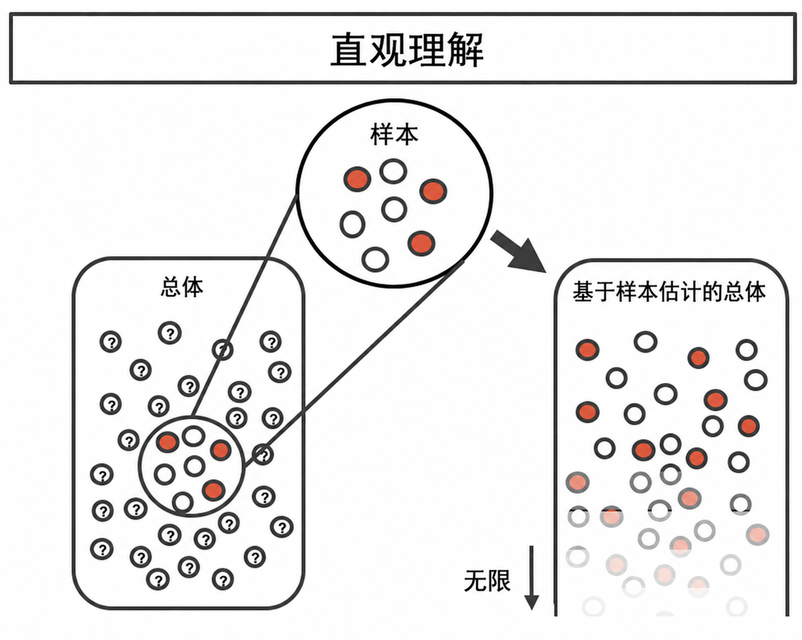
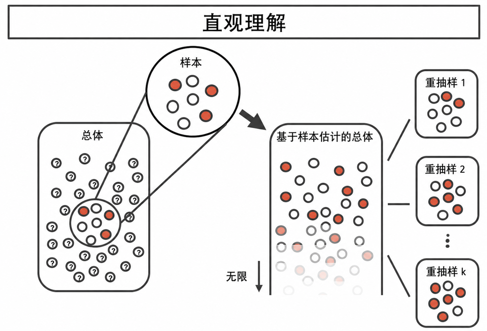
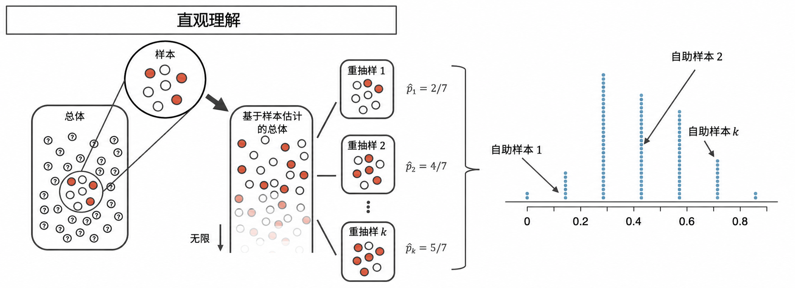
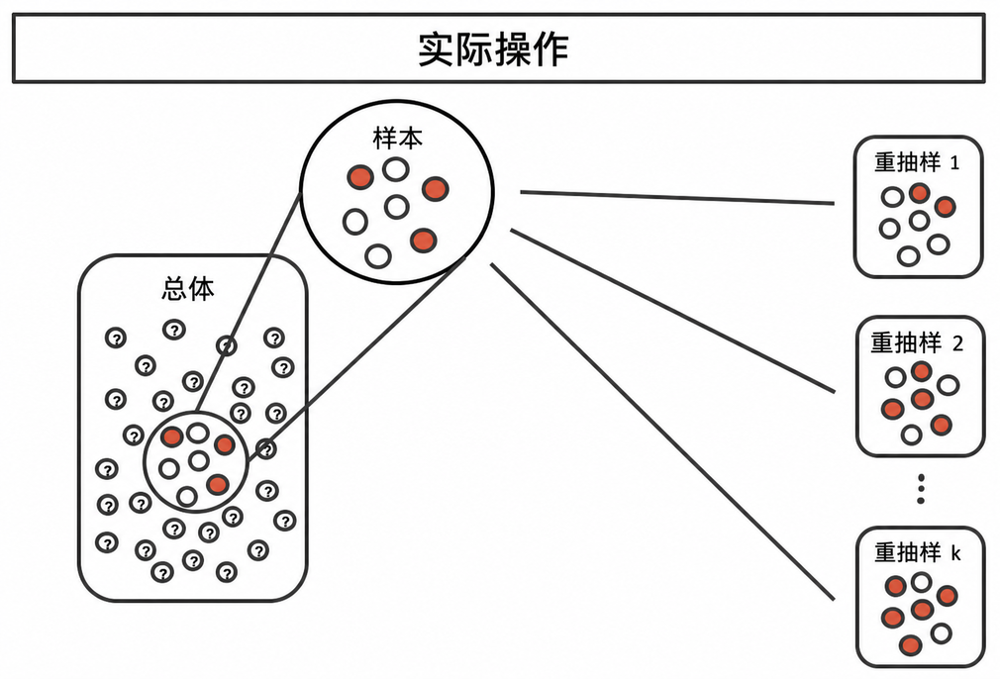
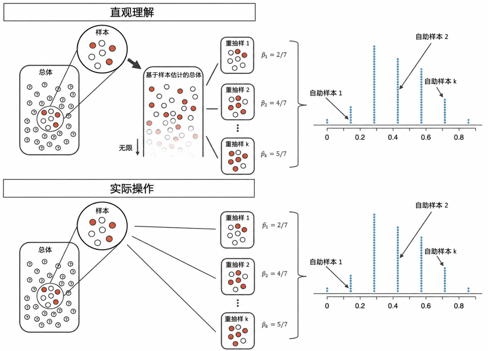

# 使用自助法构建置信区间 {#sec-foundations-bootstrapping}

```{r}
#| include: false
source("_common.R")
```


::: {.chapterintro data-latex=""}
在本章中，我们进一步探讨了用样本比例估计总体比例这一熟悉的概念。
也就是说，我们构建了所谓的**置信区间**\index{confidence interval}，它是一个可能包含真实总体值的合理数值范围。
构建置信区间的过程，基于理解当从许多不同样本计算出许多不同的统计量时，一个统计量（此处为样本比例）如何围绕其参数（此处为总体比例）*变化*。

如果可能，我们会通过重复从总体中抽取样本数据并计算样本比例，来衡量统计量的变异性。
然后我们可以再做一次。
再再做一次。
如此反复，直到对原始估计的变异性有充分的把握。

当不同样本间的变异性很大时，我们会认为原始统计量可能远离我们关心的真实总体参数（并且区间估计会很宽）。
当不同样本间的变异性很小时，我们期望样本统计量接近我们关心的真实参数（并且区间估计会很窄）。

抽样数据免费或极其廉价的理想世界几乎从未存在，从总体中进行重复抽样通常也是不可能的。因此，自助法没有采用“从总体中再抽样”的方法，而是采用了“从样本中再抽样”的方法。
在本章中，我们将详细讨论自助法的过程。
:::

如 [第 -@sec-foundations-randomization 章]所示，随机化是一种适用于评估样本比例差异是否由偶然性导致的统计技术。

随机化检验最适合用于对这类实验进行建模：其中处理（解释变量）被随机分配给观测单位，且旨在回答一个简单的是/否研究问题。


例如，考虑以下可以用随机化检验很好地评估的研究问题：

-   这种疫苗是否会使一个人感染疟疾的可能性降低？
-   饮用咖啡因是否会影响一个人敲击手指的速度？
-   我们能否预测候选人A将赢得即将到来的选举？

然而，在本章中，我们感兴趣的是理解总体参数的另一种方法。
现在的目标不再是检验某个断言，而是估计未知的总体参数值。

例如，

-   如果我接种了疫苗，感染疟疾的可能性会降低多少？
-   平均而言，一个人如果先喝咖啡因，敲击手指的速度能变快（或变慢）多少？
-   候选人A将获得多大比例的选票？

在这里，我们探讨关注单个比例的情况，并介绍一种新的模拟方法：**自助法**\index{bootstrapping}。

```{r}
#| include: false
terms_chp_12 <- c("bootstrapping")
```


自助法最适合用于对通过从总体中随机抽样生成数据的研究进行建模。与随机化检验一样，我们使用自助法的目标也是理解统计量的变异性。与随机化检验（它模拟的是如果处理分配方式不同时，统计量将如何变化）不同，自助法将模拟统计量在取自总体的不同样本之间如何变化。
这将提供关于统计量与我们关心的参数之间差异程度的信息。

量化统计量在不同样本之间的变异性是一个难题。幸运的是，有时关于统计量（在不同样本间）如何变化的数学理论是众所周知的；正如 [第 -@sec-foundations-mathematical 章]所示，样本比例就属于这种情况。

然而，有些统计量没有关于其如何变化的简单理论，而自助法提供了一种计算方法，可以为几乎任何总体参数提供区间估计。
在本章中，我们将专注于使用自助法来估计单个比例，并且我们将在 [第 -@sec-inference-one-mean 章]到 [第 -@sec-inference-paired-means 章]中再次探讨自助法，因此你将获得大量练习，并接触到自助法在许多不同数据集设定中的应用。

我们使用自助法的目标将是给出总体参数的区间估计（一个合理数值范围）。

## 医疗顾问案例研究 {#sec-case-study-med-consult}

器官捐赠者有时会寻求专门医疗顾问的帮助。
这些顾问在手术的各个方面协助患者，旨在降低医疗过程和恢复期间发生并发症的可能性。
患者选择顾问可能部分基于该顾问客户的历史并发症率。

### 观测数据

有一位顾问试图通过指出美国肝脏捐赠者手术的平均并发症率约为 10%，而她的客户在她协助的 62 例肝脏捐赠者手术中仅发生了 3 例并发症，来吸引患者。
她声称，这有力地证明她的工作对降低并发症有显著贡献（因此应该聘用她！）。

::: {.workedexample data-latex=""}
我们将用 $p$ 代表与这位顾问合作的肝脏捐赠者的真实并发症率。
（“真实”并发症率将被称为**参数**。）我们使用数据来估计 $p$，并将这个估计值记为 $\hat{p}.$

------------------------------------------------------------------------

并发症率的样本比例是用 3 例并发症除以该顾问参与过的 62 例手术计算得出的：$\hat{p} = 3/62 = 0.048.$
:::

::: {.workedexample data-latex=""}
是否可能利用数据来评估这位顾问的主张（即并发症的减少归功于她的工作）？

------------------------------------------------------------------------

不能。
该主张声称存在因果关联，但数据是观察性的，所以我们必须警惕混杂变量。
例如，也许那些能负担得起医疗顾问费用的患者也能负担更好的医疗服务，这也可能导致较低的并发症率。
虽然无法评估这一因果主张，但我们仍然有可能了解这位顾问的真实并发症率。
:::

::: {.important data-latex=""}
**参数。**\index{parameter}

**参数**是我们所关心的“真实”值。

我们通常使用来自样本数据的**点估计**\index{point estimate}来估计参数。
点估计也称为**统计量**\index{statistic}。

例如，我们通过考察这位医疗顾问以往客户的并发症率，来估计她的客户出现并发症的概率 $p$：

$$\hat{p} = 3 / 62 = 0.048~\text{用于估计}~p$$
:::

```{r}
#| include: false
terms_chp_12 <- c(terms_chp_12, "parameter", "point estimate", "statistic")
```


### 统计量的变异性

在医疗顾问案例研究中，参数是 $p$，即这位医疗顾问客户的真实并发症概率。
我们没有理由相信 $p$ 恰好等于 $\hat{p} = 3/62,$ 但同样没有理由相信 $p$ 离 $\hat{p} = 3/62$ 特别远。通过对数据集进行有放回抽样（这一过程称为**自助法**\index{bootstrapping}），可以近似得到可能的 $\hat{p}$ 值的变异性。

本书涵盖的大多数推断方法都基于这样一个基础：量化当两个数据集均取自同一总体时，它们之间会有多大差异。
从同一总体中重复抽取样本没有意义，因为如果你有条件抽取更多样本，那么增大样本量要比分别评估两个样本量完全相同的样本更有意义。
相反，我们考察样本在一个估计的总体下的表现。

[图 -@fig-boot1]展示了如何利用观测到的样本数据来近似成功与失败的比例（在本例中，即医疗顾问的并发症和无并发症比例），从而估计未知的原始总体。

```{r}
#| label: fig-boot1
#| fig-cap: |
#|   利用观测到的样本数据来估计未知总体。请注意，
#|   我们可以利用样本来创建一个估计的（即自助的）总体，并从中抽样。
#|   观测数据包含 3 个红色和 4 个白色弹珠，因此
#|   估计的总体中包含 3/7 的红色弹珠和 4/7 的白色弹珠。
#| fig-alt: |
#|   从一个大部分个体取值未知的大型总体中抽取了一个包含 3 个红色弹珠
#|   和 4 个白色弹珠的小样本。然后，该样本被无限次复制，
#|   以创建一个代理总体，其中已知红色弹珠占 3/7，白色弹珠占 4/7。
#| out-width: 50%

```


通过从估计的总体中重复抽样，可以观察到样本间的变异性。
在 [图 -@fig-boot2]中，重复的自助样本彼此之间以及与原总体之间显然是不同的。
请记住，这些自助样本都取自同一个（估计的）总体，因此差异完全是由抽样过程中的自然变异性造成的。

```{r}
#| label: fig-boot2
#| fig-cap: |
#|   自助抽样提供了对样本间变异性的度量。请注意，我们是从根据观测数据创建的估计总体中进行抽样的。
#| fig-alt: |
#|   展示了一个未知的大总体及其样本（3红4白弹珠）。创建代理总体（对样本的无限复制）后，可以从该代理总体中抽取新的、大小为 7 的重抽样样本。图中显示了三个大小为 7 的重抽样样本：重抽样样本1有2/7为红色；重抽样样本2有4/7为红色；重抽样样本k有5/7为红色。
#| out-width: 60%

```


对每个自助样本进行汇总（此处使用的是样本比例），我们可以直接看到样本比例 $\hat{p}$ 在不同样本间的变异性。
该示例场景下的 $\hat{p}_{boot}$ 分布如 [图 -@fig-boot3]所示，医疗顾问数据的完整自助分布则如 [图 -@fig-MedConsBSSim]所示。

```{r}
#| label: fig-boot3
#| fig-cap: |
#|   对每个自助样本估计自助比例。由此得到的自助分布（点图）提供了比例在不同样本间如何变化的度量。
#| fig-alt: |
#|   展示了同一个未知大总体及其样本（3红4白弹珠）；比例为3/7红色弹珠的无限代理总体；以及k个大小为7的重抽样样本。计算每个重抽样样本的红色弹珠自助比例（显示为2/7, 4/7，和5/7）。采集大量重抽样样本后，将自助比例汇总在一个点图中。这些比例在0/7到7/7之间呈钟形分布，大多数自助比例落在1/7到6/7之间。
#| out-width: 100%

```


实际上，计算机很难处理一个无限总体（且具有与样本相同的比例构成）。
然而，存在一种物理和计算方法，能以计算高效的方式产生样本比例的等价自助分布。

将观测数据视为一袋弹珠，其中 3 颗代表成功（红色），4 颗代表失败（白色）。
通过有放回地从袋中抽取弹珠，我们描绘了与使用无限大的估计总体进行抽样时完全相同的抽样**过程**。

```{r}
#| label: fig-boot4
#| fig-cap: |
#|   从样本数据中反复进行重抽样，与创建无限大的总体估计是同一过程。直接从样本进行重抽样在计算上更可行。请注意，此处的重抽样是有放回的（也就是说，原始样本本身永远不变），因此原始样本与估计的假设总体是等价的。
#| fig-alt: |
#|   展示了一个未知大总体及其样本（3红4白弹珠）。无需创建无限大的代理总体，重抽样直接取自原始样本（通过对样本进行有放回抽样）。图中显示了三个大小为7的重抽样样本：重抽样样本1有2/7红色；重抽样样本2有4/7红色；重抽样样本k有5/7红色。
#| out-width: 70%

```


```{r}
#| label: fig-boot1prop
#| fig-cap: |
#|   对比从估计的无限总体中抽样与从原始样本有放回重抽样的过程。请注意，自助比例的点图是相同的，因为估计统计量的过程是等价的。
#| fig-alt: |
#|   顶部图像包含以下步骤：(1) 一个大的未知总体，(2) 观测到的样本（大小为7，含3红4白），(3) 创建一个无限大的代理总体，以及 (4) 三个重抽样样本。(5) 考虑大量重抽样样本并绘制自助比例的点图。底部图像遵循相同的过程，但不包含无限大的代理总体。即，在底部图像中，(1) 从原始总体中抽取一个样本，(2) 三个重抽样样本直接取自观测数据（使用有放回抽样）。(3) 同样，考虑大量重抽样样本并绘制自助比例的点图。
#| out-width: 100%

```


如果我们将自助抽样过程应用于医疗顾问的例子，我们可以将每位客户视为袋中的一颗弹珠。
袋中有 59 颗白色弹珠（无并发症）和 3 颗红色弹珠（有并发症）。
如果我们从袋中抽取 62 颗弹珠（每次有放回地抽取一颗），并计算模拟患者中出现并发症的比例 $\hat{p}_{boot},$ 那么这个“自助”比例就代表了通过“从样本中重抽样”方法得到的一个模拟比例。

::: {.guidedpractice data-latex=""}
在对 62 名患者进行模拟时，我们预期大约有多少人会出现并发症？[^12-foundations-bootstrapping-1]
:::

[^12-foundations-bootstrapping-1]: 在模拟中，大约 4.8% 的患者（平均 3 人）会出现并发症，因为这是在样本中观察到的情况。
    不过，我们会看到每次模拟之间会略有变化。

仅靠一次模拟不足以了解不同自助比例之间的变异性，因此我们用计算机将模拟重复了 10,000 次。

[图 -@fig-MedConsBSSim]显示了 10,000 次自助模拟的分布。
自助比例的变化范围大约从 0 到 11.3%。
自助比例的变异性使我们相信，真实的并发症概率（即参数 $p$）很可能落在 0% 到 11.3% 之间，因为这些数值覆盖了 95% 的自助重采样值。

真实比例的取值范围被称为**自助法百分位置信区间**，在接下来的几节和几章中我们还会再次见到它。

```{r}
#| label: fig-MedConsBSSim
#| fig-cap: |
#|   对原始医疗顾问数据进行 10,000 次自助法抽样。每次模拟都从原始数据中创建一个样本，其中
#|   并发症的概率为 $\hat{p} = 3/62.$ 自助法的第 2.5 百分位数比例为 0，
#|   第 97.5 百分位数为 0.113。结论是：我们确信，在总体中，
#|   真实的并发症概率在 0% 到 11.3% 之间。
#| fig-alt: |
#|   10,000 个自助比例的直方图。自助法的第 2.5 百分位数比例为 0，
#|   第 97.5 百分位数为 0.113。
#| fig-asp: 0.5
bsprop_med <- tibble(
  bsprop = rbinom(10000, size = 62, prob = (3 / 62)) / 62
)

bsprop_med_summary <- bsprop_med |>
  summarise(
    bsprop_025 = quantile(bsprop, 0.025),
    bsprop_975 = quantile(bsprop, 0.975),
  )

ggplot(bsprop_med, aes(x = bsprop)) +
  geom_histogram(binwidth = 0.0075) +
  gghighlight(
    bsprop <= bsprop_med_summary$bsprop_025 |
      bsprop >= bsprop_med_summary$bsprop_975
  ) +
  annotate(
    "segment",
    x = bsprop_med_summary$bsprop_025,
    y = 0,
    xend = bsprop_med_summary$bsprop_025,
    yend = 1000,
    linetype = "dashed"
  ) +
  annotate(
    "segment",
    x = bsprop_med_summary$bsprop_975,
    y = 0,
    xend = bsprop_med_summary$bsprop_975,
    yend = 1000,
    linetype = "dashed"
  ) +
  annotate(
    "text",
    x = bsprop_med_summary$bsprop_025,
    y = 1200,
    label = "第 2.5\n百分位数"
  ) +
  annotate(
    "text",
    x = bsprop_med_summary$bsprop_975,
    y = 1200,
    label = "第 97.5\n百分位数"
  ) +
  labs(
    x = "手术并发症的自助比例",
    y = "频数",
    title = "10,000 个自助比例"
  )
```


::: {.workedexample data-latex=""}
最初的说法是，该顾问的真实并发症率低于 10% 的全国水平。
0% 到 11.3% 的并发症真实概率区间估计是否表明该外科顾问的并发症率低于全国平均水平？
请解释。

------------------------------------------------------------------------

不支持。
因为该区间与 10% 重叠，顾问的工作可能与较低的并发症风险相关，也可能与较高（即大于 10%）的并发症风险相关！
此外，如前所述，由于这是一项观察性研究，即使能够测量出关联，也没有证据表明顾问的工作是导致并发症率（更高或更低）的原因。
:::

## 敲击者和听众案例研究 {#sec-tapperscasestudy}

你可以和朋友或家人尝试这样一个游戏：选一首简单且耳熟能详的歌曲，在桌子上敲出它的旋律，看看对方能否猜出这首歌。
在这个简单的游戏中，你是敲击者，对方是听众。

### 观测数据

斯坦福大学的研究生 Elizabeth Newton 利用敲击者-听众游戏进行了一项实验。[^12-foundations-bootstrapping-2]
在她的研究中，她招募了 120 名敲击者和 120 名听众。
大约 50% 的敲击者期望听众能够猜出歌曲。
Newton 想知道，50% 是一个合理的期望吗？

[^12-foundations-bootstrapping-2]: 这个案例研究在 Chip 和 Dan Heath 的 [Made to Stick](https://en.wikipedia.org/wiki/Made_to_Stick) 一书中有所描述。
    鲜为人知的是，许多 OpenIntro 资源背后的教学原则都基于 *Made to Stick*。

在牛顿的研究中，120名听众中只有3人（$\hat{p} = 0.025$）猜对了曲子！
这个数字看起来相当低，这促使研究者提出疑问：能猜对曲子的人的真实比例是多少？


### 统计量的变异性

为了回答这个问题，我们将再次使用模拟。
为了模拟120场游戏，这次我们使用一个装有120颗弹珠的袋子：3颗是红色的（代表猜对的人），117颗是白色的（代表没有猜对曲子的人）。
从袋子中抽样120次（记得每次都要将弹珠放回袋中，以保持红色弹珠的总体比例恒定）就产生了一个自助样本。

例如，我们可以从装有3颗红色和117颗白色弹珠的袋子中抽取5颗弹珠，来模拟5对敲击者-听众配对。

|   W   |   W   |   W   |    R    |   W   |
|:-----:|:-----:|:-----:|:-------:|:-----:|
| 错误 | 错误 | 错误 |   正确   | 错误 |

在抽取了120颗弹珠后，我们数出2颗红色弹珠对应 $\hat{p}_{boot1} = 0.0167.$ 正如我们使用随机化技术时那样，只看一次模拟会发生什么是不够的。
为了理解观测到的比例0.025可能与真实参数相距多远，我们应该生成更多的模拟。
这里我们将整个模拟重复了十次：

$$0.0417 \quad 0.025 \quad 0.025 \quad 0.0083 \quad 0.05 \quad 0.0333 \quad 0.025 \quad 0 \quad 0.0083 \quad 0$$ <!-- % round(rbinom(10, 120, 0.5) / 120, 3) -->

和之前一样，我们将使用计算机总共运行 10,000 次模拟。
如 [图 -@fig-tappers-bs-sim]所示，$\hat{p}_{boot}$ 的重采样值中有 95% 落在 0.000 到 0.0583 之间。
也就是说，我们预计真正能猜出敲击者曲调的人的比例在 0% 到 5.83% 之间。

```{r}
#| label: fig-tappers-bs-sim
#| fig-cap: |
#|   原始的听众-敲击者数据进行了10,000次自助法重抽样。每次
#|   模拟都会创建一个样本，其中猜对的概率为
#|   $\hat{p} = 3/120.$ 第2.5百分位数的比例为0，第97.5
#|   百分位数为0.0583。结果是，我们有信心认为，在
#|   总体中，能正确猜对曲子的人的真实百分比在 0% 到 5.83% 之间。
#| fig-alt: |
#|   10,000个自助比例的直方图。自助比例的第2.5百分位数
#|   为零，第97.5百分位数为0.0583。
#| fig-asp: 0.5
bsprop_tap <- tibble(
  bsprop = rbinom(10000, size = 120, prob = (3 / 120)) / 120
)

bsprop_tap_summary <- bsprop_tap |>
  summarise(
    bsprop_025 = quantile(bsprop, 0.025),
    bsprop_975 = quantile(bsprop, 0.975),
  )

ggplot(bsprop_tap, aes(x = bsprop)) +
  geom_histogram(binwidth = 0.0045) +
  gghighlight(bsprop <= bsprop_tap_summary$bsprop_025 | bsprop >= bsprop_tap_summary$bsprop_975) +
  annotate("segment",
    x = bsprop_tap_summary$bsprop_025, y = 0,
    xend = bsprop_tap_summary$bsprop_025, yend = 1000,
    linetype = "dashed"
  ) +
  annotate("segment",
    x = bsprop_tap_summary$bsprop_975, y = 0,
    xend = bsprop_tap_summary$bsprop_975, yend = 1000,
    linetype = "dashed"
  ) +
  annotate("text", x = bsprop_tap_summary$bsprop_025, y = 1200, label = "2.5th\npercentile") +
  annotate("text", x = bsprop_tap_summary$bsprop_975, y = 1200, label = "97.5th\npercentile") +
  labs(
    x = "猜对听众的自助比例",
    y = "计数",
    title = "10,000个自助比例"
  )
```


::: {.guidedpractice data-latex=""}
这些数据是否提供了有说服力的证据来反驳 50% 的听众能猜出敲击者曲调的说法？[^12-foundations-bootstrapping-3]
:::

[^12-foundations-bootstrapping-3]: 因为 50% 不在真实参数的区间估计内，我们可以说有令人信服的证据反对 50% 的听众能猜出曲调这一假设。
    此外，50% 与最大的重采样统计量相距甚远，这表明有**非常**令人信服的证据反对该假设。


## 置信区间 {#sec-ConfidenceIntervals}

\index{confidence interval}

点估计为参数提供了一个单一的合理值。
然而，点估计很少是完美的；估计中通常存在一些误差。
除了提供参数的点估计之外，下一个合理的步骤就是为参数提供一个合理的*值范围*。

### 总体参数的合理值范围

总体参数的一个合理值范围称为**置信区间**\index{confidence interval}。
只使用一个点估计就像在浑浊的湖里用矛捕鱼，而使用置信区间则像用网捕鱼。
我们可以朝看到鱼的地方投出长矛，但我们很可能会错过。
另一方面，如果我们向那个区域撒网，我们就有很大机会抓到鱼。

如果我们报告一个点估计，我们很可能无法正好命中总体参数。
另一方面，如果我们报告一个合理值的范围——一个置信区间——我们就有很大机会捕获到这个参数。

::: {.guidedpractice data-latex=""}
如果我们想非常确定能捕获总体参数，我们应该使用更宽的区间（例如，99%）还是更窄的区间（例如，80%）？[^12-foundations-bootstrapping-4]
:::

[^12-foundations-bootstrapping-4]: 如果我们想更确定能捕到鱼，我们可能会用更宽的网。
    同样，如果我们想更确定能捕获参数，我们就使用更宽的置信区间。

\vspace{-5mm}

### 自助法置信区间

如上所述，**自助样本**\index{bootstrap sample}就是原始样本的一个样本。
以医疗并发症数据为例，我们按如下步骤进行：

-   从 62 名患者中随机抽取一个观测（将弹珠放回袋中以保持总体不变）。
-   从 62 名患者中随机抽取第二个观测。因为我们采用有放回抽样（即实际上并不从袋中取出弹珠），所以第二次抽取到与第一步相同的观测的概率是 1/62！
-   继续逐个抽取观测……
-   从 62 名患者中随机抽取第 62 个观测。

```{r}
#| include: false
terms_chp_12 <- c(terms_chp_12, "bootstrap sample", "bootstrap percentile confidence interval", "sampling with replacement", "confidence interval")
```


自助法抽样通常被称为**有放回抽样**\index{sampling with replacement}。

自助样本的行为类似于从总体中抽取的实际样本，我们计算出感兴趣的点估计（此处计算 $\hat{p}_{boot}$）。

基于超出本文范围的理论，我们知道自助比例 $\hat{p}_{boot}$ 围绕 $\hat{p}$ 的变化方式，与不同样本比例（即 $\hat{p}$ 的值）围绕真实参数 $p$ 的变化方式类似。
因此，可以利用 $\hat{p}_{boot}$ 值本身来生成 $p$ 的区间估计。

::: {.important data-latex=""}
**参数 $p$ 的 95% 自助法百分位置信区间**。

\index{boostrap percentile confidence interval}
参数 $p$ 的 95% 自助法百分位置信区间可以直接使用排序后的 $\hat{p}_{boot}$ 值来获得。

考虑排序后的 $\hat{p}_{boot}$ 值。
将第 2.5% 的自助比例值称为“下界”，将第 97.5% 的自助比例值称为“上界”。

95% 置信区间由下式给出：(下界, 上界)
:::

在 [第 -@sec-one-prop-null-boot 节]中，我们将讨论不同置信水平的置信区间（例如 90% 置信区间或 99% 置信区间）。

[第 -@sec-one-prop-null-boot 节]还详细讨论了“95% 置信”的实际含义。


## 章节回顾 {#sec-chp12-review}

### 总结

[图 -@fig-bootboth]提供了创建自助法置信区间的视觉总结。

```{r}
#| label: fig-bootboth
#| fig-cap: |
#|   我们将使用有放回抽样来衡量感兴趣的统计量（此处为比例）的变异性。
#|   有放回抽样是一种计算工具，它等价于将样本用作估计一个无限大的总体的方式，然后从该总体中抽样。
#| fig-alt: |
#|   自助法过程的完整描述。图中显示了总体和潜在自助样本的卡通示意图，每个样本都有不同的自助比例。
#|   自助比例的点图显示了它们固有的变异性。
#| out-width: 100%

```


我们可以将自助法过程总结如下：

-   **根据要估计的参数来框定研究问题。** 置信区间适用于旨在估计总体中某个数字（称为参数）的研究问题。
-   **通过观察性研究或实验收集数据。** 如果研究问题可以表达为关于参数的查询，我们就可以收集数据来计算一个统计量，这是我们对该参数值的最佳猜测。然而，我们知道由于自然变异性，统计量不会恰好等于参数。
-   **使用数据值作为总体的代理来模拟随机性。** 为了评估统计量可能距离参数多远，我们从数据集中重复重抽样以测量自助统计量的变异性。自助统计量围绕观测统计量的变异性（这是一个可以通过计算技术测量的量）应该大致等于许多观测样本统计量围绕参数的变异性（这是一个很难测量的量，因为在现实生活中我们只能得到确切的一个样本）。


-   **创建区间。** 选择特定的置信水平后，利用自助统计量的变异性创建一个区间估计，希望它能捕获真实参数。虽然与手头特定样本相关的区间估计可能捕获也可能不捕获参数，但研究者知道，在整个研究生涯中，置信水平将决定他们有多少比例的研究置信区间能够捕获真实参数。
-   **形成结论。** 使用分析得到的置信区间，报告感兴趣参数的区间估计。同时，务必用通俗的语言写出结论，以便普通读者理解结果。

[表 -@tbl-chp12-summary]是自助法过程总结的另一种呈现方式。

```{r}
#| label: tbl-chp12-summary
#| tbl-cap: 作为推断统计方法的自助法总结。
#| tbl-pos: H
inference_method_summary_table |>
  filter(question != "What are the technical conditions?") |>
  select(question, bootstrapping) |>
  kbl(linesep = "\\addlinespace", booktabs = TRUE, col.names = c("问题", "答案")) |>
  kable_styling(
    bootstrap_options = c("striped", "condensed"),
    latex_options = c("striped", "hold_position"), full_width = TRUE
  ) |>
  column_spec(1, width = "15em")
```


### 术语

本章介绍的术语列在 [表 -@tbl-terms-chp-12]中。
如果你不确定其中某些术语的含义，我们建议你回到正文中回顾它们的定义。
你应该能很容易地找到它们，因为它们在正文中均以**粗体**显示。

```{r}
#| label: tbl-terms-chp-12
#| tbl-cap: 本章介绍的术语。
#| tbl-pos: H
make_terms_table(terms_chp_12)
```


## 练习 {#sec-chp12-exercises}

奇数编号练习的答案可以在 [附录 -@sec-exercise-solutions-12]中找到。

::: {.exercises data-latex=""}

:::
