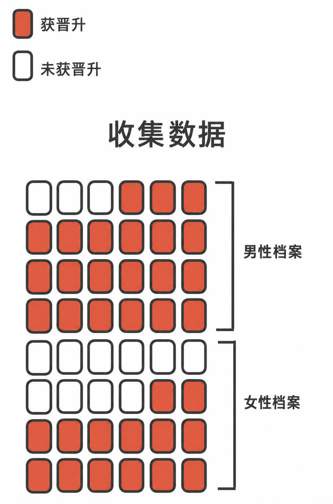
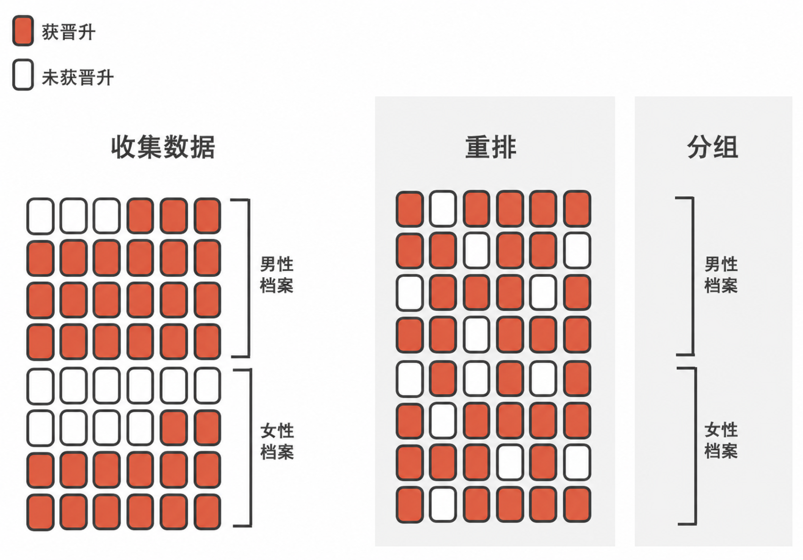
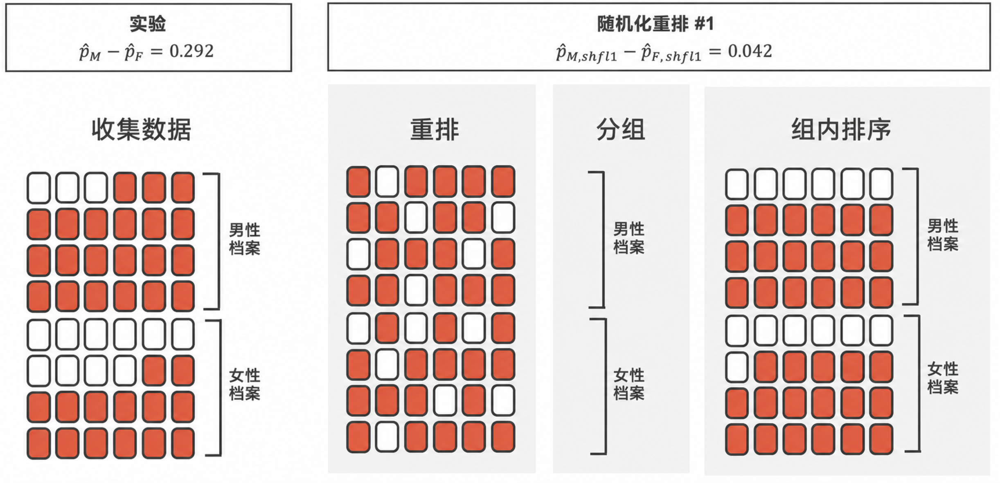
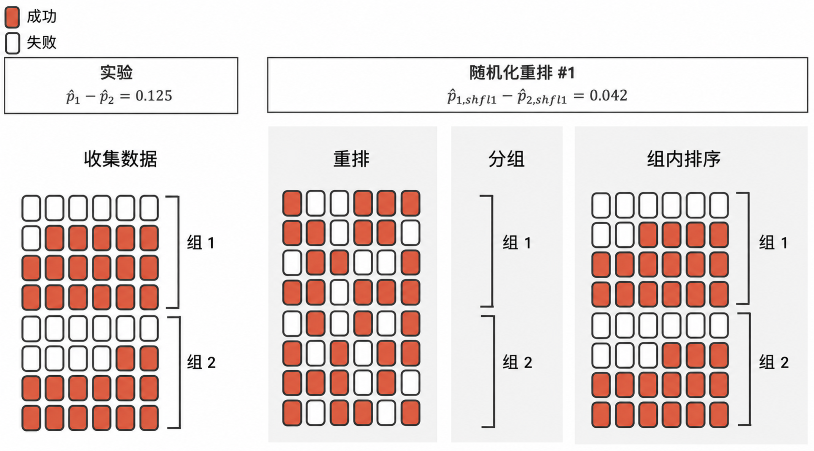

```{r}
#| include: false

source("_common.R")
```


# 随机化假设检验 {#sec-foundations-randomization}

::: {.chapterintro data-latex=""}
统计推断主要关注理解和量化参数估计的不确定性。
虽然方程和细节会因具体情境而异，但推断的基础在整个统计学中都是相同的。

我们从两个案例研究入手，这些案例旨在引出针对研究主张作出决策的过程。
我们通过引入**假设检验框架**\index{hypothesis test}将这一过程形式化，该框架使我们能够对有关总体的主张进行正式评估。
:::

```{r}
#| include: false
terms_chp_11 <- c("hypothesis test")
```


到目前为止，在本书中你已经在各种情境下处理过数据。
你学习了如何汇总和可视化数据，以及如何同时对多个变量进行建模。
有时，手头的数据集就代表了整个研究问题。
但更多的时候，收集数据是为了回答关于一个更大群体的研究问题，而数据是来自该群体的一个（希望是）有代表性的子集。

你可能会同意，数据中几乎总是存在变异性——即使两个数据集都是用相同方法从同一个总体中收集的，它们也不会完全相同。
然而，量化数据中的变异性既不直观也不容易，也就是说，回答“一个数据集与另一个数据集*有多*不同？”这个问题并非易事。

首先，关于符号的一个说明。
我们通常用 $p$ 表示总体比例，用 $\hat{p}$ 表示样本比例。
类似地，我们通常用 $\mu$ 表示总体均值，用 $\bar{x}$ 表示样本均值。

::: {.workedexample data-latex=""}
假设你的教授把你班上的学生分成两组：坐在教室左边的学生和坐在教室右边的学生。
如果 $\hat{p}_{L}$ 代表坐在教室左侧且偏好屏幕阅读的学生的比例，而 $\hat{p}_{R}$ 代表坐在教室右侧且偏好屏幕阅读的学生的比例，如果 $\hat{p}_{L}$ 不*恰好*等于 $\hat{p}_{R}$，你会感到惊讶吗？

------------------------------------------------------------------------

虽然比例 $\hat{p}_{L}$ 和 $\hat{p}_{R}$ 可能彼此接近，但它们完全相同的可能性很小。
我们很可能会由于偶然性而观察到一个小的差异。
:::

::: {.guidedpractice data-latex=""}
如果我们不认为一个人上课时坐在教室的哪一侧与他们是否偏好屏幕阅读有关联，那么我们对这两个变量之间的关系做了什么假设？[^11-foundations-randomization-1]
:::

[^11-foundations-randomization-1]: 我们假设这两个变量是**独立的**\index{variable!independent}\index{independent variable}。

```{r}
#| include: false
terms_chp_11 <- c(terms_chp_11, "independent")
```


研究这种形式的随机性是统计学的重点之一。
在本章及后续章节中，我们提供了三种量化数据固有变异性的方法：随机化、自助法和数学模型。
使用本章提供的方法，我们将能够得出超越手头数据集的结论，以回答有关样本所来源的更大总体的研究问题。

我们将探究的第一种变异性来自解释变量（或处理）被随机分配给观测单位的实验。
正如你在 [第 -@sec-data-hello 章]中学到的，随机化实验可用于评估一个变量（解释变量）是否导致第二个变量（响应变量）的变化。
每个数据集都有一些变异性，因此为了判断数据中的变异性是源于（1）因果机制（实验中被随机化的解释变量）还是源于（2）数据固有的自然变异性，我们设置了一个仿造的随机化实验作为比较。
也就是说，我们假设每个观测单位无论接受何种处理水平，都会得到完全相同的响应值。
通过多次重新分配处理，我们可以将实际实验与仿造实验进行比较。
如果实际实验的结果比任何仿造实验的结果都更极端，我们就会相信是解释变量导致了该结果，而非仅仅是数据固有的变异性。
通过几个不同的案例研究，让我们更仔细地看看**随机化检验**\index{randomization test}这一思想。

```{r}
#| include: false
terms_chp_11 <- c(terms_chp_11, "randomization test")
```


## 性别歧视案例研究 {#sec-caseStudySexDiscrimination}

我们考虑一项调查 1970 年代性别歧视的研究，其背景是一家银行的人事决策。
我们希望回答的研究问题是：“在那些自我认同为男性的经理们作出的晋升决策中，自我认同为女性的个体是否受到歧视？” [@Rosen:1974]

::: {.data data-latex=""}
[`sex_discrimination`](http://openintrostat.github.io/openintro/reference/sex_discrimination.html) 数据可以在 [**openintro**](http://openintrostat.github.io/openintro) R 包中找到。
:::

这项研究考虑了生理性别角色，并且只允许“男性”和“女性”两种选项。
我们应该注意到，所考虑的身份并非性别身份，并且该研究只允许对生理性别进行二元分类。

### 观测数据

这项研究的参与者是 48 位自我认同为男性的银行主管，他们于 1972 年参加了北卡罗来纳大学的一个管理学院。
他们被要求扮演银行人事总监的角色，并收到一份人事档案，用以判断是否应将该人晋升为分行经理。
提供给参与者的文件是相同的，只是其中一半标明候选人自我认同为男性，另一半标明候选人自我认同为女性。
这些文件被随机分配给了银行经理们。

::: {.guidedpractice data-latex=""}
这是一项观察性研究还是一项实验？
研究类型如何影响我们能从结果中推断出什么？[^11-foundations-randomization-2]
:::

[^11-foundations-randomization-2]: 这项研究是一项实验，因为受试者被随机分配了“男性”档案或“女性”档案（请记住，所有档案的内容实际上都是相同的）。
    由于这是一项实验，因此可以利用研究结果来评估候选人的生理性别与晋升决策之间的因果关系。

```{r}
#| label: sex-discrimination-obs-p
sex_discrimination_props <- sex_discrimination |>
  rename(sex = sex) |>
  count(sex, decision) |>
  group_by(sex) |>
  mutate(p = n / sum(n))

p_male <- sex_discrimination_props |>
  filter(sex == "male", decision == "promoted") |>
  pull(p)

p_female <- sex_discrimination_props |>
  filter(sex == "female", decision == "promoted") |>
  pull(p)

p_diff <- p_male - p_female

perc_male <- label_percent(accuracy = 0.1)(p_male)
perc_female <- label_percent(accuracy = 0.1)(p_female)
perc_diff <- label_percent(accuracy = 0.1)(p_diff)
```


对于每位主管，其被分配档案所关联的生理性别和晋升决策都被记录下来。
利用总结在 [表 -@tbl-sex-discrimination-obs]中的研究结果，我们希望评估自我认同为女性的个体在晋升决策中是否受到了不公平的歧视。
在这项研究中，自我认同为女性的申请者获得晋升的比例低于男性（`r p_female` 对比 `r p_male`），但尚不清楚这一差异是否提供了有说服力的证据表明自我认同为女性的个体受到了不公平歧视。

```{r}
#| label: tbl-sex-discrimination-obs
#| tbl-cap: 性别歧视研究的汇总结果。
#| tbl-pos: H
sex_discrimination |>
  count(decision, sex) |>
  pivot_wider(names_from = decision, values_from = n) |>
  adorn_totals(where = c("col", "row")) |>
  mutate(sex = recode(sex, "male" = "男性", "female" = "女性", "Total" = "合计")) |>
  rename("晋升" = promoted, "不晋升" = `not promoted`, "合计" = Total) |>
  kbl(linesep = "", booktabs = TRUE) |>
  kable_styling(
    bootstrap_options = c("striped", "condensed"),
    latex_options = c("striped"),
    full_width = FALSE
  ) |>
  add_header_above(c(" " = 1, "decision" = 2, " " = 1)) |>
  column_spec(1:4, width = "7em")
```


数据在 [图 -@fig-sex-rand-obs]中被可视化为一组卡片。
请注意，每张卡片代表一个人事文件（我们数据集中的一个观测），颜色表示决策结果：红色代表晋升，白色代表未晋升。
此外，这些观测被分成了男性和女性身份的群体。

```{r}
#| label: fig-sex-rand-obs
#| fig-cap: |
#|   性别歧视研究可以被看作 48 张红色和白色的卡片。
#| fig-alt: |
#|   共摆放了 48 张卡片；24 张表示男性文件，24 张表示女性文件。
#|   在 24 张男性文件中，有 3 张是白色的，21 张是红色的。
#|   在女性文件中，有 10 张是白色的，14 张是红色的。
#| out-width: 35%

```


::: {.workedexample data-latex=""}
统计学家有时需要评估证据的强度。
观察这项研究中的晋升率时，我们为什么会倾向于立刻得出认同为女性的个体受到歧视的结论？

------------------------------------------------------------------------

晋升率的巨大差异（女性人员为 `r perc_female`，而男性人员为 `r perc_male`）暗示在晋升决策中可能存在对女性的歧视。
然而，我们还不能确定观察到的差异是代表了歧视，还是仅仅由于没有歧视发生时的随机机会。
因为即使晋升决策真的与性别独立，我们也不会期望样本比例*完全*相等，所以在仅仅比较样本比例时，我们不能排除随机机会作为一种可能的解释。
:::

前一个例子提醒我们，数据中总会存在变异性（使得各群体有所不同），即使这种差异没有潜在的原因（例如，即使不存在歧视）。
[表 -@tbl-sex-discrimination-obs]显示，女性人员比男性人员少获得了 7 次晋升，晋升率的差异为 `r perc_diff` $\left( \frac{21}{24} - \frac{14}{24} = 0.292 \right).$ 这个观察到的差异就是我们所说的真实差异的**点估计**\index{point estimate}。
晋升率差异的点估计很大，但这项研究的样本量很小，因此尚不清楚观察到的差异是代表了歧视，还是仅仅由于机会所致。
机会可以被视为由自然变异性所导致的主张；歧视则可以被视为研究者试图去证明的主张。
我们将这两个相互竞争的主张标记为 $H_0$ 和 $H_A$：

```{r}
#| include: false
terms_chp_11 <- c(terms_chp_11, "point estimate")
```


-   $H_0:$ **原假设**\index{null hypothesis}。变量 `sex` 和 `decision` 是独立的。晋升率 `r perc_diff` 的差异是由于总体固有的自然变异性造成的。
-   $H_A:$ **备择假设**\index{alternative hypothesis}。变量 `sex` 和 `decision` *并非*独立的。晋升率 `r perc_diff` 的差异不是由于自然变异性造成的，并且同等资质的女性人员比男性人员更不容易获得晋升。

```{r}
#| include: false
terms_chp_11 <- c(terms_chp_11, "null hypothesis", "alternative hypothesis")
```


::: {.important data-latex=""}
**假设检验。**

这些假设是所谓的**假设检验**\index{hypothesis test}的一部分。假设检验是一种利用数据评估相互竞争的主张的统计技术。通常，原假设采取*无差异*或*无效*的立场。这一假设假定任何观察到的差异都源于总体固有的变异性，且可能由随机机会产生。

如果原假设和数据明显不一致，那么我们就拒绝原假设，转而支持备择假设。

假设检验有许多细微之处，所以如果在本节结束时你觉得自己并非假设检验的大师，也请不要担心。在本章以及接下来的章节中，我们会多次讨论这些概念和细节。
:::

```{r}
#| include: false
terms_chp_11 <- c(terms_chp_11, "hypothesis test")
```


\vspace{-5mm}

如果原假设——即变量 `sex` 和 `decision` 无关——成立，那意味着什么？
这意味着每位银行家决定是否晋升候选人时，不会考虑人事档案上所注明的性别。
也就是说，晋升百分比的差异将源于文件被随机分配给不同银行家时产生的自然变异性，而正是这种随机化恰好产生了相对较大的 `r perc_diff` 差异。

考虑备择假设：银行家受到了人事档案上所注明的性别的影响。
如果这是真的，尤其是如果这种影响很大，我们预期会看到男性和女性候选人的晋升率存在一些差异。
如果这种性别偏见针对的是女性候选人，我们预期女性职员的晋升推荐比例相对于男性职员会更低。

我们将通过评估数据与原假设 $H_0$ 的冲突是否大到令原假设显得不合理，从而在两个相互竞争的主张之间做出选择。
如果数据和原假设似乎相互矛盾，并且数据支持 $H_A$，那么我们将拒绝独立性的观点，并得出结论：数据提供了存在歧视的证据。

\vspace{-2mm}

### 统计量的变异性

[表 -@tbl-sex-discrimination-obs]显示，35 位银行主管推荐了晋升，13 位没有。
现在，假设银行家的决策与候选人的性别是独立的。
那么，如果我们用不同的性别随机分配方式重做该实验，晋升率的差异将仅基于晋升决策中的随机波动。
我们可以执行这种**随机化**，以模拟如果银行家的决策与 `sex` 独立，但我们以不同的方式分配文件性别时会发生的情况。[^11-foundations-randomization-3]

[^11-foundations-randomization-3]: 我们在本节中使用的检验程序有时被称为**随机化检验**。如果解释变量没有被随机分配，如在观察性研究中，该程序则被称为**置换检验**。置换检验用于解释变量未被随机分配的观察性研究\index{permutation test}。

```{r}
#| include: false
terms_chp_11 <- c(terms_chp_11, "permutation test")
```


\clearpage

在**模拟**\index{simulation}中，我们将 48 份人事档案（35 份标记为“晋升”，13 份标记为“不晋升”）彻底洗牌，然后将它们分成两个新的堆。
请注意，通过保持 35 份晋升和 13 份未晋升，我们假设有 35 位银行经理会晋升文件中内容对应的个人，且与文件上注明的性别**独立**。
我们将 24 份文件放入第一堆，代表 24 份“女性”文件。
第二堆也有 24 份文件，代表 24 份“男性”文件。
[图 -@fig-sex-rand-shuffle-1]突出了洗牌和重新分配到模拟性别组的两个步骤。

```{r}
#| label: fig-sex-rand-shuffle-1
#| fig-cap: |
#|   洗牌并重新分配性别歧视数据，将其分到新的男性和女性文件组中。
#| fig-alt: |
#|   代表原始数据的 48 张红白卡片被洗牌并重新分配，每组 24 张，分别代表 24 份男性文件和 24 份女性文件。
#| out-width: 75%

```


然后，就像处理原始数据那样，我们将结果制成表格，并确定被归类为“男性”和“女性”的人事档案中获得晋升的比例。

```{r}
#| include: false
terms_chp_11 <- c(terms_chp_11, "simulation")
```

由于在此模拟中文件的随机分配独立于晋升决策，因此晋升率的任何差异都是由于偶然性。
[表 -@tbl-sex-discrimination-rand-1]展示了一次此类模拟的结果。

```{r}
#| label: tbl-sex-discrimination-rand-1
#| tbl-cap: |
#|   模拟结果，其中男性和女性晋升率的差异纯粹由偶然性导致。
#| tbl-pos: H
sex_discrimination_rand_1 <- tibble(
  sex = c(rep("male", 24), rep("female", 24)),
  decision = c(
    rep("promoted", 18),
    rep("not promoted", 6),
    rep("promoted", 17),
    rep("not promoted", 7)
  )
) |>
  mutate(
    sex = fct_relevel(sex, "male", "female"),
    decision = fct_relevel(decision, "promoted", "not promoted")
  )

sex_discrimination_rand_1 |>
  count(decision, sex) |>
  pivot_wider(names_from = decision, values_from = n) |>
  adorn_totals(where = c("col", "row")) |>
  mutate(sex = recode(sex, "male" = "男性", "female" = "女性", "Total" = "合计")) |>
  rename("晋升" = promoted, "不晋升" = `not promoted`, "合计" = Total) |>
  kbl(linesep = "", booktabs = TRUE) |>
  kable_styling(
    bootstrap_options = c("striped", "condensed"),
    latex_options = c("striped"),
    full_width = FALSE
  ) |>
  add_header_above(c(" " = 1, "决策" = 2, " " = 1)) |>
  column_spec(1:4, width = "7em")
```


::: {.guidedpractice data-latex=""}
在 [表 -@tbl-sex-discrimination-rand-1]中，两个模拟组之间的晋升率差异是多少？
这与实际研究中观察到的 29.2% 的差异相比如何？[^11-foundations-randomization-4]
:::

[^11-foundations-randomization-4]: $18/24 - 17/24=0.042$ 或约为 4.2% 偏向男性员工。
    这个由于偶然性产生的差异远小于在实际组中观察到的差异。

\clearpage

[图 -@fig-sex-rand-shuffle-1-sort]表明，原始数据中的晋升率差异远大于模拟组中的差异 (0.292 \> 0.042)。
在本案例研究中，我们感兴趣的量始终是晋升率的差异。
我们将这个汇总值称为感兴趣的**统计量**\index{statistic}（也常称作**检验统计量**\index{test statistic}）。
当我们遇到不同的数据结构时，统计量可能会改变（例如，我们可能计算平均数而不是比例），但我们总是希望理解统计量在不同样本间如何变化。

```{r}
#| include: false
terms_chp_11 <- c(terms_chp_11, "statistic", "test statistic")
```


```{r}
#| label: fig-sex-rand-shuffle-1-sort
#| fig-cap: |
#|   在无性别歧视的前提下，我们对随机化数据进行汇总，得到一个比例差异的估计值。
#|   请注意，排序步骤只是为了方便直观地计算模拟的样本比例。
#| fig-alt: |
#|   48张红色和白色的卡片显示在三个面板中。第一个面板代表原始数据以及男性和女性文件的原始分配（原始数据中，男性组有3张白卡，女性组有10张白卡）。
#|   第二个面板代表经过洗牌的红色和白色卡片，它们被随机分配为男性和女性文件。第三个面板中，卡片根据随机分配的男女性别进行了排序。
#|   在第三个面板中，男性组有6张白卡，女性组有7张白卡。
#| out-width: 100%

```


\vspace{-5mm}

### 观察到的统计量与原假设下的统计量

我们在引导练习中计算了原假设下的一种可能差异，它代表了当假设原假设为真时，由于偶然性产生的一种差异。
虽然在这第一次模拟中，我们是手动分发文件，但使用计算机执行此模拟要高效得多。
在计算机上重复模拟，我们在相同假设下得到另一个由于偶然性产生的差异：-0.042。
又一个：0.208。
如此重复，直到我们进行了足够多次的模拟，从而对原假设下*差异的分布*形状有了较好的了解。
[图 -@fig-sex-rand-dot-plot]展示了来自 100 次模拟的差异图，其中每个点代表一次模拟中男性和女性文件被推荐晋升的比例差异。

```{r}
#| label: fig-sex-rand-dot-plot
#| fig-cap: |
#|    基于原假设 $H_0$（模拟的性别与决策独立）产生的 100 次模拟差异的堆叠点图。100 次模拟中有两次的差异至少达到研究中观察到的 29.2%，并以实心点表示，
#|    用蓝点标示。
#| fig-alt: |
#|   男性与女性文件被推荐晋升的比例之间 100 次模拟差异的堆叠点图。这些差异是在“不存在歧视”的原假设下模拟的。
#|   100 次模拟中有两次的差异达到 29.2%，并以蓝色标出，表示它们与观察到的差异一样极端或更极端。
#| fig-asp: 0.5
set.seed(37)
sex_discrimination |>
  specify(decision ~ sex, success = "promoted") |>
  hypothesize(null = "independence") |>
  generate(reps = 100, type = "permute") |>
  calculate(stat = "diff in props", order = c("male", "female")) |>
  mutate(stat = round(stat, 3)) |>
  ggplot(aes(x = stat)) +
  geom_dotplot(binwidth = 0.01) +
  gghighlight(stat >= 0.292) +
  theme(
    axis.ticks.y = element_blank(),
    axis.text.y = element_blank()
  ) +
  labs(
    x = "多次重排下的晋升率差异（男性 - 女性）",
    y = NULL
  )
```


\clearpage

注意，这些模拟的比例差异分布以 0 为中心。
在原假设下，我们的模拟没有对男性和女性人事档案做任何区分。
因此，以 0 为中心是合理的：我们应该预期，仅由偶然性引起的差异会围绕 0 波动，每次模拟都会有一些随机起伏。

::: {.workedexample data-latex=""}
根据 [图 -@fig-sex-rand-dot-plot]，你观察到至少 `r perc_diff`（`r p_diff`）差异的频率有多高？
经常、有时、很少，还是从不？

------------------------------------------------------------------------

看起来，根据 [图 -@fig-sex-rand-dot-plot]，在原假设下，出现至少 `r perc_diff` 差异的时间大约只有 2%。
如此低的概率表明，仅由于偶然性观察到如此大的差异是罕见的。
:::

\vspace{-5mm}

如果列出候选人性别确实没有任何影响，那么 29.2% 的差异是一个罕见事件，这为我们提供了两种可能的方式来解释研究结果：

-   如果 $H_0$（**原假设**）为真：性别对晋升决定没有影响，而我们观察到了一个如此之大、仅会罕见地发生的差异。

-   如果 $H_A$（**备择假设**）为真：性别对晋升决定有影响，而我们观察到的结果实际上是由于同等资历的女性候选人在晋升决定中受到歧视，这解释了 29.2%. 的巨大差异。

当我们进行正式研究时，如果数据与原假设立场（即数据仅是偶然性的结果）强烈冲突，我们就会拒绝该原假设。[^11-foundations-randomization-5]
在我们的分析中，我们确定，在原假设为真的情况下，仅有 $\approx$ 2% 的概率会观察到与我们的数据一样极端或更极端的结果，即获得一个男性候选人比女性候选人获得晋升比例高 $\geq$ 29.2% 的样本，因此我们得出结论，数据提供了强有力的证据，表明男性主管对女性候选人存在性别歧视。
在这种情况下，我们拒绝原假设，支持备择假设。

[^11-foundations-randomization-5]: 这种推理通常不能推广到轶事性的观察。
    我们每个人每天都会观察到极其罕见的事件，这些事件是我们不可能预测到的。
    然而，在轶事证据这种非严格的背景下，几乎任何事情都可能看起来像罕见事件，因此在日常活动中寻找罕见事件的想法是极具误导性的。
    例如，我们可以看看彩票：历史上最大头奖（2018年10月23日）的 Mega Millions 号码是 (5, 28, 62, 65, 70)，Mega 球为 (5)，其出现的概率只有 1/1.76 亿，但尽管如此，这些号码还是出现了！
    然而，无论出现什么号码，它们都会有同样极小的发生概率。
    也就是说，*我们可能观察到的任何一组号码最终都将是极其罕见的*。
    这种情况在我们日常生活中很典型：每一个可能发生的事件本身看起来都极其罕见，但如果我们考虑到所有其他可能的结果，那些结果也同样极其罕见。
    我们应该小心，不要误解这类轶事证据。

**统计推断**\index{statistical inference} 是在不确定性存在的背景下，根据数据做出决策和得出结论的过程。
错误确实会发生，就像罕见事件一样，手头的数据集可能会引导我们得出错误的结论。
虽然给定的数据集可能并不总是引导我们得出正确的结论，但统计推断为我们提供了工具，以控制和评估这些错误发生的频率。
在深入探讨假设检验的细节之前，让我们先分析另一个案例研究。

```{r}
#| include: false
terms_chp_11 <- c(terms_chp_11, "statistical inference")
```


## 机会成本案例研究 {#sec-caseStudyOpportunityCost}

典型的美国大学生的行为有多理性与一致呢？
在本节中，我们将探讨大学生消费者是否总是会考虑下面这个道理：现在不花的钱可以留待以后再花。

我们特别感兴趣的是，提醒学生这个关于金钱的众所周知的事实，是否会导致他们变得稍微节俭一些。
怀疑论者可能认为这种提醒不会产生任何影响。
我们可以用原假设与备择假设的框架来概括这两种不同的观点。

-   $H_0:$ **原假设**。提醒学生可以把钱省下来用于以后的购买，不会对学生的消费决策产生任何影响。
-   $H_A:$ **备择假设**。提醒学生可以把钱省下来用于以后的购买，会降低他们继续购买的可能性。

在本节中，我们将探讨研究人员为美国西南部一所大学的学生进行的一项实验，该实验研究的就是这个问题。
[@Frederick:2009]

\clearpage

### 观测数据

这项研究招募了150名学生，每人都得到了以下陈述：

> *想象一下，你一直在存一些额外的钱，打算买些东西。最近一次去音像店时，你恰好遇到一部新影片特价销售。这部电影有你最喜欢的男演员或女演员，也是你最喜欢的电影类型（例如喜剧、剧情片、惊悚片等）。你正在考虑的这部影片是你长期以来一直想买的。它的特价是14.99美元。在这种情况下，你会怎么做？请圈出下面的一个选项。*[^11-foundations-randomization-6]

[^11-foundations-randomization-6]: 如果你出生在实体音像店时代之后，可能会觉得这个情境有些奇怪。如果你好奇它们是什么样子的，可以搜索一下“Blockbuster”。

这150名学生中的一半被随机分配到对照组，他们看到以下两个选项：

> (A) 购买这部有趣的影片。

> (B) 不购买这部有趣的影片。

其余75名学生被分配到处理组，他们看到的选项(B)稍有不同：

> (A) 购买这部有趣的影片。

> (B) 不购买这部有趣的影片。把14.99美元留作其他购买用途。

额外提醒学生一个显而易见的事实，会影响购买决策吗？
[表 -@tbl-opportunity-cost-obs]总结了研究结果。

::: {.data data-latex=""}
[`opportunity_cost`](http://openintrostat.github.io/openintro/reference/opportunity_cost.html) 数据集可以在 [**openintro**](http://openintrostat.github.io/openintro) R 包中找到。
:::

```{r}
#| label: tbl-opportunity-cost-obs
#| tbl-cap: 机会成本研究的结果汇总。
#| tbl-pos: H
opportunity_cost |>
  count(group, decision) |>
  pivot_wider(names_from = decision, values_from = n) |>
  adorn_totals(where = c("col", "row")) |>
  mutate(group = recode(group, "control" = "对照组", "treatment" = "处理组", "Total" = "合计")) |>
  rename("购买影片" = `buy video`, "不购买影片" = `not buy video`, "合计" = Total) |>
  kbl(linesep = "", booktabs = TRUE) |>
  kable_styling(
    bootstrap_options = c("striped", "condensed"),
    latex_options = c("striped"),
    full_width = FALSE
  ) |>
  add_header_above(c(" " = 1, "决策" = 2, " " = 1)) |>
  column_spec(1:4, width = "7em")
```


使用可视化手段来审视结果可能会更容易一些。
[图 -@fig-opportunity-cost-obs-bar]显示，与对照组的学生相比，处理组中选择不购买影片的学生比例更高。

```{r}
#| label: fig-opportunity-cost-obs-bar
#| fig-cap: 机会成本研究结果的堆叠条形图。
#| fig-alt: |
#|   对照组和处理组的堆叠条形图，填充部分表示购买和未购买影片的比例。
#|   对照组中约有 74% 的学生购买了影片，而处理组中购买影片的比例则略高于
#|   50%。
#| fig-asp: 0.3
#| fig-pos: H
ggplot(opportunity_cost, aes(y = fct_rev(group), fill = fct_rev(decision))) +
  geom_bar(position = "fill") +
  scale_fill_openintro("two") +
  scale_x_continuous(labels = label_percent()) +
  labs(
    x = "比例",
    y = "组别",
    fill = "决策"
  )
```


另一种审视 [表 -@tbl-opportunity-cost-obs]中结果的有效方法是使用行比例，具体是考察每组参与者中表示会购买或不会购买影片的比例。
这些汇总数据在 [表 -@tbl-opportunity-cost-obs-row-prop]中给出。

```{r}
#| label: tbl-opportunity-cost-obs-row-prop
#| tbl-cap: |
#|   机会成本数据使用行比例进行汇总。行比例在这里特别有用，因为我们可以查看每组中*购买*和*不购买*决策的比例。
#| tbl-pos: H
opportunity_cost |>
  count(group, decision) |>
  pivot_wider(names_from = decision, values_from = n) |>
  adorn_percentages(denominator = "row") |>
  adorn_totals(where = "col") |>
  kbl(linesep = "", booktabs = TRUE) |>
  kable_styling(
    bootstrap_options = c("striped", "condensed"),
    latex_options = c("striped"),
    full_width = FALSE
  ) |>
  add_header_above(c(" " = 1, "决策" = 2, " " = 1)) |>
  column_spec(1:4, width = "7em")
```


我们将本研究中的**成功**\index{success}定义为选择不购买影片的学生。[^11-foundations-randomization-7]
那么，感兴趣的值就是通过提醒学生“现在不花钱意味着以后可以花”所引起的影片购买率变化。

[^11-foundations-randomization-7]: 研究中通常将**成功**\index{success}定义为感兴趣的**结果变量**，并且一个“成功”实际上可能并非积极的结果。
    例如，一项关于 COVID-19 患病率的研究中，研究人员可能在统计意义上将患有 COVID-19 的患者定义为“成功”。
    关于术语**成功**\index{success}更完整的讨论将在 [第 -@sec-inference-one-prop 章]中给出。

```{r}
#| include: false
terms_chp_11 <- c(terms_chp_11, "success")
```


我们可以为此差异构建一个点估计（T 表示处理组，C 表示对照组）：

$$\hat{p}_{T} - \hat{p}_{C} = \frac{34}{75} - \frac{19}{75} = 0.453 - 0.253 = 0.200$$

处理组中选择不购买影片的学生比例比对照组高 20 个百分点。
如果两组学生的消费习惯没有差异，两组之间如此显著的百分比差异是否不太可能仅由偶然产生？

### 统计量的变异性

本数据分析的主要目标是理解，如果原假设为真（即处理对学生没有影响），我们可能会看到何种差异。
因为这是一项实验，所以我们将使用与 [第 -@sec-caseStudySexDiscrimination 节]中相同的方法：随机化。

让我们在假设的背景下思考这些数据。
如果原假设 $(H_0)$ 为真且处理对学生的决策没有影响，那么观察到的两组间 20% 的差异完全可以归因于随机偶然。
另一方面，如果备择假设 $(H_A)$ 为真，那么该差异表明提醒学生为以后购买存钱确实影响了他们的购买决策。

### 观测到的统计量与原假设下的统计量

就像性歧视研究一样，我们可以进行统计分析。
使用上一节的随机化技术，让我们看看在“处理没有效果”的情景下模拟实验时会发生什么。

虽然在现实中我们会在计算机上进行这种模拟，但思考如何在没有计算机的情况下进行模拟可能是有益的。
我们准备 150 张卡片，并在每张卡片上标记以表示我们的响应变量 `decision` 的分布。
也就是说，53 张卡片将标记为“不买影片”以代表选择不买的 53 名学生，另外 97 张将标记为“买影片”代表其他 97 名学生。
然后我们彻底洗牌这些卡片，并将它们分成两叠，每叠 75 张，代表模拟的处理组和对照组。
因为我们已经将两组的卡片混洗在一起，并假设它们的购买行为没有差异，所以观察到的“不买影片”卡片比例之间的任何差异（我们之前将其定义为*成功*）可完全归因于随机性。

::: {.workedexample data-latex=""}
如果我们随机分配卡片到模拟处理组和对照组，我们预期每个模拟组最终会有多少张“不买影片”卡片？
两组间“不买影片”卡片比例的预期差异是多少？

------------------------------------------------------------------------

由于模拟组大小相等，我们预期每个模拟组有 $53 / 2 = 26.5,$ 即 26 或 27 张“不买影片”卡片，从而得到的模拟比例差异点估计为 0%.
然而，由于随机性，我们有时也可能会观察到略高于或低于 26 或 27 的数字。
:::

单次随机化的结果如 [表 -@tbl-opportunity-cost-obs-simulated]所示。

```{r}
#| label: tbl-opportunity-cost-obs-simulated
#| tbl-cap: |
#|   学生选择与其模拟分组的对比汇总。分组分配与学生决策无关，
#|   因此两组之间的任何差异都仅仅是偶然造成的。
#| tbl-pos: H
opportunity_cost_rand_1 <- tibble(
  group = c(rep("control", 75), rep("treatment", 75)),
  decision = c(
    rep("buy video", 46),
    rep("not buy video", 29),
    rep("buy video", 51),
    rep("not buy video", 24)
  )
) |>
  mutate(
    group = as.factor(group),
    decision = as.factor(decision)
  )

opportunity_cost_rand_1 |>
  count(group, decision) |>
  pivot_wider(names_from = decision, values_from = n) |>
  adorn_totals(where = c("col", "row")) |>
  kbl(linesep = "", booktabs = TRUE) |>
  kable_styling(
    bootstrap_options = c("striped", "condensed"),
    latex_options = c("striped"),
    full_width = FALSE
  ) |>
  add_header_above(c(" " = 1, "决策" = 2, " " = 1)) |>
  column_spec(1:4, width = "7em")
```


根据此表，我们可以计算出第一次打乱数据（即仅凭偶然性）产生的差异：

$$\hat{p}_{T, shfl1} - \hat{p}_{C, shfl1} = \frac{24}{75} - \frac{29}{75} = 0.32 - 0.387 = - 0.067$$

仅仅一次模拟不足以让我们了解仅凭偶然性会产生什么样的差异。

```{r}
#| label: opportunity-cost-rand-dist
set.seed(25)
opportunity_cost_rand_dist <- opportunity_cost |>
  specify(decision ~ group, success = "not buy video") |>
  hypothesize(null = "independence") |>
  generate(reps = 1000, type = "permute") |>
  calculate(stat = "diff in props", order = c("treatment", "control")) |>
  mutate(stat = round(stat, 3))
```


我们将模拟另一组分配并计算新的差异：`r opportunity_cost_rand_dist$stat[1]`。

再模拟一次：`r opportunity_cost_rand_dist$stat[2]`。

再模拟一次：`r opportunity_cost_rand_dist$stat[3]`。

我们将这个过程重复 1,000 次。

结果汇总在 [图 -@fig-opportunity-cost-rand-dot-plot]的点图中，每个点代表一次随机化产生的差异。

```{r}
#| label: fig-opportunity-cost-rand-dot-plot
#| fig-cap: |
#|   在原假设 $H_0$ 下产生的 1,000 个模拟（原假设）差异的堆叠点图。
#|   1,000 次模拟中有 6 次的差异至少达到研究中观察到的 20%。
#| fig-alt: |
#|   购买视频的学生比例（处理组减对照组）的 1,000 次模拟差异的堆叠点图。
#|   这些差异是在“处理没有效果”的原假设下模拟的。
#|   1,000 次模拟中有 6 次的差异至少为 20%，并以蓝色标出，
#|   表明它们与观测差异同样极端或更极端。
#| fig-width: 7
#| fig-asp: 0.5
ggplot(opportunity_cost_rand_dist, aes(x = stat)) +
  geom_dotplot(binwidth = 0.01, dotsize = 0.165) +
  gghighlight(stat >= 0.20) +
  theme(
    axis.ticks.y = element_blank(),
    axis.text.y = element_blank()
  ) +
  labs(
    title = "1,000 次随机化比例的差异",
    x = "不购买视频的学生比例的随机化差异\n（处理组 - 对照组）",
    y = NULL
  )
```


由于点数过多且难以彼此区分，将结果汇总在直方图中更为方便，例如 [图 -@fig-opportunity-cost-rand-hist]中的直方图，其中每个柱的高度代表了产生该幅度结果的模拟次数。

```{r}
#| label: fig-opportunity-cost-rand-hist
#| fig-cap: |
#|   在原假设下产生的 1,000 个偶然差异的直方图。
#|   当模拟次数很多时，像这样的直方图是表示数据或结果的便捷方法。
#| fig-alt: |
#|   购买视频的学生比例（处理组减对照组）的 1,000 次模拟差异的直方图。
#|   这些差异是在“处理没有效果”的原假设下模拟的。
#|   1,000 次模拟中有 6 次的差异至少为 20%，对应的直方图条形以蓝色标出，
#|   表明它们与观测差异同样极端或更极端。
#|   使用直方图而非点图，是因为它能更便捷地表示数据。
#| fig-width: 7
ggplot(opportunity_cost_rand_dist, aes(x = stat)) +
  geom_histogram(binwidth = 0.04) +
  gghighlight(stat >= 0.20) +
  labs(
    title = "1,000 次随机化比例的差异",
    x = "不购买视频的学生比例的随机化差异\n（处理组 - 对照组）",
    y = "计数\n（模拟情境的数量）"
  )
```


在原假设（无处理效应）下，观察到至少 +20% 差异的概率约为 0.6%。
这确实非常罕见！
相反，我们将得出结论：数据提供了强有力的证据表明存在处理效应：在购买前提醒学生他们以后可以把钱花在其他东西上，会降低他们继续购买的可能性。
请注意，由于这是一项实验，我们能够对此做出因果陈述，尽管我们不知道提醒为何会导致更低的购买率。

## 假设检验 {#sec-HypothesisTesting}

在前两节中，我们使用了**假设检验**\index{hypothesis test}，这是一种用于评估两种相互竞争的可能性的正式技术。
在每个场景中，我们都描述了一个**原假设**\index{null hypothesis}，它代表了一种怀疑的视角或无差异的视角。
我们还提出了一个**备择假设**\index{alternative hypothesis}，它代表了一种新的视角，例如两个变量之间存在关联的可能性，或实验中存在处理效应的可能性。
备择假设通常是科学家们最初着手开展研究的原因。

```{r}
#| include: false
terms_chp_11 <- c(
  terms_chp_11,
  "hypothesis test",
  "null hypothesis",
  "alternative hypothesis"
)
```


::: {.important data-latex=""}
**原假设和备择假设。**

**原假设** $(H_0)$ 通常代表一种怀疑的视角或一个待检验的“无差异”主张。

**备择假设** $(H_A)$ 代表一个正在考虑中的备择主张，通常由感兴趣数值的可能取值范围来表示。
:::

如果一个人提出了一个有些难以置信的主张，我们最初会持怀疑态度。
然而，如果有充分的证据支持该主张，我们就会打消怀疑。
假设检验的这些特征也存在于美国法庭系统之中。

### 美国法庭系统

在美国法庭系统中，陪审员评估证据，以判断其是否能令人信服地表明被告有罪。
被告在被证明有罪之前被假定为无罪。

::: {.workedexample data-latex=""}
美国法庭考虑关于被告的两种可能主张：无罪或有罪。

如果我们在假设框架中设定这些主张，哪一个是原假设，哪一个是备择假设？

------------------------------------------------------------------------

陪审团会考虑证据是否如此令人信服（强有力），以至于对被告的罪行不存在合理怀疑。
也就是说，怀疑的视角（原假设）是此人无罪，直到呈现的证据使陪审团相信此人有罪（备择假设）。
:::

陪审员审查证据，以判断其是否能令人信服地表明被告有罪。
请注意，如果陪审团裁决被告*无罪*，这并不必然意味着陪审团确信此人无辜。
他们只是没有被备择假设（即此人有罪）说服。
假设检验也是如此：*即使我们未能拒绝原假设，我们也不接受原假设为真*。

未能找到支持备择假设的证据，并不等同于找到了原假设为真的证据。
我们将在 [第 -@sec-foundations-decision-errors 章]中更详细地探讨这一理念。

### p 值与统计可辨识性

在 [第 -@sec-caseStudySexDiscrimination 节]中，我们遇到了 20 世纪 70 年代的一项研究，该研究探讨了是否有强有力的证据表明女性候选人获得晋升的可能性低于男性候选人。
这个研究问题——女性候选人在晋升决定中是否受到歧视？
——被置于假设的框架中：

-   $H_0:$ 性别对晋升决定没有影响。

-   $H_A:$ 女性候选人在晋升决定中受到歧视。

原假设 $(H_0)$ 是晋升无差异的视角。
性别歧视数据提供了一个点估计，表明男性和女性候选人的推荐晋升率之间存在 `r perc_diff` 的差异。
我们判定，仅凭偶然性导致这样的差异（假设原假设为真）将非常罕见：大约每 100 次中只会发生 2 次。
当这样的结果与 $H_0$ 不一致时，我们会拒绝 $H_0$ 而支持 $H_A$。在此，我们得出结论：存在对女性候选人的歧视。

这 2/100 的概率就是我们所说的 **p 值**，它是一个在给定观测数据的条件下，量化反对原假设的证据强度的概率。

::: {.important data-latex=""}
**p 值。**

**p 值**\index{p-value}\index{hypothesis testing!p-value} 是指，在原假设为真的条件下，观察到对备择假设的支持程度至少与当前数据集相同的数据的概率。
我们通常使用数据的汇总统计量，例如比例差，来帮助计算 p 值并评估假设。
这个用于计算 p 值的汇总统计量通常称为**检验统计量**\index{test statistic}。
:::

```{r}
#| include: false
terms_chp_11 <- c(terms_chp_11, "p-value", "test statistic")
```


\clearpage

::: {.workedexample data-latex=""}
在性别歧视研究中，歧视率之差就是我们的检验统计量。
那么，在 [第 -@sec-caseStudyOpportunityCost 节]中介绍的机会成本研究中，检验统计量是什么？

------------------------------------------------------------------------

机会成本研究中的检验统计量是处理组和对照组中决定不购买视频的学生比例之差。
在这些例子中，比例差的**点估计**都被用作检验统计量。
:::

当 p 值很小，即小于一个预先设定的阈值时，我们就说结果是**统计上可辨识的**\index{statistically significant}\index{statistically discernible}。
这意味着数据提供了反对 $H_0$ 的强证据，因此我们拒绝原假设，转而支持备择假设。[^11-foundations-randomization-8]
这个阈值被称为**可辨识水平**\index{hypothesis testing!discernibility level}\index{significance level}\index{discernibility level}，通常用 $\alpha$（希腊字母 *alpha*）表示。[^11-foundations-randomization-9] $\alpha$ 值表示要拒绝原假设时，事件需要稀有到何种程度。
历史上，许多领域设定 $\alpha = 0.05$，以此作为拒绝原假设的门槛。
$\alpha$ 的值可以根据具体领域或应用而有所不同。

[^11-foundations-randomization-8]: 许多教材使用“统计显著的”一词，而非“统计上可辨识的”。我们选择使用“可辨识的”来表明一个精确的统计事件已经发生，而不是指一个可能符合也可能不符合统计上可辨识或显著定义的重要效应。

[^11-foundations-randomization-9]: 同样，在这里我们选择了“可辨识水平”而非你会在一些教材中看到的“显著性水平”。

```{r}
#| include: false
terms_chp_11 <- c(
  terms_chp_11,
  "significance level",
  "discernibility level",
  "statistically significant",
  "statistically discernible"
)
```


需要注意的是，你可能听说过用“统计显著的”来描述“统计上可辨识的”。尽管在日常语言中“显著的”表示差异很大或很有意义，但在统计学中未必如此。
“统计上可辨识的”这一术语仅表明一项研究的 p 值低于所选定的可辨识水平。
例如，在性别歧视研究中，p 值约为 0.02。
使用可辨识水平 $\alpha = 0.05,$ 我们会说数据提供了统计上可辨识的证据来反对原假设。
然而，这一结论并没有提供关于晋升率差异大小的任何信息！

::: {.important data-latex=""}
**统计可辨识性。**

如果 p 值小于某个预先确定的阈值（例如 0.01, 0.05, 0.1），我们就说数据提供了**统计上可辨识的**\index{hypothesis testing!statistically discernible.} 证据来反对原假设。
:::

\vspace{-5mm}

::: {.workedexample data-latex=""}
在 [第 -@sec-caseStudyOpportunityCost 节]的机会成本研究中，我们分析了一项实验，如果提醒研究参与者如果不把钱花在视频上可以用于未来的其他购买，他们继续购买视频的可能性会下降 20%。
我们断定，如果提醒实际上对学生决策没有影响，如此大的差异发生的概率仅有千分之六。
这项研究的 p 值是多少？你会将结果归类为“统计上可辨识的”吗？

------------------------------------------------------------------------

p 值是 0.006。
由于 p 值小于 0.05，数据提供了统计上可辨识的证据，表明美国大学生确实受到了提醒的影响。
:::

\vspace{-5mm}

::: {.important data-latex=""}
**为什么0.05这么特别？**

我们常常使用0.05这个阈值来判断一个结果是否是**统计上可辨识的**。
但为什么是0.05？
也许我们应该用更大或更小的数字。
如果你心存疑惑，这可能意味着你正在用批判性的眼光阅读——做得好！
我们录制了一个视频来帮助澄清*为什么是0.05*：

<https://www.openintro.org/book/stat/why05/>

有时，偏离标准也是不错的选择。
我们将在 [第 -@sec-foundations-decision-errors 章]中讨论何时选择不同于0.05的阈值。
:::

\clearpage

## 章节回顾 {#sec-chp11-review}

### 小结

[图 -@fig-fullrand]以图示方式总结了随机化检验的过程。

\index{randomization test}

```{r}
#| include: false
terms_chp_11 <- c(terms_chp_11, "randomization test")
```


```{r}
#| label: fig-fullrand
#| fig-cap: |
#|   一个假设数据集的完整随机化过程的一次模拟示例，如第一个面板所示。
#|   我们将此步骤重复数百或数千次。
#| fig-alt: |
#|   三个面板中展示了48张红色和白色卡片。第一个面板代表原始数据以及第1组和第2组的原始分配（原始数据中第1组有7张白卡，第2组有10张白卡）。
#|   第二个面板代表洗牌后的红白卡片，它们被随机指定为第1组和第2组。
#|   第三个面板中的卡片根据随机分配的第1组和第2组进行了排序。在第三个面板中，第1组有8张白卡，第2组有9张白卡。
#| out-width: 100%

```


我们可以将随机化检验程序总结如下：

-   **将研究问题表述为假设形式。** 假设检验适用于可以概括为两个对立假设的研究问题。原假设 $(H_0)$ 通常代表一种怀疑的观点，或者变量之间没有关系的观点。备择假设 $(H_A)$ 通常代表一种新的观点，或者变量之间存在关系的观点。
-   **通过观察性研究或实验收集数据。** 如果一个研究问题可以形成两个假设，我们就可以收集数据来进行假设检验。如果研究问题关注变量间的关联但不涉及因果关系，则应使用观察性研究。如果研究问题寻求两个或多个变量之间的因果联系，则应使用实验。
-   **模拟在原假设成立时将会出现的随机性。** 在上述例子中，我们对变异性的建模，是基于处理分配（例如，性别身份、机会）与研究结果相互独立的假设。计算机生成的原假设分布是许多不同随机化的结果，它量化了在原假设为真时预期会出现的变异性。
-   **分析数据。** 选择适合数据的分析方法并识别 p 值。到目前为止，我们只看到了一种分析方法：随机化。在本教材的其余部分，我们还将遇到适用于许多其他情境的新方法。
-   **形成结论。** 利用分析得到的 p 值，判断数据是否提供了反对原假设的证据。同时，务必用通俗的语言书写结论，以便非专业读者也能理解结果。

[表 -@tbl-chp11-summary]提供了从另一个角度看的随机化检验总结。

```{r}
#| label: tbl-chp11-summary
#| tbl-cap: 作为推断统计方法的随机化检验总结。
#| tbl-pos: H
inference_method_summary_table |>
  filter(question != "What are the technical conditions?") |>
  select(question, randomization) |>
  kbl(
    linesep = "\\addlinespace",
    booktabs = TRUE,
    col.names = c("问题", "答案")
  ) |>
  kable_styling(
    bootstrap_options = c("striped", "condensed"),
    latex_options = c("striped"),
    full_width = TRUE
  ) |>
  column_spec(1, width = "15em")
```


### 术语

本章介绍的术语列于 [表 -@tbl-terms-chp-11]中。
如果你不确定其中某些术语的含义，我们建议你回到正文中回顾其定义。
你应该能很容易地发现它们是**加粗的文本**。

```{r}
#| label: tbl-terms-chp-11
#| tbl-cap: 本章介绍的术语。
#| tbl-pos: H
make_terms_table(terms_chp_11)
```


\clearpage

## 练习 {#sec-chp11-exercises}

奇数编号练习的答案可在 [附录 -@sec-exercise-solutions-11]中找到。

::: {.exercises data-latex=""}

:::
