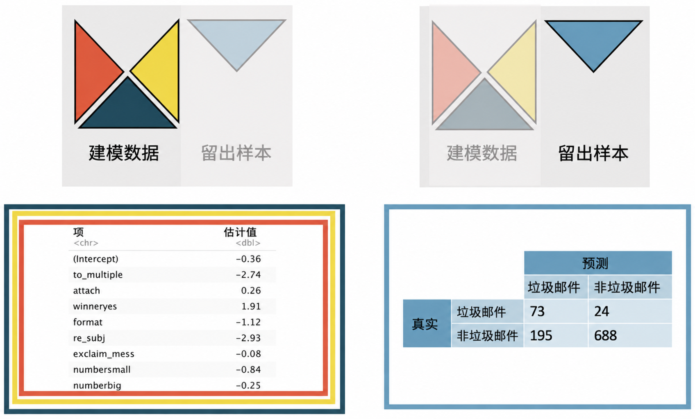

# 逻辑斯谛回归推断 {#sec-inf-model-logistic}

```{r}
#| include: false
source("_common.R")
```


::: {.chapterintro data-latex=""}
结合 [第 -@sec-model-logistic 章] 逻辑斯谛回归、[第 -@sec-foundations-mathematical 章] 数学模型推断，以及 [第 -@sec-inf-model-slr 章] 和 [第 -@sec-inf-model-mlr 章] 将推断技术应用于线性模型的内容，我们将推断方法应用于逻辑斯谛回归模型，以此为本书收尾。
此外，我们使用交叉验证作为逻辑斯谛回归模型的一种独立评估方法。
:::

```{r}
#| include: false
terms_chp_26 <- c("inference on logistic regression")
```


与多元线性回归类似，逻辑斯谛回归的推断将侧重于对系数的解释以及解释变量之间关系的理解。
p 值和交叉验证都将用于评估逻辑斯谛回归模型。

考虑 `email` 数据，它描述了可用于预测特定收件邮件是否为垃圾邮件（未经请求的批量电子邮件）的特征。
如果不逐一阅读收到的邮件，能有一种自动识别垃圾邮件的方法会很有用。
描述每封邮件的变量中，哪些对于预测邮件状态是重要的？

::: {.data data-latex=""}
[`email`](http://openintrostat.github.io/openintro/reference/email.html) 数据集可以在 [**openintro**](http://openintrostat.github.io/openintro) R 包中找到。
:::

```{r}
#| label: tbl-resume-variables
#| tbl-cap: |
#|   `email` 数据集中的变量及其描述。其中许多变量是指示变量，
#|   这意味着如果存在指定的特征，则取值为 1，否则为 0。
email_variables <- tribble(
  ~variable      , ~description                                                                                                 ,
  "spam"         , "指示电子邮件是否为垃圾邮件。"                                                                               ,
  "to_multiple"  , "指示电子邮件是否发送给多位收件人。"                                                                         ,
  "from"         , "邮件是否列出了发件人（常规外发邮件通常默认列出）。"                                                         ,
  "cc"           , "抄送的人数。"                                                                                               ,
  "sent_email"   , "指示发件人在过去 30 天内是否发送过电子邮件。"                                                               ,
  "attach"       , "附件数量。"                                                                                                 ,
  "dollar"       , "电子邮件中出现美元符号或单词“dollar”的次数。"                                                               ,
  "winner"       , "指示电子邮件中是否出现“winner”。"                                                                           ,
  "format"       , "指示电子邮件是否使用 HTML 编写（例如，可能包含加粗或活动链接）。"                                             ,
  "re_subj"      , "主题是否以“Re:”、“RE:”、“re:”或“rE:”开头。"                                                                 ,
  "exclaim_subj" , "主题中是否有感叹号。"                                                                                       ,
  "urgent_subj"  , "电子邮件主题中是否包含单词“urgent”。"                                                                       ,
  "exclaim_mess" , "电子邮件正文中的感叹号数量。"                                                                               ,
  "number"       , "因子变量，表示其中没有数字、有小数字（小于 100 万）还是大数字。"
)

email_variables |>
  kbl(
    linesep = "",
    booktabs = TRUE,
    col.names = c("变量", "描述")
  ) |>
  kable_styling(
    bootstrap_options = c("striped", "condensed"),
    latex_options = c("striped"),
    full_width = TRUE
  ) |>
  column_spec(1, monospace = TRUE) |>
  column_spec(2, width = "30em")
```


## 模型诊断

在讨论与系数相关的假设检验之前（结果证明它们与线性回归中的检验非常相似！），理解逻辑斯谛回归推断所依赖的技术条件是很有帮助的。
通常，正如你在逻辑斯谛回归建模例子中看到的那样，响应变量必须是二元的，这一点至关重要。
此外，逻辑斯谛回归的关键技术条件涉及预测变量（$x_i$ 值）与结果为“成功”的概率之间的关系。
事实证明，这种关系是一种称为 logit 函数的特定函数形式，其中 ${\rm logit}(p) = \log_e(\frac{p}{1-p}).$ 这个函数可能看起来有些复杂，而且记住 logit 的公式对于理解逻辑斯谛回归并非必需。
你需要记住的是，结果为“成功”的概率是解释变量线性组合的函数。

::: {.important data-latex=""}
**逻辑斯谛回归条件。**

\index{technical conditions logistic regression}

拟合逻辑斯谛回归模型有两个关键条件：

1.  每个结果 $Y_i$ 都与其他结果相互独立。
2.  当所有其他预测变量保持不变时，每个预测变量 $x_i$ 都与 logit$(p_i)$ 呈线性关系。
:::

```{r}
#| include: false
terms_chp_26 <- c(terms_chp_26, "technical conditions")
```


如果我们可以假设几个月内到达收件箱的邮件在是否为垃圾邮件方面相互独立，那么逻辑斯谛回归模型的第一个条件——结果的独立性——就是合理的。

逻辑斯谛回归模型的第二个条件，如果没有相当大量的数据，是不容易检验的。
幸运的是，我们的数据集中有 `r nrow(email)` 封邮件！
让我们首先通过绘制邮件的真实分类与模型的拟合概率来对这些数据进行可视化，如 @fig-spam-predict 所示。

```{r}
#| label: fig-spam-predict
#| fig-cap: |
#|   3921 封邮件中每一封被预测为垃圾邮件的概率。对点进行了抖动处理，
#|   以免数值几乎相同的点完全重叠绘制。
#| fig-alt: |
#|   散点图，x 轴为被预测为垃圾邮件的概率，y 轴为原始类别（垃圾邮件或非垃圾邮件）。
#|   可以看到预测并未完美分类所有邮件；然而，非垃圾邮件通常比垃圾邮件具有更低的预测概率。
#| fig-asp: 0.43
#| fig-width: 7
spam_fit <- logistic_reg() |>
  set_engine("glm") |>
  fit(
    spam ~ to_multiple + cc + dollar + urgent_subj,
    data = email,
    family = "binomial"
  )

spam_pred <- predict(spam_fit, new_data = email, type = "prob") |>
  bind_cols(email |> select(spam))

ggplot(spam_pred, aes(x = .pred_1, y = spam)) +
  geom_jitter(alpha = 0.2) +
  coord_cartesian(xlim = c(0, 1)) +
  labs(
    y = NULL,
    x = "电子邮件被预测为垃圾邮件的概率"
  ) +
  scale_y_discrete(labels = c("非垃圾邮件 (0)", "垃圾邮件 (1)"))
```


我们希望评估模型的质量。
例如，我们可能会问：如果我们查看那些被模型预测为有10%概率是垃圾邮件的邮件，其中实际是垃圾邮件的比例是否接近10%？
我们可以通过如下步骤对数据进行分组并构建图形来检查这一点：

1.  根据预测概率将观测分箱。
2.  计算每组的平均预测概率。
3.  计算每组的观测概率，以及这些个体成功真实概率的95%置信区间。
4.  将观测概率（带有95%置信区间）与每组的平均预测概率进行对比绘制。

如果模型能很好地描述数据，那么绘制的点应该接近直线 $y = x$，因为预测概率应该与观测概率相似。
我们可以利用置信区间来粗略判断是否存在问题。
这样的图形展示在 @fig-logisticModelBucketDiag 中。

```{r}
#| label: fig-logisticModelBucketDiag
#| fig-cap: |
#|   对 @fig-spam-predict 的重新配置。同样，对于每封邮件，x 轴是预测概率，y 轴是真实类别。数据按预测概率分桶后，垃圾邮件的比例（即观测概率）由黑色圆点表示。虚线落在许多桶的 95% 置信区间内，表明逻辑斯谛拟合是合理的。
#| fig-alt: |
#|   散点图，x 轴为成为垃圾邮件的预测概率，y 轴为原始类别（垃圾邮件或非垃圾邮件）。叠加显示的是成为垃圾邮件的观测概率，由每个预测概率分桶中垃圾邮件的比例计算得出。观测概率与预测概率吻合得相当好。
#| out-width: 90%
#| fig-asp: 0.6
par_og <- par(no.readonly = TRUE) # save original par
par(mar = c(5.1, 7, 0, 0))

m <- glm(
  spam ~ to_multiple + cc + dollar + urgent_subj,
  data = email,
  family = binomial
)

p <- predict(m, type = "response")

set.seed(1)
noise <- rnorm(nrow(email), sd = 0.08)

ns1 <- 4
plot(
  p,
  as.numeric(email$spam) - 1 + noise / 5,
  type = "n",
  xlim = 0:1,
  ylim = c(-0.07, 1.07),
  axes = FALSE,
  xlab = "预测概率",
  ylab = ""
)
par(las = 0)
mtext("真实类别", 2, 5.5)
par(las = 1)
rect(0, 0, 1, 1, border = IMSCOL["gray", "full"], col = "#00000000", lwd = 1.5)
lines(0:1, 0:1, lty = 2, col = IMSCOL["gray", "full"], lwd = 1.5)
points(
  p,
  as.numeric(email$spam) - 1 + noise / 5,
  col = IMSCOL["blue", "f5"],
  pch = 20
)
axis(1)
at <- seq(0, 1, length.out = 6)
labels <- c(
  "0 (非垃圾邮件)",
  "0.2  ",
  "0.4  ",
  "0.6  ",
  "0.8  ",
  "1 (垃圾邮件)"
)
axis(2, at, labels)
eps <- 1e-4
bucket_breaks <- quantile(p, seq(0, 1, 0.01))
bucket_breaks[1] <- bucket_breaks[1] - eps
n_buckets <- length(bucket_breaks) - 1
bucket_breaks[n_buckets] <- bucket_breaks[n_buckets] + 1e3 * eps
bucket_breaks. <- bucket_breaks
k <- 1
for (i in 1:n_buckets) {
  if (abs(bucket_breaks.[i] - bucket_breaks[k]) >= 0.01) {
    k <- k + 1
    bucket_breaks[k] <- bucket_breaks.[i]
  }
}
bucket_breaks <- bucket_breaks[1:k]
n_buckets <- length(bucket_breaks)
xp <- rep(NA, n_buckets)
yp <- rep(NA, n_buckets)
yp_lower <- rep(NA, n_buckets)
yp_upper <- rep(NA, n_buckets)
zs <- qnorm(0.975)
for (i in 1:n_buckets) {
  these <- bucket_breaks[i] < p & p <= bucket_breaks[i + 1]
  xp[i] <- mean(p[these])
  # cat(paste("xp", "i", "=", xp[i]))
  y <- (as.numeric(email$spam) - 1)[these]
  yp[i] <- mean(y)
  # cat(paste("yp", "i", "=", yp[i]))
  yp_lower[i] <- yp[i] - zs * sqrt(yp[i] * (1 - yp[i]) / length(y))
  # cat(paste("yp_lower", "i", "=", yp_lower[i]))
  yp_upper[i] <- yp[i] + zs * sqrt(yp[i] * (1 - yp[i]) / length(y))
  # cat(paste("yp_upper", "i", "=", yp_upper[i]))
}
points(xp, yp, pch = 19)
segments(xp, yp_lower, xp, yp_upper)
arrows(0.3, 0.17, 0.24, 0.22, length = 0.07)
text(
  0.3,
  0.15,
  paste(
    "将观测分桶后，我们计算",
    "每个桶内的观测概率",
    "与平均预测概率",
    "的对应关系，并附上 95% 置信区间。",
    sep = "\n"
  ),
  cex = 0.85,
  pos = 4
)
par(par_og) # restore original par
```

像 @fig-logisticModelBucketDiag 这样的图有助于更好地理解这些离差。还可以创建类似于 @sec-tech-cond-linmod 中所展示的额外诊断方法。例如，我们可以将残差计算为观测到的结果变量值减去期望结果变量值（$e_i = Y_i - \hat{p}_i$），然后绘制这些残差对各个预测变量的散点图。

\index{logistic regression}

## 软件的多元逻辑斯谛回归输出 {#sec-inf-log-reg-soft}

正如你在 [第 -@sec-model-mlr 章] 中所学到的，可以使用优化方法来寻找逻辑斯谛模型的系数估计值。未知的总体模型可以写为：

$$
\begin{aligned}
\log_e\bigg(\frac{p}{1-p}\bigg) = \beta_0 &+ \beta_1 \times \texttt{to\_multiple}\\
&+ \beta_2 \times \texttt{cc} \\
&+ \beta_3 \times \texttt{dollar}\\
&+ \beta_4 \times \texttt{urgent\_subj}
\end{aligned}
$$

该回归模型的估计方程可以写成一个包含四个预测变量的模型，其中 $\hat{p}$ 是一封邮件为垃圾邮件的估计概率：

$$
\begin{aligned}
\log_e\bigg(\frac{\hat{p}}{1-\hat{p}}\bigg) = -2.05 &-1.91 \times \texttt{to\_multiple}\\
&+ 0.02 \times \texttt{cc} \\
&- 0.07 \times \texttt{dollar}\\
&+ 2.66 \times \texttt{urgent\_subj}
\end{aligned}
$$

```{r}
#| label: tbl-emaillogmodel
#| tbl-cap: |
#|   基于变量 to_multiple、cc、dollar 和 urgent_subj 预测邮件是否为垃圾邮件的逻辑斯谛模型汇总。
#|   每个变量都有自己的系数估计值和 p 值。
#| tbl-pos: H
glm(
  spam ~ to_multiple + cc + dollar + urgent_subj,
  data = email,
  family = "binomial"
) |>
  tidy() |>
  mutate(p.value = ifelse(p.value < .0001, "<0.0001", round(p.value, 4))) |>
  kbl(
    linesep = "",
    booktabs = TRUE,
    digits = 2,
    align = "lrrrr"
  ) |>
  kable_styling(
    bootstrap_options = c("striped", "condensed"),
    latex_options = c("striped")
  ) |>
  column_spec(1, width = "15em", monospace = TRUE) |>
  column_spec(2:5, width = "5em")
```

@tbl-emaillogmodel 不仅提供了系数的估计值，还提供了关于推断分析（即假设检验）的信息，这正是本章的重点。

与 [第 -@sec-inf-model-mlr 章] 一样，当存在**多个预测变量**\index{variable!multiple predictors}\index{multiple predictors}时，每一个（针对解释变量的）假设检验都是以模型中包含的其他变量为条件的。

```{r}
#| include: false
terms_chp_26 <- c(terms_chp_26, "multiple predictors")
```

> 若有多个预测变量：$H_0: \beta_i = 0$（在给定模型中包含其他变量的情况下）

使用上面的例子，并关注每个变量的 p 值（这里我们不讨论与截距关联的 p 值），我们可以写出四个不同的假设（与 @tbl-emaillogmodel 中每个系数/行的 p 值相关联）：

-   $H_0: \beta_1 = 0$（给定模型中包含 `cc`、`dollar` 和 `urgent_subj`）
-   $H_0: \beta_2 = 0$（给定模型中包含 `to_multiple`、`dollar` 和 `urgent_subj`）
-   $H_0: \beta_3 = 0$（给定模型中包含 `to_multiple`、`cc` 和 `urgent_subj`）
-   $H_0: \beta_4 = 0$（给定模型中包含 `to_multiple`、`cc` 和 `dollar`）

软件输出的极低 p 值告诉我们，在 0.05 的可辨识水平下，三个变量（即除 `cc` 之外）在模型中充当统计上可辨识的预测变量，无论模型中是否包含其他任何变量。考虑 $H_0: \beta_1 = 0$ 的 p 值。低 p 值表明，如果 `to_multiple` 与 `spam` 之间的真实关联不存在（即如果 $\beta_1 = 0$），**并且**模型中也包含了 `cc`、`dollar` 和 `urgent_subj`，那么观测到系数至少偏离 0 达 -1.91（即 $|b_1| > 1.91$）的数据的可能性极低。还要注意，`dollar` 的系数有一个很小的关联 p 值，但系数的大小看起来也很小（0.07）。事实证明，以标准误为单位衡量（此处为 0.02），0.07 实际上距离零相当远，这完全取决于语境！其他变量的 p 值解释方式类似。根据 @tbl-emaillogmodel 中的初步输出（p 值），`to_multiple`、`dollar` 和 `urgent_subj` 似乎是建模邮件是否为 `spam` 的重要变量。我们提醒你，虽然 p 值提供了有关模型中每个预测变量重要性的某些信息，但在选择最佳模型时，还有许多可以说更重要的方面需要考虑。

与线性回归一样（参见 @sec-inf-mult-reg-collin），存在彼此相关的预测变量会同时影响系数估计值和关联的 p 值。然而，对逻辑斯谛回归模型中多重共线性的探讨，将留给更详细介绍逻辑斯谛回归的教材。接下来，作为模型构建中 p 值方法的替代（或补充），我们将在预测每封单独邮件状态的背景下，重新审视交叉验证。

## 针对预测误差的交叉验证 {#sec-inf-log-reg-cv}

p 值是在无关联设定下的一种概率度量。该 p 值提供了有关关联程度的信息（例如，上文我们使用 p 值衡量了 `spam` 与 `to_multiple` 之间的关联），但 p 值并不能衡量模型预测每封单独邮件的效果如何（例如，模型的准确率）。根据研究项目的目标，你可能倾向于关注变量的重要性（通过 p 值），也可能倾向于关注预测准确率（通过交叉验证）。

这里我们介绍一种利用**交叉验证**\index{cross-validation} **准确率**\index{accuracy}来确定哪些变量（如果有的话）应该纳入预测电子邮件是否为垃圾邮件的模型中的方法。
对交叉验证和逻辑斯谛回归模型的详细讨论超出了本教材的范围。
使用 $k$ 折交叉验证，我们可以建立 $k$ 个不同的模型，用于预测 $k$ 个留出样本中的观测。
与线性回归类似（参见 @sec-inf-mult-reg-cv），我们将一个较小的逻辑斯谛回归模型与一个较大的逻辑斯谛回归模型进行比较。
较小的模型仅使用 `to_multiple` 变量，完整数据集（未经交叉验证）的模型输出见 @tbl-emaillogmodel1。
该逻辑斯谛回归模型可以写成如下形式，其中 $\hat{p}$ 是邮件为垃圾邮件的估计概率。

```{r}
#| include: false
terms_chp_26 <- c(terms_chp_26, "cross-validation", "accuracy")
```


**较小的模型：**

\vspace{-5mm}

$$\log_e\bigg(\frac{\hat{p}}{1-\hat{p}}\bigg) =  -2.12 + -1.81 \times \texttt{to\_multiple}$$

```{r}
#| label: tbl-emaillogmodel1
#| tbl-cap: |
#|   较小的模型。仅基于预测变量 `to_multiple` 预测电子邮件是否为垃圾邮件的逻辑斯谛回归模型摘要。
#|   每个变量都有各自的系数估计值和 p 值。
#| tbl-pos: H
glm(spam ~ to_multiple, data = email, family = "binomial") |>
  tidy() |>
  mutate(p.value = ifelse(p.value < .0001, "<0.0001", round(p.value, 4))) |>
  kbl(
    linesep = "",
    booktabs = TRUE,
    digits = 2,
    align = "lrrrr"
  ) |>
  kable_styling(
    bootstrap_options = c("striped", "condensed"),
    latex_options = c("striped")
  ) |>
  column_spec(1, width = "15em", monospace = TRUE) |>
  column_spec(2:5, width = "5em")
```


对于每个交叉验证模型，其系数都会略有变化，并且该模型被用于对留出样本做出独立的预测。
第一个交叉验证样本得出的模型在 @fig-emailCV1 中给出，可以与 @tbl-emaillogmodel1 中的系数进行比较。

```{r}
#| label: fig-emailCV1
#| fig-cap: |
#|   较小的模型。系数是基于单个预测变量，使用 3/4 的数据通过最小二乘模型
#|   估计得到的。对剩余 1/4 的观测进行预测。注意，预测的错误率相当高。
#| fig-alt: |
#|   左图显示了逻辑斯谛回归模型，该模型根据电子邮件是否发送给多个接收者来预测
#|   其为垃圾邮件的概率；该模型是使用观测数据中红色、绿色和黄色三角形部分的数据
#|   构建的。右图展示了观测数据的蓝色三角形部分中，预测的垃圾邮件标签与实际观测
#|   的垃圾邮件标签的混淆矩阵。在 83 封垃圾邮件中，有 80 封被正确分类为垃圾邮件。
#|   在 897 封非垃圾邮件中，有 143 封被正确分类为非垃圾邮件。
#| out-width: 90%

```


```{r}
#| echo: false
set.seed(470)
data(email)
emailfolds <- caret::createFolds(email$spam, k = 4)

logCV1 <- data.frame(
  predicted = glm(
    spam ~ to_multiple,
    data = email[-emailfolds$Fold1, ],
    family = "binomial"
  ) |>
    predict(
      newdata = email[emailfolds$Fold1, c("to_multiple")],
      type = "response"
    ),
  obs = email[emailfolds$Fold1, ]$spam,
  fold = rep("1st quarter", length(emailfolds$Fold1))
) |>
  rbind(data.frame(
    predicted = glm(
      spam ~ to_multiple,
      data = email[-emailfolds$Fold2, ],
      family = "binomial"
    ) |>
      predict(
        newdata = email[emailfolds$Fold2, c("to_multiple")],
        type = "response"
      ),
    obs = email[emailfolds$Fold2, ]$spam,
    fold = rep("2nd quarter", length(emailfolds$Fold2))
  )) |>
  rbind(data.frame(
    predicted = glm(
      spam ~ to_multiple,
      data = email[-emailfolds$Fold3, ],
      family = "binomial"
    ) |>
      predict(
        newdata = email[emailfolds$Fold3, c("to_multiple")],
        type = "response"
      ),
    obs = email[emailfolds$Fold3, ]$spam,
    fold = rep("3rd quarter", length(emailfolds$Fold3))
  )) |>
  rbind(data.frame(
    predicted = glm(
      spam ~ to_multiple,
      data = email[-emailfolds$Fold4, ],
      family = "binomial"
    ) |>
      predict(
        newdata = email[emailfolds$Fold4, c("to_multiple")],
        type = "response"
      ),
    obs = email[emailfolds$Fold4, ]$spam,
    fold = rep("4th quarter", length(emailfolds$Fold4))
  )) |>
  mutate(predspam = ifelse(predicted <= 0.1, 0, 1))

# logCV1 |>
#  select(obs, predspam, fold) |>
#  table()

# glm(spam ~ to_multiple,
#    data = email[-emailfolds$Fold1,], family = "binomial") |> tidy() |>
#  select(term, estimate) |>
#  mutate(estimate = round(estimate,2))
```


```{r}
#| label: tbl-email-spam
#| tbl-cap: |
#|   较小的模型。每次剔除四分之一的数据来构建模型，并预测邮件是否为垃圾邮件（TRUE 或 FALSE）。
#|   逻辑斯谛回归模型的拟合独立于被剔除的邮件。该模型仅使用 `to_multiple` 来预测邮件是否为垃圾邮件。
#|   由于我们使用了旨在识别垃圾邮件的截断值，因此对非垃圾邮件的预测准确率很低。
#|   `spamTP` 是真正是垃圾邮件中被预测为垃圾邮件的比例。`notspamTP` 是真正不是垃圾邮件中被预测为非垃圾邮件的比例。
#| tbl-pos: H
logCV1 |>
  group_by(fold) |>
  summarize(
    count = n(),
    accuracy = sum(obs == predspam) / n(),
    notspamTP = sum(obs == 0 & predspam == 0) / sum(obs == 0),
    spamTP = sum(obs == 1 & predspam == 1) / sum(obs == 1)
  ) |>
  kbl(
    linesep = "",
    booktabs = TRUE,
    col.names = c("折次", "计数", "准确率", "notspamTP", "spamTP"),
    digits = 2
  ) |>
  kable_styling(
    bootstrap_options = c("striped", "condensed"),
    latex_options = c("striped"),
    full_width = FALSE
  )
```


由于 `email` 数据集中约90%为非垃圾邮件、10%为垃圾邮件，一个将所有邮件都随机猜测为非垃圾邮件的模型将具有90%的总体准确率！
显然，我们希望捕获垃圾邮件的信息，因此我们关注的是垃圾邮件中被识别为垃圾邮件的百分比（见 @tbl-email-spam）。
此外，在这个逻辑斯谛回归模型中，我们使用了10%的截断值来预测邮件是否为垃圾邮件。
幸运的是，我们的预测做得很好！
然而，代价是现在大多数非垃圾邮件都被预测为垃圾邮件，这对一个预测算法而言是不可接受的。
在模型中加入更多变量或许能同时改善对垃圾邮件和非垃圾邮件的预测。

较大的模型使用了 `to_multiple`、`attach`、`winner`、`format`、`re_subj`、`exclaim_mess` 和 `number` 这组七个预测变量，完整数据集（未经交叉验证）的模型输出见 @tbl-emaillogmodel2。
该逻辑斯谛回归模型可以写成如下形式，其中 $\hat{p}$ 是邮件为垃圾邮件的估计概率。

\vspace{5mm}

**较大的模型：**

$$
\begin{aligned}
\log_e\bigg(\frac{\hat{p}}{1-\hat{p}}\bigg) = -0.34 &- 2.56 \times \texttt{to\_multiple} + 0.20 \times \texttt{attach} + 1.73 \times \texttt{winner}_{yes} \\
&- 1.28 \times \texttt{format} - 2.86 \times \texttt{re\_subj} + 0.00 \times \texttt{exclaim\_mess} \\
&- 1.07 \times \texttt{number}_{small} - 0.42 \times \texttt{number}_{big}
\end{aligned}
$$

```{r}
#| label: tbl-emaillogmodel2
#| tbl-cap: |
#|   较大的模型。基于变量 `to_multiple`、`attach`、`winner`、
#|   `format`、`re_subj`、`exclaim_mess` 和 `number` 预测邮件是否为垃圾邮件的
#|   逻辑斯谛回归模型摘要。每个变量都有各自的系数估计值和 p 值。
#| tbl-pos: H
glm(
  spam ~ to_multiple +
    attach +
    winner +
    format +
    re_subj +
    exclaim_mess +
    number,
  data = email,
  family = "binomial"
) |>
  tidy() |>
  mutate(p.value = ifelse(p.value < .0001, "<0.0001", round(p.value, 4))) |>
  kbl(
    linesep = "",
    booktabs = TRUE,
    digits = 2,
    col.names = c("项", "估计值", "标准误", "统计量", "p 值"),
    align = "lrrrr"
  ) |>
  kable_styling(
    bootstrap_options = c("striped", "condensed"),
    latex_options = c("striped")
  ) |>
  column_spec(1, width = "15em", monospace = TRUE) |>
  column_spec(2:5, width = "5em")
```

```{r}
#| label: fig-emailCV2
#| fig-cap: |
#|   较大的模型。模型系数是使用最小二乘模型在数据集的 3/4 部分上、
#|   基于七个指定的预测变量进行估计的。预测在剩余的 1/4 观测上进行。
#|   请注意，这些预测值独立于所估计的模型系数。
#|   当前模型对垃圾邮件和非垃圾邮件的预测效果都比之前（仅用单一预测变量时）要好得多。
#| fig-alt: |
#|   左图显示了预测邮件为垃圾邮件概率的逻辑斯谛模型，该概率是以下变量的函数：
#|   收件人是否为多人、附件数量、是否使用了“winner”一词、是否为HTML格式、
#|   主题行是否包含“RE”、邮件中感叹号数量以及邮件中是否包含数字；该模型是使用观测数据中的
#|   红色、绿色和黄色三角形部分构建的。右图显示了针对观测数据中蓝色三角形部分的那组观测，
#|   预测的垃圾邮件标签与观测到的垃圾邮件标签交叉的混淆矩阵。在 97 封垃圾邮件中，
#|   有 73 封被正确分类为垃圾邮件。在 883 封非垃圾邮件中，有 688 封被正确分类为非垃圾邮件。
#| out-width: 100%

```


```{r}
set.seed(470)
emailfolds <- caret::createFolds(email$spam, k = 4)

logCV2 <- data.frame(
  predicted = glm(
    spam ~ to_multiple +
      attach +
      winner +
      format +
      re_subj +
      exclaim_mess +
      number,
    data = email[-emailfolds$Fold1, ],
    family = "binomial"
  ) |>
    predict(
      newdata = email[
        emailfolds$Fold1,
        c(
          "to_multiple",
          "attach",
          "winner",
          "format",
          "re_subj",
          "exclaim_mess",
          "number"
        )
      ],
      type = "response"
    ),
  obs = email[emailfolds$Fold1, ]$spam,
  fold = rep("第 1 折", length(emailfolds$Fold1))
) |>
  rbind(data.frame(
    predicted = glm(
      spam ~ to_multiple +
        attach +
        winner +
        format +
        re_subj +
        exclaim_mess +
        number,
      data = email[-emailfolds$Fold2, ],
      family = "binomial"
    ) |>
      predict(
        newdata = email[
          emailfolds$Fold2,
          c(
            "to_multiple",
            "attach",
            "winner",
            "format",
            "re_subj",
            "exclaim_mess",
            "number"
          )
        ],
        type = "response"
      ),
    obs = email[emailfolds$Fold2, ]$spam,
    fold = rep("第 2 折", length(emailfolds$Fold2))
  )) |>
  rbind(data.frame(
    predicted = glm(
      spam ~ to_multiple +
        attach +
        winner +
        format +
        re_subj +
        exclaim_mess +
        number,
      data = email[-emailfolds$Fold3, ],
      family = "binomial"
    ) |>
      predict(
        newdata = email[
          emailfolds$Fold3,
          c(
            "to_multiple",
            "attach",
            "winner",
            "format",
            "re_subj",
            "exclaim_mess",
            "number"
          )
        ],
        type = "response"
      ),
    obs = email[emailfolds$Fold3, ]$spam,
    fold = rep("第 3 折", length(emailfolds$Fold3))
  )) |>
  rbind(data.frame(
    predicted = glm(
      spam ~ to_multiple +
        attach +
        winner +
        format +
        re_subj +
        exclaim_mess +
        number,
      data = email[-emailfolds$Fold4, ],
      family = "binomial"
    ) |>
      predict(
        newdata = email[
          emailfolds$Fold4,
          c(
            "to_multiple",
            "attach",
            "winner",
            "format",
            "re_subj",
            "exclaim_mess",
            "number"
          )
        ],
        type = "response"
      ),
    obs = email[emailfolds$Fold4, ]$spam,
    fold = rep("第 4 折", length(emailfolds$Fold4))
  )) |>
  mutate(predspam = ifelse(predicted <= 0.1, 0, 1))
```

```{r}
#| label: tbl-email-spam2
#| tbl-cap: |
#|   较大的模型。数据被逐折地从模型构建中移除，并预测电子邮件是否为垃圾邮件（TRUE 或 FALSE）。
#|   逻辑斯谛回归模型的拟合独立于被移除的电子邮件。现在，使用变量 `to_multiple`、`attach`、`winner`、
#|   `format`、`re_subj`、`exclaim_mess` 和 `number` 来预测电子邮件是否为垃圾邮件。`spamTP` 是
#|   被预测为垃圾邮件的真实垃圾邮件的比例。`notspamTP` 是被预测为非垃圾邮件的真实非垃圾邮件的比例。
#| tbl-pos: H
logCV2 |>
  group_by(fold) |>
  summarize(
    count = n(),
    accuracy = sum(obs == predspam) / n(),
    notspamTP = sum(obs == 0 & predspam == 0) / sum(obs == 0),
    spamTP = sum(obs == 1 & predspam == 1) / sum(obs == 1)
  ) |>
  kbl(
    linesep = "",
    booktabs = TRUE,
    digits = 2
  ) |>
  kable_styling(
    bootstrap_options = c("striped", "condensed"),
    latex_options = c("striped"),
    full_width = FALSE
  )
```


不出所料，较大的模型（参见 @tbl-email-spam2）能够捕捉电子邮件中更细微的特征，从而带来更好的预测。
然而，添加变量并不总是能带来更好的预测，因为存在相关性的或噪声变量可能会削弱真正用于预测状态的变量集合所携带的信号。
我们鼓励你在未来探索统计主题时，深入学习多元模型和交叉验证。

\clearpage

## 章节回顾 {#sec-chp27-review}

### 总结

在全书中，我们呈现了现代视角的统计学入门。
在前面，我们介绍了能够展示多个变量间关系的图形技术。
我们还使用模型将这些关系形式化。
在 [第 -@sec-inf-model-logistic 章] 中，我们探讨了关于模型的推断主张，这些模型包含多个用于预测结果变量为成功的概率的变量。
我们继续强调实验设计在得出研究结论中的重要性。
特别要记住，变异性可能有不同的来源（例如，随机抽样与随机分配，参见 @fig-randsampValloc）。

正如你所猜测的，本书仅仅触及了可应用于不同数据集的统计分析世界的皮毛。
具体来说，为了充分探讨这一主题，我们所介绍的线性模型和广义线性模型各自都可以用一门课程或一本书来专门讲解。
分层模型、拟合参数的替代方法（例如，岭回归或 LASSO），以及应用于多元模型的高级计算方法（例如，置换响应变量？一个解释变量？所有解释变量？）都超出了本书的范围。
然而，你对已介绍概念的成功理解，已为你迈向更高层次的统计建模和推断奠定了完美的基础。
祝你学习愉快！

### 术语

本章引入的术语列于 @tbl-terms-chp-26。
如果你不确定其中某些术语的含义，我们建议你回到正文中复习它们的定义。
你应该能够容易地发现它们，因为它们都以**粗体**标出。

```{r}
#| label: tbl-terms-chp-26
#| tbl-cap: 本章介绍的术语。
#| tbl-pos: H
make_terms_table(terms_chp_26)
```


\clearpage

## 练习题 {#sec-chp26-exercises}

奇数编号练习题的答案可在 [附录 -@sec-exercise-solutions-26] 中找到。

::: {.exercises data-latex=""}

:::
