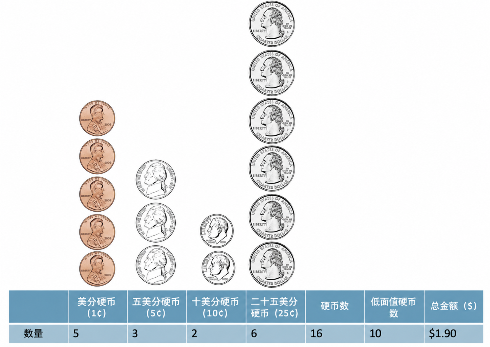
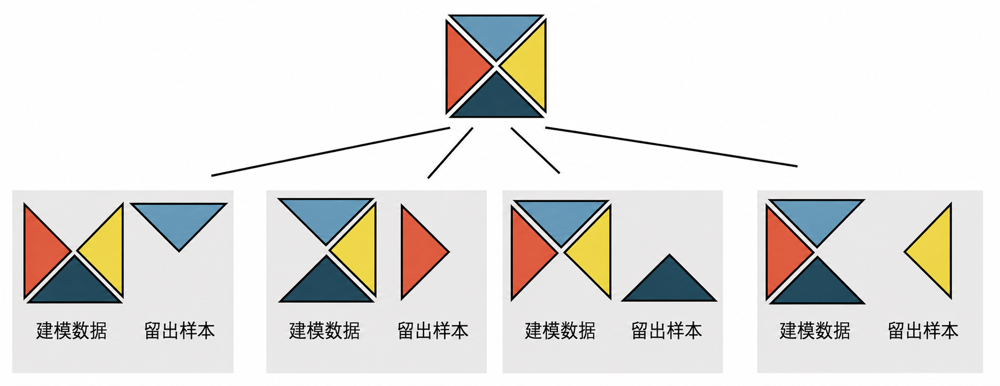
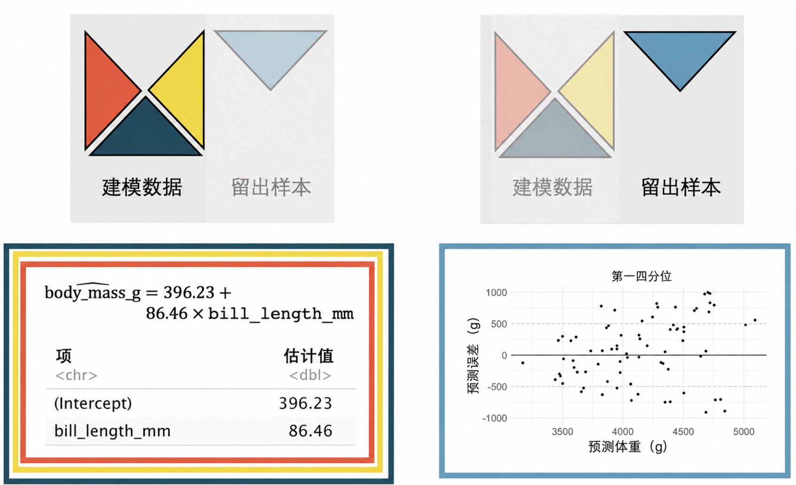
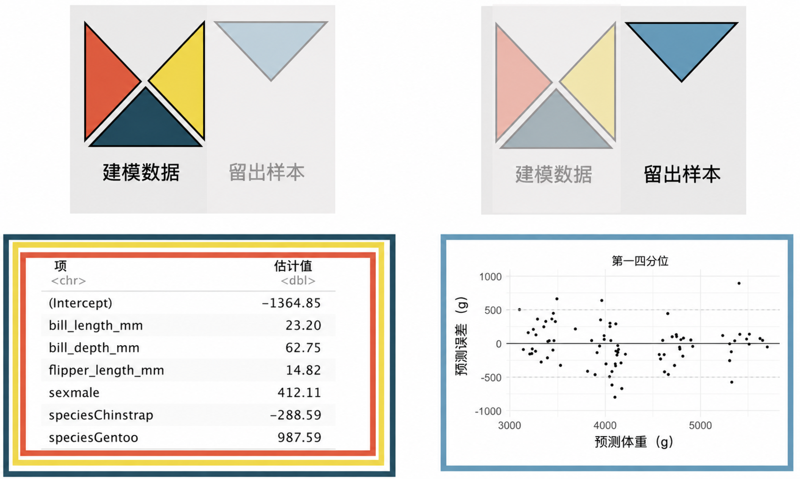

# 多元预测变量线性回归的推断 {#sec-inf-model-mlr}

\chaptermark{多元预测变量回归的推断}

```{r}
#| include: false
source("_common.R")
```


::: {.chapterintro data-latex=""}
在 [第 -@sec-model-mlr 章]中，我们使用了最小二乘回归法来估计线性模型，这些模型在给定多个解释变量的情况下预测特定的结果变量。
这里，我们将讨论每个变量是否单独作为结果变量的统计上可辨识的预测变量，或者说模型是否在没有该变量的情况下也同样有效。
也就是说，和之前一样，我们应用推断方法来探究一个变量是否可能来自其特定系数为零的总体。
如果某个线性模型系数在总体中确实为零，那么使用最小二乘法得到的该系数估计值将在零附近波动。
我们当前的推断任务是，判断该系数与零的差异是否大到足以让我们认定数据不可能来自一个真实总体系数为零的模型。
无论是基于数学模型的推导还是随机化模型的推导，都超出了本书的范围，但我们能够使用统计软件计算 p 值。
我们将讨论在多元回归背景中如何解释 p 值，并指出一些需要仔细理解变量背景及其相互关联的场景。
我们使用交叉验证作为对多元线性回归模型进行独立评估的方法。
:::

```{r}
#| include: false
terms_chp_25 <- c("inference on multiple linear regression")
```


## 软件输出的多元回归结果 {#sec-inf-mult-reg-soft}

回忆一下 [第 -@sec-model-mlr 章]中的 `loans` 数据。

::: {.data data-latex=""}
[`loans_full_schema`](http://openintrostat.github.io/openintro/reference/loans_full_schema.html) 数据可在 R 包 [**openintro**](http://openintrostat.github.io/openintro) 中找到。
基于该数据集，我们创建了两个新变量：`credit_util`，计算为总已使用信用额度除以总信用额度；以及 `bankruptcy`，它将破产次数转换成一个指示变量（0 代表无破产，1 代表至少 1 次破产）。
我们将这个修改后的数据集称为 `loans`。
:::


现在，我们的目标是创建一个模型，使用变量 `debt_to_income`、`term` 和 `credit_checks` 来预测 `interest_rate`。
正如你在 [第 -@sec-model-mlr 章]中学到的，最小二乘法可用于寻找线性模型的系数估计值。
未知的总体模型可以写为：

$$
\begin{aligned}
E[\texttt{interest\_rate}] = \beta_0 &+ \beta_1\times \texttt{debt\_to\_income} \\
&+ \beta_2 \times \texttt{term}\\
&+ \beta_3 \times \texttt{credit\_checks}\\
\end{aligned}
$$

```{r}
#| label: tbl-loansmodel
#| tbl-cap: |
#|   基于 `debt_to_income`、`term` 和 `credit_checks`
#|   预测利率的线性模型摘要。每个变量都有各自的系数估计以及 p 值。
#| tbl-pos: H
loans <- loans_full_schema |>
  mutate(
    credit_util = total_credit_utilized / total_credit_limit,
    bankruptcy = as.factor(if_else(public_record_bankrupt == 0, 0, 1)),
    verified_income = droplevels(verified_income)
  ) |>
  rename(credit_checks = inquiries_last_12m) |>
  select(
    interest_rate,
    verified_income,
    debt_to_income,
    credit_util,
    bankruptcy,
    term,
    credit_checks,
    issue_month
  )


lm(interest_rate ~ debt_to_income + term + credit_checks, data = loans) |>
  tidy() |>
  mutate(p.value = ifelse(p.value < 0.0001, "<0.0001", round(p.value, 4))) |>
  kbl(
    linesep = "",
    booktabs = TRUE,
    digits = 2,
    align = "lrrrr"
  ) |>
  kable_styling(
    bootstrap_options = c("striped", "condensed"),
    latex_options = c("striped")
  ) |>
  column_spec(1, width = "10em", monospace = TRUE) |>
  column_spec(2:5, width = "5em")
```


该回归模型的估计方程可以写成包含三个预测变量的模型：

$$
\widehat{\texttt{interest\_rate}} = 4.31 + 0.041 \times \texttt{debt\_to\_income} + 0.16 \times \texttt{term} + 0.25 \times \texttt{credit\_checks}
$$

[表 -@tbl-loansmodel]不仅提供了系数的估计值，还提供了关于推断分析（即假设检验）的信息，而这正是本章的重点。

在 [第 -@sec-inf-model-slr 章]中你已学到，对于**单预测变量**[^25-inf-model-mlr-1]的线性模型，其假设检验可以写作：\index{variable!predictor}\index{predictor variable}

[^25-inf-model-mlr-1]: 在前面章节中，使用的术语是**解释变量** \index{variable!explanatory}\index{explanatory variable} 而非**预测变量**。
    这两个词是同义的，并在不同章节中分别使用，以符合大多数分析者的习惯：检验时用解释变量，建模时用预测变量。

```{r}
#| include: false
terms_chp_25 <- c(terms_chp_25, "predictor")
```


> 若只有一个预测变量， $H_0: \beta_1 = 0.$

也就是说，如果真实的总体斜率为零，p 值衡量的是抽到能够产生所观测到的斜率值（$b_1$）的数据的可能性。

对于**多个预测变量**\index{variable!multiple predictors}\index{multiple predictors}，假设检验的形式类似，但现在它是在给定模型中其他变量的条件下进行的。

```{r}
#| include: false
terms_chp_25 <- c(terms_chp_25, "multiple predictors")
```


> 若有多个预测变量， $H_0: \beta_i = 0$ 在给定模型中其他变量的条件下

使用上面的示例，并关注每个变量的 p 值（这里我们不讨论与截距相关的 p 值），我们可以写出三个不同的假设：

-   $H_0: \beta_1 = 0$，条件是模型中包含 `term` 和 `credit_checks`
-   $H_0: \beta_2 = 0$，条件是模型中包含 `debt_to_income` 和 `credit_checks`
-   $H_0: \beta_3 = 0$，条件是模型中包含 `debt_to_income` 和 `term`

软件输出的极低 p 值告诉我们，尽管模型中包含了其他两个变量，但每个变量在模型中都是重要的预测变量。
考虑 $H_0: \beta_1 = 0$ 的 p 值。
这个低 p 值意味着，如果 `debt_to_income` 与 `interest_rate` 之间的真实关联并不存在（即，如果 $\beta_1 = 0$），并且模型也同时包含了 `term` 和 `credit_checks`，那么抽到能使 `debt_to_income` 的系数达到 0.041 这么大的数据将是极其不可能的。
你可能认为数值 0.041 很小（即接近零），但在该问题的具体背景下，0.041 实际上是远离零的，这完全取决于具体情境！
`term` 和 `credit_checks` 的 p 值可以类似地解释。

有时，一组预测变量会以不同寻常的方式影响模型，这通常源于预测变量本身存在相关。


## 多重共线性 {#sec-inf-mult-reg-collin}

在实践中，多元回归模型中的解释变量之间几乎总是存在某种程度的相关性。
对于回归模型来说，理解模型的整体上下文至关重要，尤其是对于相关的变量。
我们的讨论将侧重于阐释系数（及其符号）与其他变量之间的关系，以及每个系数的可辨识性（即 p 值）。

考虑一个例子：我们希望仅根据碟子中的硬币数量来预测碟子里有多少钱。
我们询问了 26 名学生关于他们个人硬币碟子的情况，收集了总金额、总硬币数和低值硬币数的数据。[^25-inf-model-mlr-2]
低值硬币数是指总硬币数减去夸特（25 美分）硬币的数量（夸特是美国常用硬币中最大面值的，价值 0.25 美元）。
[图 -@fig-money]展示了一个美国硬币的样本、它们的总价值（`total_amount`）、总硬币数（`number_of_coins`）和低值硬币数（`number_of_low_coins`）。

[^25-inf-model-mlr-2]: 说实话，这个特定的数据集是虚构的，问题的原始想法来自奥柏林学院的 Jeff Witmer。

```{r}
#| label: fig-money
#| fig-cap: |
#|   一个硬币样本，包含 16 个硬币，其中 10 个为低值硬币，总价值为 1.90 美元。
#| fig-alt: |
#|   图片展示了五个 1 美分、三个 5 美分、两个 10 美分和六个 25 美分硬币。一个汇总表
#|   表明总共有 16 个硬币，其中 10 个被认为是低值硬币。总金额为一美元九十美分。
#| out-width: 65%

```


收集的数据见 [图 -@fig-coinfig]，它显示总金额（`total_amount`）与总硬币数（`number_of_coins`）的相关程度，高于其与低值硬币数（`number_of_low_coins`）的相关程度。
我们还注意到，总硬币数（`number_of_coins`）和低值硬币数（`number_of_low_coins`）是正相关的。

```{r}
#| label: fig-coinfig
#| fig-cap: |
#|   描述总金额（美元）作为硬币总数或低面值硬币数的函数的两个图形。正如你可能预期的那样，总金额与硬币总数呈正相关的程度高于与低面值硬币数呈正相关的程度。
#| fig-subcap:
#|   - x 轴为硬币总数。
#|   - x 轴为低面值硬币数。
#| fig-alt: |
#|   两个散点图，y 轴均为总金额。左图的 x 轴是硬币总数。右图的 x 轴是低面值硬币数。两个图都显示出正相关，但硬币总数与总金额的相关性强于低面值硬币数与总金额的相关性。
#| layout-ncol: 2
#| fig-width: 5
#| out-width: 100%
# 数据为模拟数据
money <- tibble(
  number_of_coins = c(
    9,
    10,
    3,
    5,
    10,
    37,
    28,
    9,
    11,
    4,
    6,
    17,
    15,
    7,
    9,
    1,
    5,
    9,
    36,
    30,
    47,
    13,
    5,
    7,
    18,
    16
  ),
  number_of_low_coins = c(
    4,
    8,
    0,
    4,
    9,
    34,
    9,
    3,
    2,
    2,
    5,
    12,
    11,
    4,
    8,
    0,
    4,
    9,
    34,
    9,
    3,
    2,
    2,
    5,
    12,
    11
  ),
  total_amount = c(
    1.37,
    1.01,
    1.5,
    0.56,
    0.61,
    3.06,
    5.42,
    1.75,
    5.4,
    0.56,
    0.34,
    2.33,
    3.34,
    1.3,
    1.2,
    1.7,
    0.86,
    0.61,
    2.96,
    5.52,
    8.95,
    5.2,
    1.56,
    0.74,
    1.83,
    3.74
  )
)

ggplot(money, aes(y = total_amount, x = number_of_coins)) +
  geom_point() +
  labs(x = "硬币数量", y = "总金额（美元）")

ggplot(money, aes(y = total_amount, x = number_of_low_coins)) +
  geom_point() +
  labs(x = "低面值硬币数量", y = "总金额（美元）")
```


以 `number_of_coins`（硬币总数）作为预测变量， [表 -@tbl-coinhigh]提供的系数最小二乘估计值为 0.13。
对于盘子中每多出的一枚硬币，我们预测该学生会多拥有 US\$0.13。
系数 $b_1 = 0.13$ 有一个与之有关联的很小 p 值，这表明如果 `number_of_coins` 与总金额之间没有线性关系，我们不太可能看到像这样的数据。

\vspace{-2mm}

$$\widehat{\texttt{total\_amount}} = 0.55 + 0.13 \times \texttt{number\_of\_coins}$$

```{r}
#| label: tbl-coinhigh
#| tbl-cap: |
#|   基于硬币总数预测总金额的线性模型输出。
#| tbl-pos: H
lm(total_amount ~ number_of_coins, data = money) |>
  tidy() |>
  mutate(p.value = ifelse(p.value < .0001, "<0.0001", round(p.value, 4))) |>
  kbl(
    linesep = "",
    booktabs = TRUE,
    digits = 2
  ) |>
  kable_styling(
    bootstrap_options = c("striped", "condensed"),
    latex_options = c("striped")
  ) |>
  column_spec(1, width = "10em", monospace = TRUE) |>
  column_spec(2:5, width = "5em")
```


\vspace{-4mm}

以 `number_of_low_coins` 作为预测变量， [表 -@tbl-coinlow]提供的系数最小二乘估计值为 0.02。
对于盘子中每多出的一枚低面值硬币，我们预测该学生会多拥有 US\$0.02。
系数 $b_1 = 0.02$ 有一个与之有关联的很大 p 值，这表明即使 `number_of_low_coins` 与总金额完全没有线性关系，我们也很容易看到像我们这样的数据。

\vspace{-2mm}

$$\widehat{\texttt{total\_amount}} = 2.28 + 0.02 \times \texttt{number\_of\_low\_coins}$$
\vspace{-5mm}

```{r}
#| label: tbl-coinlow
#| tbl-cap: |
#|   基于低面值硬币数量预测总金额的线性模型输出。
#| tbl-pos: H
lm(total_amount ~ number_of_low_coins, data = money) |>
  tidy() |>
  mutate(p.value = ifelse(p.value < .0001, "<0.0001", round(p.value, 4))) |>
  kbl(
    linesep = "",
    booktabs = TRUE,
    digits = 2,
    align = "lrrrr"
  ) |>
  kable_styling(
    bootstrap_options = c("striped", "condensed"),
    latex_options = c("striped")
  ) |>
  column_spec(1, width = "10em", monospace = TRUE) |>
  column_spec(2:5, width = "5em")
```


\vspace{-5mm}

::: {.workedexample data-latex=""}
请构建一个例子：两个观测的低面值硬币数量相同，但总硬币数相差一枚。总金额的差异是多少？

------------------------------------------------------------------------

两组硬币观测：低面值硬币数量相同（均为 3 枚），但总硬币数不同（4 枚 vs 5 枚），总金额也不同（\$0.41 vs \$0.66）。

```{r}
#| label: lowsame
#| fig-alt: |
#|   展示了四枚硬币：1美分、5美分、10美分和25美分各一枚。
#|   然后加入一枚25美分，得到五枚硬币：1美分、5美分、10美分各一枚，25美分两枚。
#|   这两组硬币的低面值硬币数相同，但总硬币数不同。
#| out-width: 45%
#| fig-align: center
knitr::include_graphics("images/lowsame.png")
```

:::

\vspace{-5mm}

::: {.workedexample data-latex=""}
请构建一个例子：两个观测的总硬币数相同，但低面值硬币数量不同。总金额的差异是多少？

------------------------------------------------------------------------

两组硬币观测：总硬币数相同（均为 4 枚），但低面值硬币数量不同（3 枚 vs 4 枚），总金额也不同（\$0.41 vs \$0.17）。

```{r}
#| label: totalsame
#| fig-alt: |
#|   展示了四枚硬币：1美分、5美分、10美分和25美分各一枚。
#|   然后将25美分替换为1美分，得到新的四枚硬币：两枚1美分，一枚5美分，一枚10美分。
#|   这两组硬币的总硬币数相同，但低面值硬币数不同。
#| out-width: 45%
#| fig-align: center
knitr::include_graphics("images/totalsame.png")
```

:::


使用总 `number_of_coins` 和 `number_of_low_coins` 这两个变量作为预测变量， [表 -@tbl-coinhighlow]给出了两个系数的最小二乘估计值，分别为 0.21 和 -0.16。现在，模型中有两个变量，解释也变得更加微妙。

-   系数的解释总是表示在一个变量发生变化时，**同时保持另一个（或几个）变量不变**。\
    对于盘子中每增加一枚硬币（**同时**保持 `number_of_low_coins` 不变），我们预测该学生将多拥有 US\$0.21。重新审视"盘子中每增加一枚硬币**同时**低面值硬币数保持不变"这一表述，我们会意识到每次增加的只是一枚额外的 25 美分硬币（更大的样本量会使 $b_1$ 系数更接近 0.25，这是因为此处描述的是确定性关系）。\
-   对于盘子中每增加一枚低面值硬币（**同时**保持总 `number_of_coins` 不变），我们预测该学生将少拥有 US\$0.16。再次思考"**在总硬币数不变的前提下**，盘子中每增加一枚低面值硬币"这句话，我们会意识到这相当于用一枚 1 美分、5 美分或 10 美分硬币替换了一枚 25 美分硬币。

结合我们对美国硬币的了解，对比 [表 -@tbl-coinhigh]、 [表 -@tbl-coinlow]和 [表 -@tbl-coinhighlow]中的系数，有助于我们理解变量之间的相关关系，以及为什么系数的符号会因模型而异。然而，也要注意，`number_of_low_coins` 系数的 p 值从 [表 -@tbl-coinlow]到 [表 -@tbl-coinhighlow]发生了变化。这是合理的：`number_of_low_coins` 变量当它与总 `number_of_coins` 一同作为多元线性回归模型的一部分时，比它单独作为简单线性回归模型中的唯一变量时，能提供关于 `total_amount` 的更多信息。

$$
\begin{aligned}
\widehat{\texttt{total\_amount}} = 0.80 &+ 0.21 \times \texttt{number\_of\_coins} \\
&- 0.16 \times \texttt{number\_of\_low\_coins}
\end{aligned}
$$

```{r}
#| label: tbl-coinhighlow
#| tbl-cap: |
#|    基于总硬币数和低面值硬币数预测总金额的线性模型输出。
#| tbl-pos: H
lm(total_amount ~ number_of_coins + number_of_low_coins, data = money) |>
  tidy() |>
  mutate(p.value = ifelse(p.value < .0001, "<0.0001", round(p.value, 4))) |>
  kbl(
    linesep = "",
    booktabs = TRUE,
    digits = 2,
    align = "lrrrr"
  ) |>
  kable_styling(
    bootstrap_options = c("striped", "condensed"),
    latex_options = c("striped")
  ) |>
  column_spec(1, width = "10em", monospace = TRUE) |>
  column_spec(2:5, width = "5em")
```


在使用多元回归模型时，解释模型系数并不总是像硬币例子那样直接。然而，我们鼓励你始终仔细思考模型中的变量，考虑它们彼此之间可能存在的相关关系，并尝试不同的模型，以观察使用不同的变量集如何可能对预测所关注的响应变量产生不同的关系。

::: {.important data-latex=""}
**多重共线性。**

当预测变量之间存在相关关系时，就会发生**多重共线性**\index{multicollinearity}。
当预测变量之间存在相关性时，多元回归模型中的系数会变得难以解释。
:::

```{r}
#| include: false
terms_chp_25 <- c(terms_chp_25, "multicollinearity")
```


虽然深入探讨细节超出了本书的范围，但我们还是想对多重共线性再补充一点说明。
如果预测变量之间存在一定程度的相关性，那么解释系数的数值或者判断该变量是否是结果变量的一个统计上可辨识的预测变量，都会变得相当困难。
然而，即便是受高多重共线性影响的模型，仍可能产生对响应变量的无偏预测。
因此，如果手头的任务仅仅是进行预测（而不是解释系数），那么多重共线性可能不会带来实质性的问题。

```{=html}
<!--
Things I didn't talk about but could:

* add R^2 and R^2_adj to the coin model
* For assessing model fit, as is necessary, we will create residual plots of residual vs. fitted (instead of residual vs. X as we saw previously).
* Give another example here with a quadratic relationship and the wonky things that can happen with the p-values.
-->
```


## 用于预测误差的交叉验证 {#sec-inf-mult-reg-cv}

在 [第 -@sec-inf-mult-reg-soft 节]中，我们计算了每个模型系数的 p 值。
p 值能让人了解哪些变量对模型重要；然而，关于变量选择更全面的处理方法值得在后续课程或教科书中进行。
在这里，我们使用**交叉验证**\index{cross-validation} **预测误差**\index{prediction error}来关注哪些变量对预测我们关注的响应变量是重要的。
通常，线性模型也用于对单个观测进行预测。
除构建模型外，交叉验证还提供了一种生成预测的方法，这些预测不会对当前特定数据集过度拟合。
我们仍然鼓励你对交叉验证这一主题进行深入研究，因为它是现代数据分析中最重要的思想之一，而我们在此仅能作初步介绍。

交叉验证是一种计算技术，它在运行模型之前移除部分观测，然后在留置样本上评估模型的准确率。
通过移除部分观测，我们为自己提供了对模型的独立评估（也就是说，被移除的观测不会参与寻找最小化最小二乘方程的参数）。
交叉验证可以以多种不同方式（作为独立评估手段）使用，而在这里，我们仅就如何使用该技术来比较模型这一点进行初步介绍。
关于交叉验证过程的直观展示，请参见 [图 -@fig-cv]。

```{r}
#| label: fig-cv
#| fig-cap: |
#|   数据集被分成 k 折（此处 k = 4）。每次留出一折，使用其余的 k-1 折数据建立一个模型，
#|   并在完全独立于模型估计的单个留置样本上计算预测值。
#| fig-alt: |
#|   一个正方形代表原始的观测数据，它被划分为四个三角形部分。基于这种原始划分，考虑了四种不同的设置。
#|   第一种设置是，使用数据的红色、绿色和黄色三角形部分来建立模型；数据的蓝色三角形部分被留置，用于独立的模型预测。
#|   第二种设置是，使用数据的蓝色、绿色和黄色三角形部分来建立模型；数据的红色三角形部分被留置，用于独立的模型预测。
#|   第三种设置是，使用数据的红色、蓝色和黄色三角形部分来建立模型；数据的绿色三角形部分被留置，用于独立的模型预测。
#|   第四种设置是，使用数据的红色、绿色和蓝色三角形部分来建立模型；数据的黄色三角形部分被留置，用于独立的模型预测。
#| fig-width: 10.0

```


```{r}
#| include: false
terms_chp_25 <- c(terms_chp_25, "cross-validation", "prediction error")
```


::: {.data data-latex=""}
[`penguins`](https://allisonhorst.github.io/palmerpenguins/articles/intro.html) 数据可以在 [**palmerpenguins**](https://github.com/allisonhorst/palmerpenguins) R 包中找到。
:::

我们本节的目标是比较两个不同的回归模型，它们都试图以克为单位预测单个企鹅的体重。
三个不同企鹅物种的观测数据包括体型和性别的测量值。
这些数据由 [Kristen Gorman 博士](https://www.uaf.edu/cfos/people/faculty/detail/kristen-gorman.php) 和 [南极 Palmer 站长期生态研究站](https://pal.lternet.edu/) 收集，作为[长期生态研究网络](https://lternet.edu/)的一部分。
[@Gorman:2014]尽管与这项研究项目并不完全吻合，但你可以想象这样一种场景：已知企鹅的尺寸（例如，通过航拍照片），但不知道其体重。
第一个模型仅使用 `bill_length_mm`（一个表示企鹅喙长度的变量，单位为毫米）来预测 `body_mass_g`。
第二个模型使用 `bill_length_mm`、`bill_depth_mm`、`flipper_length_mm`、`sex` 和 `species` 来预测 `body_mass_g`。

::: {.important data-latex=""}
**预测误差。**

预测误差（之前也称为**残差**）是观测值与（回归模型的）预测值之间的差值。

$$\text{预测误差}_i = e_i = y_i - \hat{y}_i$$
:::

下面的展示（参见 [图 -@fig-peng-mass1]和 [图 -@fig-peng-mass2]的比较）表明，与仅使用 `bill_length_g` 的模型相比，使用更多变量的模型预测 `body_mass_g` 的误差（预测体重减去实际体重）要小得多。
我们特意选择了一个在直觉上合理的模型（身体测量值越多，体重就越可预测）。
然而，在许多情况下，并不清楚哪些变量或哪些模型对提高预测准确性贡献最大。
交叉验证是一种获得准确的独立预测的方法，可用于比较不同的模型。

### 比较两个预测企鹅体重的模型

我们将寻求回答的问题是：与仅使用 `bill_length_mm` 的模型相比，当模型中使用 `bill_length_mm`、`bill_depth_mm`、`flipper_length_mm`、`sex` 和 `species` 时，对 `body_mass_g` 的预测是否显著更好。

我们称仅包含 `bill_length_mm` 的模型为**较小**模型。
其系数估计值、标准误和 p 值见 [表 -@tbl-peng-lm-bill]。
我们称使用 `bill_length_mm`、`bill_depth_mm`、`flipper_length_mm`、`sex` 和 `species` 的模型为**较大**模型。
其系数估计值、标准误和 p 值见 [表 -@tbl-peng-lm-all]。
鉴于我们所知的身体测量值之间的高相关性，所有变量的 p 值都很低在一定程度上并不令人意外，这表明在控制模型中所有其他变量的条件下，每个变量都是 `body_mass_g` 的一个统计上可辨识的预测变量。
然而，在本节中，我们将超越对 p 值的使用，通过考虑对 `body_mass_g` 的独立预测来比较较小模型和较大模型。

\vspace{10mm}

**较小模型：**

$$
\begin{aligned}
E[\texttt{body\_mass\_g}] &= \ \beta_0 + \beta_1 \times \texttt{bill\_length\_mm}\\
\widehat{\texttt{body\_mass\_g}} &= \ 362.31 + 87.42 \times \texttt{bill\_length\_mm}\\
\end{aligned}
$$

```{r}
#| label: tbl-peng-lm-bill
#| tbl-cap: |
#|   根据 `bill_length_mm` 预测 `body_mass_g` 的
#|   较小回归模型的最小二乘估计。
#| tbl-pos: H
lm(body_mass_g ~ bill_length_mm, data = penguins) |>
  tidy() |>
  mutate(p.value = ifelse(p.value < .0001, "<0.0001", round(p.value, 4))) |>
  kbl(
    linesep = "",
    booktabs = TRUE,
    digits = 2,
    align = "lrrrr"
  ) |>
  kable_styling(
    bootstrap_options = c("striped", "condensed"),
    latex_options = c("striped")
  ) |>
  column_spec(1, width = "10em", monospace = TRUE) |>
  column_spec(2:5, width = "5em")
```


**较大模型：**

$$
\begin{aligned}
E[\texttt{body\_mass\_g}] = \beta_0 &+ \beta_1 \times \texttt{bill\_length\_mm} \\
&+ \beta_2 \times \texttt{bill\_depth\_mm} \\
&+ \beta_3 \times \texttt{flipper\_length\_mm} \\
&+ \beta_4 \times \texttt{sex}\_{male} \\
&+ \beta_5 \times \texttt{species}\_{Chinstrap} \\
&+ \beta_6 \times \texttt{species}\_{Gentoo}\\
\widehat{\texttt{body\_mass\_g}} = -1460.99 &+ 18.20 \times \texttt{bill\_length\_mm} \\
&+ 67.22 \times \texttt{bill\_depth\_mm} \\
&+ 15.95 \times \texttt{flipper\_length\_mm} \\
&+ 389.89 \times \texttt{sex}\_{male} \\
&- 251.48 \times \texttt{species}\_{Chinstrap} \\
&+ 1014.63 \times \texttt{species}\_{Gentoo}\\
\end{aligned}
$$

```{r}
#| label: tbl-peng-lm-all
#| tbl-cap: |
#|   根据 `bill_length_mm`、`bill_depth_mm`、`flipper_length_mm`、`sex`
#|   和 `species` 预测 `body_mass_g` 的较大回归模型
#|   的最小二乘估计。
#| tbl-pos: H
lm(
  body_mass_g ~ bill_length_mm +
    bill_depth_mm +
    flipper_length_mm +
    sex +
    species,
  data = penguins
) |>
  tidy() |>
  mutate(p.value = ifelse(p.value < .0001, "<0.0001", round(p.value, 4))) |>
  kbl(
    linesep = "",
    booktabs = TRUE,
    digits = 2,
    align = "lrrrr"
  ) |>
  kable_styling(
    bootstrap_options = c("striped", "condensed"),
    latex_options = c("striped")
  ) |>
  column_spec(1, width = "10em", monospace = TRUE) |>
  column_spec(2:5, width = "5em")
```

为了在**预测企鹅体重的能力**方面比较较小模型与较大模型，我们需要构建能够基于交叉验证生成的留出样本中的企鹅提供独立预测的模型。
重申一下，每一个（组合起来后）能让我们区分较小模型与较大模型的预测，都独立于用于构建模型的数据。
在此例中，使用交叉验证时，我们在运行最小二乘计算之前会先移除四分之一的数据。
然后，使用该最小二乘模型对留出样本中企鹅的 `body_mass_g` 进行预测。
这里我们使用 4 折交叉验证（即每次移除四分之一的数据）来为每个模型生成四个不同的版本（在其他情况下，使用 2 折或 10 折交叉验证，甚至每次移除单个数据点后分别运行模型可能更为合适）。

[图 -@fig-massCV1]展示了模型如何对 3/4 的数据进行拟合（注意与 [表 -@tbl-peng-lm-bill]相比，系数存在细微差异），然后对留出样本进行预测。

```{r}
#| label: fig-massCV1
#| fig-cap: |
#|   小模型。使用仅含一个预测变量的最小二乘模型在 3/4 的数据集上估计系数。
#|   对剩余 1/4 的观测进行预测。散点图的 y 轴代表残差，即真实观测值减去预测值。
#|   注意，这些预测独立于所估计的模型系数。
#| fig-alt: |
#|   左侧面板显示了用喙长（单位：mm）预测体重（单位：克）的线性模型；该模型是使用观测数据中的红色、绿色和黄色三角区段构建的。
#|   右侧面板显示了观测数据的蓝色三角区段中，预测误差与拟合值的散点图。
#|   预测误差范围大约在 -1,000 克到 +1,000 克之间。
#| out-width: 90%

```

通过对每一个留出的四分之一样本重复此过程，可以将模型的残差与预测值绘制成图。
我们看到预测误差呈散布状态，这表明模型拟合良好，但预测误差在真实体重 $\pm$ 1,000 g 的范围内波动。

```{r}
#| label: fig-peng-mass1
#| fig-cap: |
#|   小模型。每次将四分之一的数据从建模过程中移除，然后预测被移除企鹅的体重。
#|   最小二乘回归模型的拟合独立于被移除的企鹅。
#|   体重的预测仅基于喙长。
#|   横轴代表预测值，纵轴代表误差，即实际值与预测值之差。
#| fig-alt: |
#|   每次将四分之一的数据从建模过程中移除，然后预测被移除企鹅的体重。最小二乘回归模型的拟合独立于被移除的企鹅。体重的预测仅基于喙长。横轴代表预测值，纵轴代表误差，即实际值与预测值之差。提供了四幅不同的散点图，每幅对应一组预测（基于数据集的四分之一）。所有四组误差值都围绕零值分布，大多数观测的误差在 -500 到 +500 之间。几乎所有误差都在 -1,000 到 +1,000 之间。
#| out-width: 100%
#| fig-asp: 0.6
set.seed(47)
penguins <- penguins |> na.omit()

penguinfolds <- caret::createFolds(penguins$body_mass_g, k = 4)

data.frame(
  predicted = lm(
    body_mass_g ~ bill_length_mm,
    data = penguins[-penguinfolds$Fold1, ]
  ) |>
    predict(newdata = penguins[penguinfolds$Fold1, c("bill_length_mm")]),
  obs = penguins[penguinfolds$Fold1, ]$body_mass_g,
  fold = rep("1st quarter", length(penguinfolds$Fold1))
) |>
  rbind(data.frame(
    predicted = lm(
      body_mass_g ~ bill_length_mm,
      data = penguins[-penguinfolds$Fold2, ]
    ) |>
      predict(newdata = penguins[penguinfolds$Fold2, c("bill_length_mm")]),
    obs = penguins[penguinfolds$Fold2, ]$body_mass_g,
    fold = rep("2nd quarter", length(penguinfolds$Fold2))
  )) |>
  rbind(data.frame(
    predicted = lm(
      body_mass_g ~ bill_length_mm,
      data = penguins[-penguinfolds$Fold3, ]
    ) |>
      predict(newdata = penguins[penguinfolds$Fold3, c("bill_length_mm")]),
    obs = penguins[penguinfolds$Fold3, ]$body_mass_g,
    fold = rep("3rd quarter", length(penguinfolds$Fold3))
  )) |>
  rbind(data.frame(
    predicted = lm(
      body_mass_g ~ bill_length_mm,
      data = penguins[-penguinfolds$Fold4, ]
    ) |>
      predict(newdata = penguins[penguinfolds$Fold4, c("bill_length_mm")]),
    obs = penguins[penguinfolds$Fold4, ]$body_mass_g,
    fold = rep("4th quarter", length(penguinfolds$Fold4))
  )) |>
  mutate(error = obs - predicted) |>
  # mutate(error2 = error^2) |> summarize(sum(error2)) |> pull() |> format(scientific = FALSE)
  ggplot(aes(x = predicted, y = error)) +
  geom_point() +
  geom_hline(yintercept = 0) +
  geom_hline(yintercept = 500, lty = 2, color = "grey") +
  geom_hline(yintercept = -500, lty = 2, color = "grey") +
  facet_wrap(~fold) +
  ylim(c(-1000, 1000)) +
  labs(
    x = "预测体重 (g)",
    y = "预测误差 (g)"
  )
```


```{r}
#| label: fig-peng-mass1-output
#| eval: false
# this code is used to create the powerpoint images above
massCV1 <- data.frame(
  predicted = lm(
    body_mass_g ~ bill_length_mm,
    data = penguins[-penguinfolds$Fold1, ]
  ) |>
    predict(newdata = penguins[penguinfolds$Fold1, c("bill_length_mm")]),
  obs = penguins[penguinfolds$Fold1, ]$body_mass_g,
  fold = rep("1st quarter", length(penguinfolds$Fold1))
)

lm(body_mass_g ~ bill_length_mm, data = penguins[-penguinfolds$Fold1, ]) |>
  tidy() |>
  select(term, estimate) |>
  mutate(estimate = round(estimate, 2))

massCV1 |>
  mutate(error = obs - predicted) |>
  ggplot(aes(x = predicted, y = error)) +
  geom_point() +
  geom_hline(yintercept = 0) +
  geom_hline(yintercept = 500, lty = 2, color = "grey") +
  geom_hline(yintercept = -500, lty = 2, color = "grey") +
  facet_wrap(~fold) +
  ylim(c(-1000, 1000)) +
  labs(
    x = "预测体重 (g)",
    y = "预测误差 (g)"
  )
```


交叉验证 SSE 是与这些预测相关联的误差平方和。
令 $\hat{y}_{cv,i}$ 为第 $i$ 个观测的预测值，其中第 $i$ 个观测位于留出折中，而其他三折用于构建线性模型。
对于仅使用 `bill_length_mm` 预测 `body_mass_g` 的模型，其交叉验证 SSE 为 141,552,822。

::: {.important data-latex=""}
**交叉验证 SSE。**

交叉验证模型的预测误差可用于计算模型的一个单一数值概括。
交叉验证 SSE 即为交叉验证预测误差的平方和。

$$\mbox{交叉验证 SSE} = \sum_{i=1}^n (\hat{y}_{cv,i} - y_i)^2$$

:::

对于包含更多解释变量的模型，我们重复相同的过程。
请注意，第一次交叉验证模型（在 [图 -@fig-massCV2]中）估计出的系数与基于整个数据集计算出的估计值（见于 [表 -@tbl-peng-lm-all]）略有不同。
[图 -@fig-massCV2]展示了多元模型的交叉验证过程，完整的残差图显示在 [图 -@fig-peng-mass2]中。
注意，残差大多在 $\pm$ 500g 之内，从而对独立的企鹅体重值的预测要精确得多。

```{r}
#| label: fig-massCV2
#| fig-cap: |
#|   大模型。使用指定的五个预测变量，在数据集 3/4 的部分上，
#|   利用最小二乘模型估计系数。
#|   预测是在剩余 1/4 的观测上进行的。
#|   散点图的 y 轴代表残差（真实观测值减去预测值）。
#|   请注意，这些预测独立于所估计的模型系数。
#| fig-alt: |
#|   左图展示了使用喙长、喙深、鳍肢长度、性别和物种
#|   来预测体重（克）的线性模型；该模型是使用观测数据中
#|   红色、绿色和黄色的三角形区域构建的。
#|   右图显示了观测数据的蓝色三角形区域中那组观测的
#|   预测误差相对于拟合值的散点图。
#|   预测误差的范围大约从 -500 克到 +500 克。
#| out-width: 90%

```

```{r}
#| label: fig-peng-mass2
#| fig-cap: |
#|   较大的模型。每次将四分之一的数据排除在模型构建之外，并对被排除企鹅的体重进行预测。
#|   最小二乘回归模型仅基于未被排除的企鹅数据进行拟合。体重的预测基于 [表 -@tbl-peng-lm-all]中描述的五个变量。
#|   x 轴代表预测值，y 轴代表误差，即预测值与真实值之差。
#| fig-alt: |
#|   每次将四分之一的数据排除在模型构建之外，并对被排除企鹅的体重进行预测。
#|   最小二乘回归模型仅基于未被排除的企鹅数据进行拟合。体重的预测基于较大模型中描述的五个变量。
#|   x 轴代表预测值，y 轴代表误差，即预测值与真实值之差。提供了四个不同的散点图，分别对应每组预测（基于数据集的四分之一）。
#|   所有四组误差值均以零为中心分布，几乎所有误差都在 -500 到 +500 之间。
#| out-width: 100%
#| fig-asp: 0.6
data.frame(
  predicted = lm(
    body_mass_g ~ bill_length_mm +
      bill_depth_mm +
      flipper_length_mm +
      sex +
      species,
    data = penguins[-penguinfolds$Fold1, ]
  ) |>
    predict(
      newdata = penguins[
        penguinfolds$Fold1,
        c(
          "bill_length_mm",
          "bill_depth_mm",
          "flipper_length_mm",
          "sex",
          "species"
        )
      ]
    ),
  obs = penguins[penguinfolds$Fold1, ]$body_mass_g,
  fold = rep("1st quarter", length(penguinfolds$Fold1))
) |>
  rbind(data.frame(
    predicted = lm(
      body_mass_g ~ bill_length_mm +
        bill_depth_mm +
        flipper_length_mm +
        sex +
        species,
      data = penguins[-penguinfolds$Fold2, ]
    ) |>
      predict(
        newdata = penguins[
          penguinfolds$Fold2,
          c(
            "bill_length_mm",
            "bill_depth_mm",
            "flipper_length_mm",
            "sex",
            "species"
          )
        ]
      ),
    obs = penguins[penguinfolds$Fold2, ]$body_mass_g,
    fold = rep("2nd quarter", length(penguinfolds$Fold2))
  )) |>
  rbind(data.frame(
    predicted = lm(
      body_mass_g ~ bill_length_mm +
        bill_depth_mm +
        flipper_length_mm +
        sex +
        species,
      data = penguins[-penguinfolds$Fold3, ]
    ) |>
      predict(
        newdata = penguins[
          penguinfolds$Fold3,
          c(
            "bill_length_mm",
            "bill_depth_mm",
            "flipper_length_mm",
            "sex",
            "species"
          )
        ]
      ),
    obs = penguins[penguinfolds$Fold3, ]$body_mass_g,
    fold = rep("3rd quarter", length(penguinfolds$Fold3))
  )) |>
  rbind(data.frame(
    predicted = lm(
      body_mass_g ~ bill_length_mm +
        bill_depth_mm +
        flipper_length_mm +
        sex +
        species,
      data = penguins[-penguinfolds$Fold4, ]
    ) |>
      predict(
        newdata = penguins[
          penguinfolds$Fold4,
          c(
            "bill_length_mm",
            "bill_depth_mm",
            "flipper_length_mm",
            "sex",
            "species"
          )
        ]
      ),
    obs = penguins[penguinfolds$Fold4, ]$body_mass_g,
    fold = rep("4th quarter", length(penguinfolds$Fold4))
  )) |>
  mutate(error = obs - predicted) |>
  # mutate(error2 = error^2) |> summarize(sum(error2)) |> pull() |> format(scientific = FALSE)
  ggplot(aes(x = predicted, y = error)) +
  geom_point() +
  geom_hline(yintercept = 0) +
  geom_hline(yintercept = 500, lty = 2, color = "grey") +
  geom_hline(yintercept = -500, lty = 2, color = "grey") +
  facet_wrap(~fold) +
  ylim(c(-1000, 1000)) +
  labs(
    x = "预测体重 (克)",
    y = "预测误差 (克)"
  )
```

```{r}
#| label: peng-mass2-output
#| eval: false
# 此代码用于创建上方的 PowerPoint 图像

massCV1 <- data.frame(
  predicted = lm(
    body_mass_g ~ bill_length_mm +
      bill_depth_mm +
      flipper_length_mm +
      sex +
      species,
    data = penguins[-penguinfolds$Fold1, ]
  ) |>
    predict(
      newdata = penguins[
        penguinfolds$Fold1,
        c(
          "bill_length_mm",
          "bill_depth_mm",
          "flipper_length_mm",
          "sex",
          "species"
        )
      ]
    ),
  obs = penguins[penguinfolds$Fold1, ]$body_mass_g,
  fold = rep("1st quarter", length(penguinfolds$Fold1))
)

lm(
  body_mass_g ~ bill_length_mm +
    bill_depth_mm +
    flipper_length_mm +
    sex +
    species,
  data = penguins[-penguinfolds$Fold1, ]
) |>
  tidy() |>
  select(term, estimate) |>
  mutate(estimate = round(estimate, 2))

massCV1 |>
  mutate(error = obs - predicted) |>
  ggplot(aes(x = predicted, y = error)) +
  geom_point() +
  geom_hline(yintercept = 0) +
  geom_hline(yintercept = 500, lty = 2, color = "grey") +
  geom_hline(yintercept = -500, lty = 2, color = "grey") +
  facet_wrap(~fold) +
  ylim(c(-1000, 1000)) +
  labs(
    x = "预测体重",
    y = "预测误差"
  ) +
  theme(text = element_text(size = 20))
```


[图 -@fig-peng-mass1]显示，独立预测以真实值为中心分布（即误差以零为中心分布），但当仅使用 `bill_length_mm` 来预测 `body_mass_g` 时，预测偏差可能高达 1,000 克。
另一方面，当使用 `bill_length_mm`、`bill_depth_mm`、`flipper_length_mm`、`sex` 和 `species` 来预测 `body_mass_g` 时，如 [图 -@fig-peng-mass2]所示，预测误差似乎大约只有前者的一半。
对于使用 `bill_length_mm`、`bill_depth_mm`、`flipper_length_mm`、`sex` 和 `species` 来预测 `body_mass_g` 的模型，其 CV SSE 为 27,728,698（相比之下，较小模型的 CV SSE 为 141,552,822）。
这与目视比较两组残差图的结果一致：使用更多预测变量的模型，其预测误差平方和更小。
根据交叉验证预测误差准则，包含更多预测变量的模型似乎是更好的模型。

我们对交叉验证进行了非常简要的概述并提供了应用示例。
交叉验证是一种用于模型构建和模型验证的计算方法，可以作为依赖 p 值的替代方案。
虽然 p 值在理解模型系数方面发挥着作用，但在全书中，我们不断介绍旨在拓宽数据分析统计方法的计算方法。
在 [第 -@sec-inf-model-logistic 章]的逻辑斯谛回归中，我们将再次使用交叉验证。
我们鼓励你在构建和使用各种多元模型时，同时考虑标准推断方法（如 p 值）和计算方法（如交叉验证）。


## 章节回顾 {#sec-chp25-review}

### 小结

基于 [第 -@sec-model-mlr 章]的建模思想，我们现在介绍了评估系数（基于 p 值）和评估模型（交叉验证）的方法。
在单一模型中处理多个变量时，有许多重要方面需要考虑，而我们仅浅谈了其中几个主题。
请记住，多重共线性可能导致系数解释变得困难。
本书未涉及但对多元回归模型很重要的一个主题是交互作用，我们希望你随着建模技能的不断提升，能更多地了解变量如何共同作用。

### 术语

本章介绍的术语列于 [表 -@tbl-terms-chp-25]中。
如果你不确定其中某些术语的含义，建议你回到正文中回顾其定义。
你应该能很容易地发现它们，因为它们是**粗体文本**。

```{r}
#| label: tbl-terms-chp-25
#| tbl-cap: 本章介绍的术语。
#| tbl-pos: H
make_terms_table(terms_chp_25)
```


## 练习题 {#sec-chp25-exercises}

奇数编号练习的答案可在 [附录 -@sec-exercise-solutions-25]中找到。

::: {.exercises data-latex=""}

:::