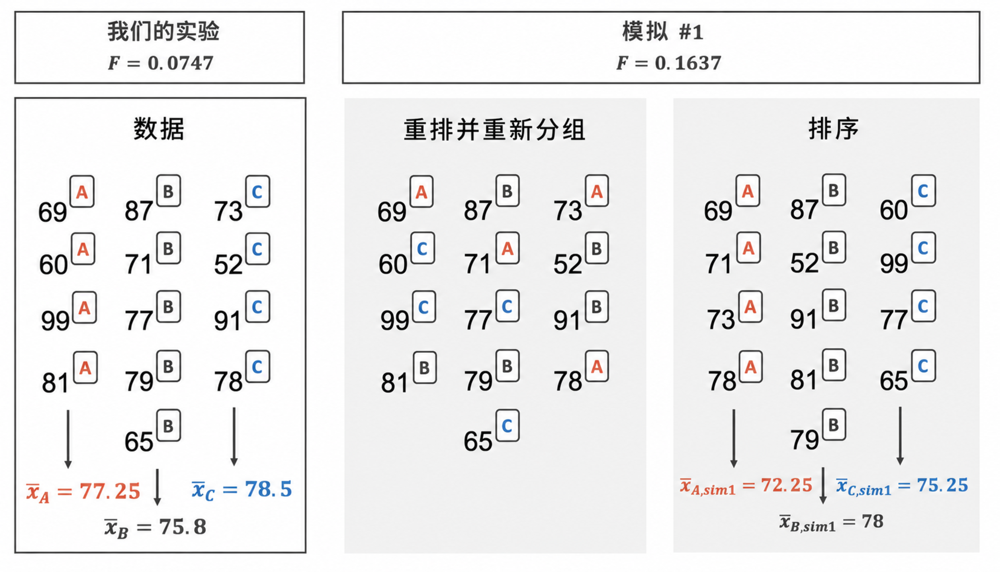

# 比较多个均值的推断 {#sec-inference-many-means}

```{r}
#| include: false
source("_common.R")
```


::: {.chapterintro data-latex=""}
在 [第 -@sec-inference-two-means 章]中，我们进行了分析以比较两个不同组的总体平均数。该分析的一个重要方面是将样本均值之差作为总体均值之差的估计。当比较多于两个组时，差值（即减法）将无法完全捕捉三个或更多组之间变异的细微差别。与两组比较一样，研究问题将聚焦于分组变量是否独立于数值的响应变量。这里，组间的独立性意味着，已知一组的观测并不会改变我们对另一组会发生什么的预期。但如果各组是**相依的**，会发生什么呢？本节我们将关注一个能够纳入多于两组均值差异的新统计量。尽管本章的思想与 t 检验非常相似，但它们拥有了自己的专属名称：**方差分析**（英文名称缩写为 **ANOVA**）\index{Analysis of Variance}\index{ANOVA}。
:::

\index{analysis of variance (ANOVA)}

有时我们想要比较多组的均值。我们最初可能会想到进行两两比较。例如，如果有三个组，我们可能会想要先比较第一个和第二个均值，然后比较第一个和第三个均值，最后再比较第二个和第三个均值，总共进行三次比较。然而，这种策略可能靠不住。如果我们有很多组并进行很多次比较，即使总体中没有差异，我们也很有可能会仅仅由于偶然性最终发现某个差异。相反，我们应该采用一个**整体性检验**来检查是否有证据表明至少有一对组实际上是不同的，这正好是 **ANOVA** 的用武之地。

```{r}
#| include: false
terms_chp_22 <- c("ANOVA", "analysis of variance")
```


在本节中，我们将学习一种名为**方差分析（ANOVA）**的新方法，以及一种名为 **$F$ 统计量**的新检验统计量（我们将在讨论数学模型时介绍它）。ANOVA 使用一次假设检验来检查多组均值是否相等：

-   $H_0:$ 所有组的结果变量的均值相同，即 $\mu_1 = \mu_2 = \cdots = \mu_k$，其中 $\mu_j$ 代表第 $j$ 类别中观测的结果变量的均值。
-   $H_A:$ 至少有一个均值不同。

通常，在进行 ANOVA 之前，我们必须检查数据是否满足三个条件：

-   组内和组间的观测是独立的，
-   每组内的响应近似正态分布，且
-   各组之间的变异性大致相等。

当这三个技术条件得到满足时，我们可以进行 ANOVA 来确定数据是否提供了令人信服的证据来反对“所有 $\mu_j$ 都相等”的原假设。

::: {.workedexample data-latex=""}
由于需求量大，大学院系通常每学期会为同一门导论课程开设多个班级。假设一个统计系开设了三个初级统计学课程的班级。我们可能想确定这三个班级（A班、B班和C班）的第一次考试成绩是否有显著差异。请描述适当的假设以确定三个班级之间是否存在任何差异。

------------------------------------------------------------------------

假设可按以下形式书写：

-   $H_0:$ 所有班级的平均分相同，即 $\mu_A = \mu_B = \mu_C$。假设每个班级的难度相同，则观察到的考试成绩差异是由偶然性造成的。
-   $H_A:$ 平均分因班级而异。如果班级平均分之间的差异大于我们仅凭偶然性所能预期的，我们将拒绝原假设，转而支持备择假设。
:::

ANOVA 中支持备择假设的有力证据表现为组均值之间异常大的差异。我们很快将认识到，评估组均值的变异性和每组内个体观测的变异性之间的相对大小，是 ANOVA 成功的关键。

::: {.workedexample data-latex=""}
查看 [图 -@fig-toyANOVA]。
比较第 I、II、III 组。
你能从视觉上判断，如果各组之间不存在差异，那么观察到的组中心差异是否不太可能出现吗？
现在比较第 IV、V、VI 组。
如果各组之间不存在差异，这些差异看起来是否不太可能出现？

------------------------------------------------------------------------

第 I、II、III 组的均值之间任何真实的差异都难以辨别，因为每组内数据的波动相对于结果变量平均数的任何差异而言都非常大。
另一方面，第 IV、V、VI 组的中心似乎存在差异。
例如，第 V 组的均值似乎高于其他两组。
考察第 IV、V、VI 组，我们发现各组中心的差异是明显的，因为这些差异相对于*各组内个体观测的变异性*而言较大。
:::

```{r}
#| label: fig-toyANOVA
#| fig-cap: |
#|   六个组结果变量的并排点图。包含两组分组：第一组由第 I、II、III 组构成，
#|   第二组由第 IV、V、VI 组构成。
#| fig-alt: |
#|   两组并排点图。第一组显示了三个观测组，其中组内变异性非常大，以至于盖过了组间的任何变异性。第二组显示了三个观测组，其中组内变异性要小得多，各组的中心看起来不同。
#| fig-asp: 0.5
toy_anova |>
  mutate(group2 = if_else(group %in% c("I", "II", "III"), "A", "B")) |>
  ggplot(aes(x = group, y = outcome, color = group2, shape = group2)) +
  geom_point(alpha = 0.7, size = 2, show.legend = FALSE) +
  scale_color_openintro() +
  facet_wrap(~group2, nrow = 1, scales = "free_x") +
  labs(x = "Group", y = "Outcome") +
  theme(strip.text = element_blank())
```


## 案例研究：击球表现

我们想分辨棒球球员的击球表现是否会根据其守备位置——外场手 (OF)、内场手 (IF) 和捕手 (C)——而存在真实差异。
我们将使用一个名为 `mlb_players_18` 的数据集，它包含了 2018 赛季美国职业棒球大联盟 (MLB) 中至少拥有 100 个打数的 429 名球员的击球记录。
`mlb_players_18` 包含 429 个观测单位，其中 6 个展示在 [表 -@tbl-mlbBat18DataFrame]中，每个变量的描述则提供在 [表 -@tbl-mlbBat18Variables]中。
我们将用于衡量球员击球表现（结果变量）的指标是上垒率 (`OBP`)。
上垒率大致代表一名球员成功上垒或击出本垒打的时间比例。

::: {.data data-latex=""}
[`mlb_players_18`](http://openintrostat.github.io/openintro/reference/mlb_players_18.html) 数据可以在 [**openintro**](http://openintrostat.github.io/openintro) R 包中找到。
:::

```{r}
#| label: mlb_players_18-data-prep
mlb_players_18 <- mlb_players_18 |>
  filter(
    AB >= 100,
    !position %in% c("P", "DH")
  ) |>
  mutate(
    position = case_when(
      position %in% c("LF", "CF", "RF") ~ "OF",
      position %in% c("1B", "2B", "3B", "SS") ~ "IF",
      TRUE ~ position
    ),
    position = fct_relevel(position, "OF", "IF", "C")
  )
```


```{r}
#| label: tbl-mlbBat18DataFrame
#| tbl-cap: 来自 `mlb_players_18` 数据框的 6 个观测单位及部分变量。
#| tbl-pos: H
mlb_players_18 |>
  arrange(name) |>
  select(name, team, position, AB, H, HR, RBI, AVG, OBP) |>
  slice_head(n = 6) |>
  kbl(linesep = "", booktabs = TRUE, align = "lllrrrrrr") |>
  kable_styling(
    bootstrap_options = c("striped", "condensed"),
    latex_options = c("striped"),
    full_width = TRUE
  ) |>
  column_spec(1, width = "7em")
```


\vspace{-5mm}

```{r}
#| label: tbl-mlbBat18Variables
#| tbl-cap: |
#|   `mlb_players_18` 数据集的变量及其描述。
#| tbl-pos: H
mlb_players_18_vars <- tribble(
  ~variable  , ~col1                                                                                                          ,
  "name"     , "球员姓名"                                                                                                  ,
  "team"     , "球员所属球队的缩写名称"                                                                    ,
  "position" , "球员的主要守备位置 (OF, IF, C)"                                                              ,
  "AB"       , "上场击球机会次数"                                                                               ,
  "H"        , "安打数"                                                                                               ,
  "HR"       , "本垒打数"                                                                                          ,
  "RBI"      , "打点数"                                                                                     ,
  "AVG"      , "打击率，等于 H/AB"                                                                      ,
  "OBP"      , "上垒率，大致等于球员上垒或击出本垒打的次数比例"
)

mlb_players_18_vars |>
  kbl(
    linesep = "",
    booktabs = TRUE,
    col.names = c("变量", "描述")
  ) |>
  kable_styling(
    bootstrap_options = c("striped", "condensed"),
    latex_options = c("striped"),
    full_width = TRUE
  ) |>
  column_spec(1, monospace = TRUE) |>
  column_spec(2, width = "30em")
```


::: {.guidedpractice data-latex=""}
考虑的原假设如下：$\mu_{OF} = \mu_{IF} = \mu_{C} = \mu_{DH}.$ 请用通俗的语言写出原假设及对应的备择假设。[^22-inference-many-means-1]
:::

[^22-inference-many-means-1]: $H_0:$ 四个位置的平均上垒率相等。
    $H_A:$ 某些（或所有）组之间的平均上垒率存在差异。

\vspace{-5mm}

::: {.workedexample data-latex=""}
球员位置被分为三组：外场手 (OF)、内场手 (IF) 和捕手 (C)。
外场手的上垒率 $\mu_{OF}$，其合适的点估计应该是什么？

------------------------------------------------------------------------

对外野手上垒率的一个好估计是，仅针对那些守备位置为外野的球员，取其 `OBP` 的样本均值：$\bar{x}_{OF} = 0.320.$
:::

\clearpage

## 比较多组均值的随机化检验 {#sec-randANOVA}

[表 -@tbl-mlbHRPerABSummaryTable]提供了各组的汇总统计量。
[图 -@fig-mlbANOVABoxPlot]展示了上垒率的并列箱线图。
注意，各组间的变异性看起来大致恒定；组间方差近似齐性是我们在考虑采用方差分析（ANOVA）方法之前必须满足的一个重要假设。

```{r}
#| label: tbl-mlbHRPerABSummaryTable
#| tbl-cap: 按球员位置划分的上垒率汇总统计量。
#| tbl-pos: H
mlb_players_18 |>
  group_by(position) |>
  summarise(
    n = n(),
    mean = round(mean(OBP), 3),
    sd = round(sd(OBP), 3)
  ) |>
  kbl(
    linesep = "",
    booktabs = TRUE,
    col.names = c("位置", "n", "均值", "标准差"),
    align = "lccc"
  ) |>
  kable_styling(
    bootstrap_options = c("striped", "condensed"),
    latex_options = c("striped"),
    full_width = FALSE
  ) |>
  column_spec(1:4, width = "6em")
```


```{r}
#| label: fig-mlbANOVABoxPlot
#| fig-cap: |
#|   429 名球员按三组划分的上垒率并列箱线图。存在少量潜在的离群值，
#|   但由于每组的观测数量都很大，离群值并未极端到足以影响计算结果，
#|   因此这不影响继续进行分析。
#| fig-alt: |
#|   按外野、内野或捕手分组的描述上垒率的并列箱线图。捕手似乎有略低的上垒率，
#|   但绝大多数球员的上垒率在 0.27 到 0.35 之间。
#| fig-asp: 0.4
ggplot(mlb_players_18, aes(x = position, y = OBP)) +
  geom_boxplot() +
  scale_y_continuous(breaks = seq(0.15, 0.45, 0.05)) +
  labs(
    x = "位置",
    y = "上垒率"
  )
```

::: {.workedexample data-latex=""}
样本均值之间差异最大的是捕手和外野手这两个位置。
让我们再次考虑原始假设：

-   $H_0:$ $\mu_{OF} = \mu_{IF} = \mu_{C}$
-   $H_A:$ 平均上垒率 $(\mu_j)$ 在某些（或所有）组之间存在差异。

为什么可能不适宜通过简单地评估 $\mu_{C}$ 和 $\mu_{OF}$ 的差值是否在 0.05 可辨识水平下“统计上可辨识”来进行检验？

------------------------------------------------------------------------

这里的主要问题在于，我们在选取要比较的组之前就先检查了数据。
先目视检查所有数据（非正式检验），然后再决定对哪些部分进行正式检验，这种做法是不恰当的。这被称为**数据窥探**\index{data snooping}或**数据钓鱼（即数据窥探）**\index{data fishing}。
自然地，我们会选择差异大的组进行正式检验，而这将导致第一类错误率的膨胀。
为了更好地理解膨胀的第一类错误率，让我们考虑一个稍有不同的情况。

假设我们要在学年之初测量一所大型小学 20 个班级学生的能力倾向。
在这所学校，所有学生都被随机分配到各个班级，因此我们在年初观察到的任何班级差异完全是由偶然造成的。
然而，由于组别很多，我们很可能观察到少数几个组彼此之间看起来差异相当大。
如果我们只选择那些看起来有差异的班级，然后进行正式检验，我们很可能会得出错误的结论，认为分配不是随机的。
尽管我们可能只正式检验少数几对班级之间的差异，但我们在选择最极端的情况进行比较之前，已经通过目视非正式地评估了其他班级。
:::

<!--
n.b. I removed this bit because the data snooping example above isn't related to the prosecutor's fallacy at all.

有关上述观点的更多信息，我们建议阅读关于**检察官谬误**（prosecutor's fallacy）的内容。[^22-inference-many-means-2]

[^22-inference-many-means-2]: 参见例如[这篇博客文章](https://statmodeling.stat.columbia.edu/2007/05/18/the_prosecutors/)。
-->

```{r}
#| include: false
terms_chp_22 <- c(terms_chp_22, "data snooping", "data fishing")
```


### 观测数据

在下一节中，我们将学习如何使用 $F$ 统计量来检验：即使各总体均值没有差异，观察到的样本均值差异是否仍可能仅由偶然造成。
在这种情境下，方差分析方法专注于回答一个问题：样本均值的变异性是否大到不太可能仅由偶然造成？
这个问题不同于之前的检验过程，因为我们将*同时*考虑多个组，并评估它们的样本均值差异是否超出了我们对自然变异的预期。
我们将这种变异性称为**均方组间**\index{mean square between groups} $(MSG)$，它有一个关联的自由度，当有 $k$ 个组时，$df_{G} = k - 1$。
$MSG$ 可以看作是均值的一个缩放后的方差公式。
如果原假设为真，样本均值的任何变异都源于偶然，因此不应太大。
$MSG$ 计算的细节在脚注中提供。[^22-inference-many-means-3]
不过，我们通常使用软件进行这些计算。
\index{degrees of freedom}\index{degrees of freedom!ANOVA}\index{ANOVA!degrees of freedom}

[^22-inference-many-means-3]: 令 $\bar{x}$ 表示所有组结果变量的总均值。
    则均方组间计算为 $MSG = \frac{1}{df_{G}}SSG = \frac{1}{k-1}\sum_{j=1}^{k} n_{j} \left(\bar{x}_{j} - \bar{x}\right)^2$，其中 $SSG$ 称为**组间平方和** $(SSG)$\index{sum of squares between groups}，$n_{j}$ 是第 $j$ 组的样本容量。

```{r}
#| include: false
terms_chp_22 <- c(
  terms_chp_22,
  "mean square between groups (MSG)",
  "degrees of freedom",
  "sum of squares between groups (SSG)",
  "mean square error (MSE)",
  "sum of squares total (SST)",
  "sum of squared error (SSE)"
)
```

组间均方本身在假设检验中是毫无用处的。我们需要一个基准值，用于衡量如果原假设为真，样本均值之间预期的变异性有多大。为此，我们计算一个合并方差估计值，通常缩写为**均方误差** $(MSE)$\index{mean square error}，其对应的自由度为 $df_E = n - k.$ 将 $MSE$ 视为组内变异性的度量是有帮助的。脚注中提供了 $MSE$ 的计算细节以及 ANOVA 计算的补充在线章节链接。[^22-inference-many-means-4]

[^22-inference-many-means-4]: 供感兴趣的读者参考的[ANOVA 计算补充细节](https://www.openintro.org/download.php?file=stat_extra_anova_calculations)。
    令 $\bar{x}$ 表示所有组结果变量的均值。
    然后计算**总平方和** $(SST)$\index{sum of squares total}，计算公式为
    $$SST = \sum_{i=1}^{n} \left(x_{i} - \bar{x}\right)^2$$
    其中求和范围遍及数据集中的所有观测。
    接着，我们用以下两种等价方式之一计算**误差平方和** $(SSE)$\index{sum of squared errors}：$SSE = SST - SSG = (n_1-1)s_1^2 + (n_2-1)s_2^2 + \cdots + (n_k-1)s_k^2$，其中 $s_j^2$ 是第 $j$ 组残差的样本方差（标准差的平方）。然后，$MSE$ 是 $SSE$ 的标准化形式：$MSE = \frac{1}{df_{E}}SSE.$

当原假设为真时，样本均值之间的任何差异纯粹出于偶然，且 $MSG$ 和 $MSE$ 应大致相等。作为 ANOVA 的检验统计量，我们考察 $MSG$ 与 $MSE$ 的比值：

$$F = \frac{MSG}{MSE}$$

$MSG$ 代表组间变异性的度量，而 $MSE$ 度量各组内部的变异性。

::: {.important data-latex=""}
**检验三个或更多均值的统计量是 F。**

F 统计量是组间差异（MSG）与组内观测变异（MSE）的比值。

$$F = \frac{MSG}{MSE}$$

当原假设为真且满足条件时，F 服从自由度为 $df_1 = k-1$ 和 $df_2 = n-k$ 的 F 分布。

条件：

-   观测独立，包括组内独立和组间独立
-   大样本且无极端离群值
:::

\clearpage

### 统计量的变异性

我们回顾 [第 -@sec-rand2mean 节]中的考试例子，该例子演示了用于比较均值的双样本随机化检验。假设现在老师有一个非常庞大的班级，以至于需要给出三种不同的考试：A、B 和 C。 [表 -@tbl-summaryStatsForThreeVersionsOfExams]和 [图 -@fig-boxplotThreeVersionsOfExams]提供了包含考试 C 在内的数据概览。我们再次希望调查三场考试的难度是否相同，因此检验为

-   $H_0: \mu_A = \mu_B = \mu_C.$ 三场考试的固有平均难度相同。
-   $H_A:$ 不是 $H_0.$ 至少有一场考试本质上比其他考试更难（或更容易）。

::: {.data data-latex=""}
[`classdata`](http://openintrostat.github.io/openintro/reference/classdata.html) 数据可以在 [**openintro**](http://openintrostat.github.io/openintro) R 包中找到。
:::

```{r}
#| label: tbl-summaryStatsForThreeVersionsOfExams
#| tbl-cap: 各考试版本成绩的汇总统计量。
#| tbl-pos: H
classdata <- classdata |>
  mutate(exam = str_to_upper(lecture))

classdata |>
  group_by(exam) |>
  summarise(
    n = n(),
    mean = round(mean(m1), 1),
    sd = round(sd(m1), 1),
    min = min(m1),
    max = max(m1)
  ) |>
  kbl(
    linesep = "",
    booktabs = TRUE,
    col.names = c("考试", "n", "均值", "标准差", "最小值", "最大值"),
    align = "lccccc"
  ) |>
  kable_styling(
    bootstrap_options = c("striped", "condensed"),
    latex_options = c("striped"),
    full_width = FALSE
  ) |>
  column_spec(1:6, width = "5em")
```


```{r}
#| label: fig-boxplotThreeVersionsOfExams
#| fig-cap: 参加三种不同考试之一的学生的考试成绩。
#| fig-alt: |
#|   按考试 A、考试 B 或考试 C 分组的考试成绩并列箱线图。考试 C 的中位数在 80 分以上，高于中位数在 74 分左右的考试 A 和中位数在 72 分左右的考试 B。
classdata |>
  ggplot(aes(x = exam, y = m1, color = exam)) +
  geom_boxplot(show.legend = FALSE) +
  geom_point(show.legend = FALSE) +
  scale_color_manual(
    values = c(
      IMSCOL["red", "full"],
      IMSCOL["green", "full"],
      IMSCOL["blue", "full"]
    )
  ) +
  labs(
    x = "考试",
    y = "成绩",
    title = "按考试版本分组的成绩箱线图。"
  )
```

[图 -@fig-randANOVA]展示了将三种不同考试随机分配给观测考试成绩的过程。
如果原假设为真，那么每个考试成绩都应代表学生在该内容上的真实能力水平。
学生参加的是考试 A、B 还是 C 应该无关紧要。
通过重新分配学生参加的考试，我们能够了解平均考试成绩的差异如何仅因自然变异性而发生变化。
[图 -@fig-randANOVA]中只展示了随机化过程的一次迭代，得到了三个不同的随机化样本均值（在原假设为真的条件下计算得出）。

```{r}
#| label: fig-randANOVA
#| fig-cap: |
#|   在各考试难度相同的原假设下，考试版本（A、B 或 C）被随机分配给考试成绩。
#| fig-alt: |
#|   四个面板展示了一个包含 13 个考试成绩的示例数据集的四种不同排列方式。第一个面板展示了观测数据；其中 4 份考试为版本 A，平均分为 77.25；5 份考试为版本 B，平均分为 75.8；4 份考试为版本 C，平均分为 78.5。观测到的 F 统计量为 0.0747。
#|   第二个面板展示了考试版本的洗牌重分配（将 4 个成绩随机重新分配给版本 A，5 个重新分配给版本 B，4 个重新分配给版本 C）。
#|   第三个面板展示了每个成绩与新重新分配的考试版本之间的对应关系。
#|   第四个面板将考试重新排序，使得版本 A 的考试在一起，版本 B 的在一起，版本 C 的在一起。在随机重新分配的版本中，版本 A 的平均分为 72.25，版本 B 的平均分为 78，版本 C 的平均分为 75.25。随机化后的 F 统计量为 0.1637。
#| out-width: 75%

```


在两样本情况下，对原假设的检验是通过样本均值之差进行的。
然而，如上所述，对于三组（三种不同考试），对三个样本均值的比较变得稍微复杂一些。
我们已经推导出了 F 统计量，这恰好是比较三个或更多组均值的方法！
回顾一下，F 统计量是组间差异（MSG）与组内观测变异（MSE）的比值。

在 [图 -@fig-randANOVA]的基础上， [图 -@fig-rand3exams]展示了在 1,000 次随机模拟中得到的 $F$ 统计量的值。
我们看到，纯粹出于偶然，F 统计量也可能高达 7。

```{r}
#| label: fig-rand3exams
#| fig-cap: |
#|   基于 1,000 次不同考试类型随机化计算出的 F 统计量直方图。
#| fig-alt: |
#|   基于 1000 次不同考试类型随机化计算出的 F 统计量的直方图。
#|   该分布呈右偏态，大多数值小于 2。尾部延伸至大约 6。
set.seed(47)
classdata |>
  specify(m1 ~ exam) |>
  hypothesize(null = "independence") |>
  generate(reps = 1000, type = "permute") |>
  calculate(stat = "F") |>
  visualize() +
  labs(
    y = "频数",
    title = "1,000 个随机化的 F 统计量",
    x = "1,000 次考试随机化所对应的 F 统计量。"
  )
```


### 观测统计量 vs. 原假设统计量

```{r}
#| label: fig-rand3examspval
#| fig-cap: |
#|   基于 1000 次不同考试类型随机化计算出的 F 统计量直方图。观测到的 F 统计量以红色垂直线表示，位于 3.48 处。其右侧的区域比观测值更极端，代表 p 值。
#| fig-alt: |
#|   基于 1000 次不同考试类型随机化计算出的 F 统计量的直方图。
#|   该分布呈右偏态，大多数值小于 2。尾部延伸至大约 6。
#|   观测到的 F 统计量以一条位于 3.48 的红色垂直线表示。
#|   3.48 右侧的区域比观测值更极端，代表 p 值。
#| fig-width: 10.0
class_Fstat <- classdata |>
  specify(m1 ~ exam) |>
  calculate(stat = "F") |>
  pull()

set.seed(47)
classdata |>
  specify(m1 ~ exam) |>
  hypothesize(null = "independence") |>
  generate(reps = 1000, type = "permute") |>
  calculate(stat = "F") |> # get_p_value(obs_stat = class_Fstat, direction = "greater")
  visualize() +
  shade_p_value(
    obs_stat = class_Fstat,
    direction = "greater",
    fill = IMSCOL["red", "f3"],
    color = IMSCOL["red", "full"]
  ) +
  labs(
    y = "频数",
    title = "1,000 个随机化的 F 统计量",
    x = "1,000 次考试随机化所对应的 F 统计量。"
  )
```

使用统计软件，我们可以计算出有 3.6% 的随机化 $F$ 检验统计量大于或等于观测到的检验统计量 $F= 3.48$。也就是说，该检验的 p 值为 0.036。
假设我们已将显著性水平设定为 $\alpha = 0.05$，那么 p 值小于该显著性水平，这将导致我们拒绝原假设。
我们得出结论，至少有一个考试的难度水平（即真实平均分，$\mu$）与其他考试不同。

虽然由于在 [第 -@sec-rand2mean 节]中无法区分考试 A 和考试 B，很容易让人认为考试 C 比另外两门考试更难，但我们必须对使用不同技术分析同一数据得出的结论保持高度谨慎。

当原假设为真时，自然界中存在的随机变异性有时会产生 p 值小于 0.05 的数据。
这种情况发生的频率有多高？
这种情况约有 5% 的概率发生。
也就是说，如果你将 20 种不同的模型应用于同一组没有真实效应（即原假设为真）的数据，那么在你运行的检验中，很有可能会得到一个小于 0.05 的 p 值。
围绕这一问题思路的细节，被称为**多重比较检验**或**多重比较问题**，已超出本教材的范围，但你应将其牢记在心。
为了最大限度地减少任何额外的第一类错误，我们建议你在运行任何分析之前，先设定好你的假设和检验方案。
一旦得出结论，你应该报告你的发现，而不是对同一数据进行另一种类型的检验。

## 比较多组均值检验的数学模型 {#sec-mathANOVA}

正如前面章节中的许多检验和统计量一样，基于 F 统计量的随机化检验也有对应的数学理论来描述其分布，从而无需使用计算方法即可加以应用。

我们回到 [表 -@tbl-mlbHRPerABSummaryTable]中的棒球例子，来演示应用于方差分析（ANOVA）场景的数学模型。

\clearpage

### 统计量的变异性

样本均值间的观测变异性 $(MSG)$ 相对于组内观测的变异性 $(MSE)$ 越大，$F$ 统计量的值就会越大，反对原假设的证据也就越强。
因为更大的 $F$ 统计量代表反对原假设的证据越强，所以我们使用该分布的右尾来计算 p 值。

::: {.important data-latex=""}
**F 统计量与 F 检验。**

\index{F-test}

方差分析（ANOVA）用于检验两个或更多组之间的结果变量均值是否存在差异。
ANOVA 使用一个检验统计量——$F$ 统计量，它代表了样本均值间的变异性相对于组内变异性的一个标准化比值。
如果 $H_0$ 成立且模型条件满足，则 $F$ 统计量服从一个参数为 $df_{1} = k - 1$ 和 $df_{2} = n - k$ 的 $F$ 分布。$F$ 分布的右尾用于表示 p 值。
:::

::: {.guidedpractice data-latex=""}
对于棒球数据，$MSG = 0.00803$，$MSE=0.00158$。请找出与 MSG 和 MSE 相关的自由度，并验证 $F$ 统计量大约为 5.077。[^22-inference-many-means-5]
:::

[^22-inference-many-means-5]: 共有 $k = 3$ 个组，因此 $df_{G} = k - 1 = 2.$ 总共有 $n = n_1 + n_2 + n_3 = 429$ 个观测，因此 $df_{E} = n - k = 426.$ 那么 $F$ 统计量计算为 $MSG$ 与 $MSE$ 的比值：$F = \frac{MSG}{MSE} = \frac{0.00803}{0.00158} = 5.082 \approx 5.077.$ ($F = 5.077$ 是使用未经四舍五入的 $MSG$ 和 $MSE$ 值计算得到的。)

### 观测统计量与原假设统计量

我们可以使用 $F$ 统计量在所谓的 F 检验中评估假设。
p 值可以利用 $F$ 分布由 $F$ 统计量计算得出，$F$ 分布有两个相关参数：$df_{1}$ 和 $df_{2}.$ 对于 ANOVA 中的 $F$ 统计量，$df_{1} = df_{G}$ 且 $df_{2} = df_{E}.$ 一个自由度为 2 和 426 的 $F$ 分布（对应于棒球假设检验的 $F$ 统计量）如 [图 -@fig-fDist2And423Shaded]所示。

```{r}
#| include: false
terms_chp_22 <- c(terms_chp_22, "F-test")
```

```{r}
#| label: fig-fDist2And423Shaded
#| fig-cap: 一个自由度为 $df_1=2$ 且 $df_2=426$ 的 $F$ 分布。
#| fig-alt: |
#|   一条展示理论 F 分布的线图，其第一个自由度等于2，第二个自由度等于426。该曲线为右偏态，大部分数值小于4。尾部延伸至大约8。5.077右侧的区域已被填充为红色。
#| fig-width: 10.0
X <- seq(0, 8, len = 300)
Y <- df(X, 2.00001, 426)
par(mar = c(2, 0, 0, 0))
plot(X, Y, type = "l", xlab = "F", ylab = "", axes = FALSE)
lines(c(0, 8), rep(0, 2))
axis(1)
temp <- which(X > 5.077)
x <- X[c(temp, rev(temp), temp[1])]
y <- c(Y[temp], rep(0, length(temp)), Y[temp[1]])
polygon(
  x,
  y,
  col = IMSCOL["red", "full"],
  border = IMSCOL["red", "full"],
  lwd = 2
)
arrows(6.3, 0.3, 6.5, 0.05, length = 0.05)
text(6.3, 0.3, "小尾部区域", pos = 3)
```

::: {.workedexample data-latex=""}
[图 -@fig-fDist2And423Shaded]中阴影区域对应的 p 值约为 0.0066。
这是否构成了反对原假设的强证据？

------------------------------------------------------------------------

p 值小于 0.05，表明该证据足够强，可以在 0.05 的可辨识水平下拒绝原假设。
也就是说，数据提供了强有力的证据，表明平均上垒率因球员的主要守备位置而异。
:::

需要注意的是，这个较小的 p 值表明不同位置的平均击球率之间存在显著差异。
然而，ANOVA 检验并没有提供机制来确定*哪些*组别是导致这些差异的因素。
如果我们对所有可能的两个均值进行比较，我们将面临较高的第一类错误率。
正如我们在 [第 -@sec-randANOVA 节]末尾看到的，围绕各个组别比较的后续问题被称为**多重比较**\index{multiple comparisons}的问题，这超出了本书的范围。
不过，我们鼓励你学习更多关于多重比较的知识，这样在你拒绝了 ANOVA 检验的原假设后，额外的比较就不会导致不必要的假阳性结论。

```{r}
#| include: false
terms_chp_22 <- c(terms_chp_22, "multiple comparisons")
```

### 阅读软件输出的 ANOVA 表

手工进行 ANOVA 计算非常繁琐且容易出错。
因此，通常使用统计软件来计算 $F$ 统计量和 p 值。

ANOVA 分析可以汇总在一个表格中，这与我们在 [第 -@sec-model-slr 章]和 [第 -@sec-model-mlr 章]中看到的回归摘要表非常相似。
[表 -@tbl-anovaSummaryTableForOBPAgainstPosition]展示了一个 ANOVA 摘要，用于检验 MLB 中不同球员位置的平均上垒率是否存在差异。
其中许多值看起来应该很熟悉；特别是，$F$ 统计量和 p 值可以在最后两列中找到。

```{r}
#| label: tbl-anovaSummaryTableForOBPAgainstPosition
#| tbl-cap: |
#|   用于检验不同球员位置的平均上垒率是否存在差异的 ANOVA 摘要。
#| tbl-pos: H
mod <- lm(OBP ~ position, data = mlb_players_18)

anova(mod) |>
  tidy() |>
  mutate(p.value = ifelse(p.value < 0.0001, "<0.0001", round(p.value, 4))) |>
  kbl(
    linesep = "",
    booktabs = TRUE,
    digits = 4,
    align = "lrrrrr"
  ) |>
  kable_styling(
    bootstrap_options = c("striped", "condensed"),
    latex_options = c("striped")
  ) |>
  column_spec(1, width = "10em", monospace = TRUE) |>
  column_spec(2:6, width = "5em")
```

### ANOVA 分析的条件

对于 ANOVA 分析，我们必须检查三个条件：所有观测必须是独立的，每组中的数据必须近似正态（或者每组必须有合理的较大样本量），并且各组内的方差必须近似相等。

-   **独立性。** 如果数据是简单随机样本，则可以认为满足此条件。
    对于过程和实验数据，需要仔细考虑数据是否可能是独立的（例如，没有配对）。
    例如，在 MLB 数据中，数据并非通过抽样获得。
    然而，没有明显的理由认为大多数或所有观测的独立性不成立。

-   **近似正态。** 与单样本和两样本均值检验一样，当样本量很小时，正态性假设尤为重要——但讽刺的是，此时也最难检查非正态性。
    各组的观测直方图如 [图 -@fig-mlbANOVADiagNormalityGroups]所示。
    由于我们所考虑的每组样本量都相对较大，我们关注的是是否存在严重的离群值。
    从图中未发现明显的离群值，因此该条件基本满足。

-   **恒定方差。** 最后一个假设是，各组的方差大致相等。可以通过检查各组结果变量的并列箱线图来验证此假设，如 [图 -@fig-mlbANOVABoxPlot]所示。在本例中，四个组的变异性相似但并不完全相同。从 [表 -@tbl-mlbHRPerABSummaryTable]中我们看到，各组的标准差差异不大。

::: {.important data-latex=""}
**方差分析（ANOVA）的诊断。**

独立性对于方差分析（ANOVA）始终重要。
正态性条件在每组样本量相对较小时重要（如果组样本量很大，观测无需服从正态分布，但也不应包含任何严重的离群值）。
恒定方差条件在各组样本量不同时尤为重要。
:::

```{r}
#| label: fig-mlbANOVADiagNormalityGroups
#| fig-cap: 各守位上垒率直方图。
#| fig-alt: |
#|   三个独立的上垒率直方图，分别对应外野手、内野手和捕手三个守位。
#|   所有三个直方图都大致呈钟形且对称。
#| fig-asp: 1.0
#| out-width: 100%
mlb_players_18 |>
  mutate(
    position = case_when(
      position == "OF" ~ "Outfielders",
      position == "IF" ~ "Infielders",
      position == "C" ~ "Catchers"
    ),
    position = fct_relevel(position, "Outfielders", "Infielders", "Catchers")
  ) |>
  ggplot(aes(x = OBP)) +
  geom_histogram() +
  facet_wrap(~position, ncol = 1, scales = "free_y") +
  labs(
    x = "上垒率",
    y = "频数"
  )
```


\clearpage

## 章节回顾 {#sec-chp22-review}

### 小结

在本章中，我们介绍了适用于解决两组或多组之间均值相等问题的随机化检验和数学模型。
请注意，要确认 F 分布是否适合用于对方差分析（ANOVA）检验统计量进行建模，需要满足重要的技术条件。
另外，你可能已经注意到，本章没有讨论如何构建置信区间。
这是因为方差分析（ANOVA）统计量没有一个可直接类比的参数来进行估计。
如果对均值差（每两组之间）的比较感兴趣，则应使用 [第 -@sec-inference-two-means 章]中比较两个独立均值的方法。

### 术语

本章介绍的术语列于 [表 -@tbl-terms-chp-22]中。
如果你不确定其中某些术语的含义，建议你返回正文回顾其定义。
你应该能轻易地将它们识别为**加粗文本**。

```{r}
#| label: tbl-terms-chp-22
#| tbl-cap: 本章介绍的术语。
#| tbl-pos: H
make_terms_table(terms_chp_22)
```


\clearpage

## 练习 {#sec-chp22-exercises}

奇数编号练习的答案可在 [附录 -@sec-exercise-solutions-22]中找到。

::: {.exercises data-latex=""}

:::
