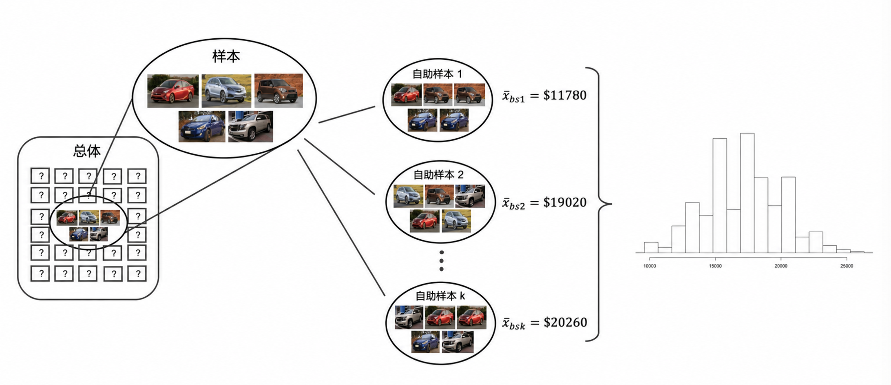

# 单均值的推断 {#sec-inference-one-mean}

```{r}
#| include: false
source("_common.R")
```


::: {.chapterintro data-latex=""}
现在，我们将关注点转向**数值数据**\index{numerical data}的统计推断。我们将再次回顾并扩展 [第 -@sec-foundations-randomization 章] 中关于假设检验的基础内容。

本章重要的数据结构是一个数值响应变量（也就是说，结果变量是定量的）。我们将详述的四种数据结构是：一个数值响应变量；一个由成对观测差值构成的数值响应变量；一个按二元解释变量分组的数值响应变量；以及一个按具有两个或更多水平的解释变量分组的数值响应变量。在适当的时候，我们将分别使用 [第 -@sec-foundations-randomization 章]、[第 -@sec-foundations-bootstrapping 章] 和 [第 -@sec-foundations-mathematical 章] 中的三种方法——随机化检验、自助法和数学模型——来分析每一种数据结构。

在我们建立推断思想的过程中，将接触到统计推断中新的基础概念。一个关键的新概念在于估计样本均值（与样本比例相对）如何随样本而变化；由此得到的值被称为**均值的标准误**。我们还将引入一个新的重要数学模型——**$t$ 分布**（作为 $t$ 检验的基础）。
:::

```{r}
#| include: false
terms_chp_19 <- c("numerical data")
```


在本章中，我们聚焦于样本均值（而不是，例如，样本中位数或观测值的极差），这是因为已有被深入研究过的数学模型来描述样本均值的性质。我们不会涵盖描述其他统计量的数学模型，但下面描述的自助法和随机化技术可以立即推广到观测数据的任何函数。我们将在单组、两配对组、两独立组和多组的情境下计算样本均值。针对每种情境描述的技术会略有不同，但发现不同情境之间的结构相似性，将对你大有裨益。

类似于我们可以用正态分布来模拟样本比例 $\hat{p}$ 的行为，在满足特定条件时，样本均值 $\bar{x}$ 也可以用正态分布来模拟。
\index{point estimate!single mean} 然而，我们很快会学到，一个被称为 **$t$ 分布**的新分布，在处理样本均值时更有用。我们将首先学习这个新分布，然后用它来进行均值的置信区间估计和假设检验。

## 均值的自助法置信区间 {#sec-boot1mean}

考虑这样一个情境：你想知道自己是否应该购买二手车行 Awesome Autos 的特许经营权。作为规划的一部分，你想了解 Awesome Autos 平均车价是多少。为了更清晰地说明这个例子，我们假设你只能从 Awesome Auto 随机抽取五辆汽车。（如果这是一个真实的例子，你肯定能抽取一个更大的样本，甚至可能测量整个总体！）

### 观测数据

@fig-5cars 显示了来自 Awesome Auto 的一个（小）随机观测样本。图中展示了实际的汽车及其售价。

```{r}
#| label: fig-5cars
#| fig-cap: 来自 Awesome Auto 的五辆汽车的样本。
#| out-width: 70%
#| fig-alt: |
#|   5 辆不同汽车的图片。这些汽车颜色、品牌和型号各不相同。每辆汽车图片的上方标有其价格；
#|   五个价格范围从 9600 美元到 27000 美元不等。
include_graphics("images/5cars.png")
```


```{r}
aa_cars <- data.frame(price = c(18300, 20100, 9600, 10700, 27000))
```


车价的样本均值为 \$`r formatC(mean(aa_cars$price), format = "f", digits = 2)`，这是对 Awesome Auto 平均车价的一个初步猜测。
然而，作为统计学的学生，你明白基于五个观测的样本均值不一定等于 Awesome Auto 所有汽车的真实总体平均车价。
事实上，你可以看到观测到的车价存在变异性，其标准差为 \$`r formatC(sd(aa_cars$price), format = "f", digits = 2)`，而且如果从总体中抽取另一个样本量为五的样本，平均车价肯定会有所不同。
幸运的是，正如前几章对样本比例所做的那样，自助法将用于近似样本均值从样本到样本的变异性。

### 统计量的变异性

与 [第 -@sec-foundations-randomization 章]、[第 -@sec-foundations-bootstrapping 章] 和 [第 -@sec-foundations-mathematical 章] 中涵盖的推断思想一样，本章的推断分析方法的基础在于量化当两个数据集都取自同一总体时，它们之间有何不同。
重申一下，我们的想法是希望知道数据集之间如何不同，但我们通常不会抽取不止一个观测样本。
从同一总体中重复抽取样本没有意义，因为如果你有能力抽取更多样本，增加样本量比从总体中抽取两个样本更有益。
因此，我们不再从实际总体中重复抽样，而是使用自助法来衡量样本在总体估计下的表现。

如前所述，为了了解 Awesome Auto 的汽车情况，你从附近的 Awesome Auto 分店抽取了五辆车的样本，以此估量所售汽车的价格。
@fig-bootpop1mean 展示了如何使用样本来近似 Awesome Auto 未知的汽车价格总体。

```{r}
#| label: fig-bootpop1mean
#| fig-cap: |
#|   如前所述，自助法背后的思想是将手头的样本视为总体的一个估计。
#|   从样本（5 辆车）中抽样等同于从一个无限总体中抽样，该无限总体仅由原始样本中的汽车组成。
#| fig-alt: |
#|   5 辆车的样本取自一个未知其他值（即其他车价）的大总体。
#|   将这 5 辆车的样本无限复制，从而创建一个代理总体，其中车价由原始数据集给出，且相对分布与样本中测量的分布一致。

```


通过从估计总体中反复抽样，可以观察到从样本到样本的变异性。
在 @fig-boot2 中，可以看到重复的自助样本彼此不同，也与原始总体不同。
回忆一下，自助样本来自同一个（估计）总体，因此自助样本之间的差异完全是由于抽样过程中的自然变异性造成的。
对于当前我们关心样本均值这一统计量的情况，样本到样本的变异性可以在 @fig-bootsamps1mean 中看到。

```{r}
#| label: fig-bootsamps1mean
#| fig-cap: |
#|   为了估计样本均值的自然变异性，从原始样本中抽取不同的自助样本。
#|   注意，每个自助重抽样彼此不同，也与原始样本不同
#| fig-alt: |
#|   样本显示为取自未知的大总体。
#|   然而，自助重抽样直接从原始样本（有放回抽样）抽取，仿佛是从一个无限大的代理总体抽取。
#|   展示了三个各包含 5 辆车的自助重抽样，每个重抽样因有放回抽样过程而略有不同。

```


通过汇总每个自助样本（这里使用样本均值），我们直接看到了样本均值 $\bar{x},$ 从样本到样本的变异性。
Awesome Auto 汽车的 $\bar{x}_{bs}$ 分布如 @fig-bootmeans1mean 所示。

```{r}
#| label: fig-bootmeans1mean
#| fig-cap: |
#|   因为每个自助法重样本代表了一组不同的汽车，
#|   所以每个自助法重样本的均值都会是一个不同的值。
#|   计算每一个自助法均值，这些值的直方图描述了
#|   由抽样过程所导致的样本均值的内在自然变异性。
#| fig-alt: |
#|   图中展示了从巨大的未知总体中抽取样本。
#|   展示了三个自助法重样本，每个包含 5 辆汽车；这三个重样本的平均汽车价格
#|   分别为 11780 美元、19020 美元和 20260 美元。
#|   一个代表许多自助法重样本的直方图表明，
#|   自助法平均数大约在 10000 美元到 25000 美元之间变化。
#| out-width: 100%

```


@fig-carsbsmean 用一个自助样本均值的直方图总结了一千个自助样本。
自助法的汽车平均价格大约在 \$10,000 到 \$25,000 之间变化。
自助法百分位置信区间是通过定位自助统计量的中间 90%（对于 90% 置信区间）或 95%（对于 95% 置信区间）来获得的。

::: {.workedexample data-latex=""}
使用 @fig-carsbsmean，找出 Awesome Auto 汽车真实平均价格的 90% 和 95% 自助法百分位置信区间。

------------------------------------------------------------------------

90% 置信区间为 \$12,140 到 \$22,007。
结论是，我们有 90% 的把握认为 Awesome Auto 汽车的真实平均价格介于 \$12,140 和 \$22,007 之间。

95% 置信区间为 \$11,778 到 \$22,500。
结论是，我们有 95% 的把握认为 Awesome Auto 汽车的真实平均价格介于 \$11,778 和 \$22,500 之间。
:::

```{r}
#| label: fig-carsbsmean
#| fig-cap: |
#|   Awesome Auto 的原始数据被自助法重抽样了 1,000 次。该直方图
#|   展示了汽车平均价格在不同样本间的变异性。
#| fig-alt: |
#|   来自 Awesome Auto 数据的 1000 个自助样本均值的直方图。
#|   给出了自助法均值的百分位数，
#|   用以创建总体真实均值的 80%、90%、95% 或 99% 自助法置信区间。
#| out-width: 90%
#| fig-asp: 0.45
set.seed(47)
bscars <- aa_cars |>
  rep_sample_n(size = 5, reps = 1000, replace = TRUE)

bscars_mean <- bscars |>
  group_by(replicate) |>
  summarize(stat = mean(price))

probs <- c(0.005, 0.025, 0.05, 0.1, 0.9, 0.95, 0.975, 0.995)

stat_quantiles <- bscars_mean |>
  pull(stat) |>
  quantile(probs) |>
  as.numeric() |>
  round()

ggplot(bscars_mean, aes(x = stat)) +
  geom_histogram(binwidth = 1500) +
  annotate(
    "segment",
    x = stat_quantiles,
    xend = stat_quantiles,
    y = rep(0, 8),
    yend = c(50, 75, 100, 150, 150, 100, 75, 50),
    linetype = "dashed"
  ) +
  annotate(
    "text",
    x = stat_quantiles,
    y = c(50, 75, 100, 150, 150, 100, 75, 50) + 15,
    label = paste0(probs * 100, "th percentile"),
    hjust = c(rep(1, 4), rep(0, 4)),
    size = 3
  ) +
  annotate(
    "text",
    x = stat_quantiles,
    y = c(50, 75, 100, 150, 150, 100, 75, 50) + 5,
    label = format(stat_quantiles, big.mark = ","),
    hjust = c(rep(1, 4), rep(0, 4)),
    size = 3
  ) +
  coord_cartesian(xlim = c(8000, 27000)) +
  scale_x_continuous(labels = label_dollar()) +
  labs(
    x = "Awesome Auto 汽车价格的自助法均值",
    y = "频数",
    title = "1,000 个自助法均值"
  )
```


### 自助法标准误置信区间

正如在 @sec-two-prop-boot-ci 中所见，创建自助法置信区间的另一种方法是直接利用自助统计量（此处为自助样本均值）的变异性进行计算。
如果自助法分布相对对称且呈钟形，那么可以使用前面章节中数学模型里熟悉的公式来构建 95% 自助法标准误置信区间：

$$\mbox{点估计} \pm 2 \cdot SE_{BS}$$ 数字 2 是一个与置信区间的“95%”部分相关的分位数（回想一下 68-95-99.7 法则）。
正如将在 @sec-one-mean-math 中看到的，一个新的分布（$t$ 分布）将被应用于大多数数值变量的数学推断。
然而，由于自助法与本书所给出的数学方法所依据的理论基础不同，我们坚持使用标准正态分位数（在 R 中，使用函数 `qnorm()` 来查找不同置信百分比对应的分位数）。[^19-inference-one-mean-1]

[^19-inference-one-mean-1]: 关于理解和改进自助法置信区间有大量文献，更多信息请参阅 @Hesterbeg:2015 发表的题为["教师应了解的关于自助法的知识"](https://www.tandfonline.com/doi/full/10.1080/00031305.2015.1089789)的论文以及 @Hayden:2019 发表的题为["对简单版本自助法的存疑主张"](https://www.tandfonline.com/doi/full/10.1080/10691898.2019.1669507)的论文。

::: {.workedexample data-latex=""}
解释自助法均值的标准误（SE）是如何计算的，它度量的是什么。

------------------------------------------------------------------------

自助法均值的标准误度量的是均值在不同重样本之间的变异程度。
自助法标准误是对如果我们从原始总体中重复抽样所得到的均值标准误的一个良好近似（我们之前已讨论过，由于浪费资源，实际上不会进行这种重复抽样）。
在操作上，我们可以使用 [第 -@sec-explore-numerical 章] 中相同的计算方法来求自助法均值的标准差。
也就是说，我们将自助法均值视为单个观测，然后度量这些观测的变异性。
:::

尽管我们不会在这个概念上花费太多精力，但你可能想知道标准误和标准差之间的一些区别。
**标准误**\index{standard error}\index{standard error (SE)}描述一个统计量（例如，样本均值或样本比例）在不同样本间的变异情况。
**标准差**\index{standard deviation}可以看作应用于任何数字列表的一个函数，它衡量这些数字偏离其自身平均数的程度。
所以，你可以计算一列狗身高的标准差，也可以计算从重抽样数据中得到的一列自助法均值的标准差。
请注意，对自助法均值计算得到的标准差，就被称为均值的自助法标准误。

```{r}
#| include: false
terms_chp_19 <- c(terms_chp_19, "SE single mean", "SD of observations")
```


::: {.guidedpractice data-latex=""}
结果表明，@fig-carsbsmean 中自助法均值的标准差为 \$2,891.87（如果我们能从总体中重复抽样，这个值是对样本均值标准误的一个极好近似）。
（注：在 R 中，此计算使用函数 `sd()` 完成。）
观测价格的平均数为 \$17,140，我们将把样本均值视为 $\mu$ 的最佳猜测点估计。
请使用自助法标准误置信区间的公式，为 $\mu$（Awesome Auto 汽车的真实平均成本）寻找并解释其置信区间。[^19-inference-one-mean-2]
:::

[^19-inference-one-mean-2]: 使用自助法标准误置信区间的公式，我们找到 $\mu$ 的 95% 置信区间为：$17,140 \pm 2 \cdot 2,891.87 \rightarrow$ (\$11,356.26, \$22,923.74)。
    我们有 95% 的把握认为 Awesome Auto 汽车的真实平均价格介于 \$11,356.26 和 \$22,923.74 之间。

::: {.workedexample data-latex=""}
比较并对比 @fig-carsbsmean 中给出的两种不同的 $\mu$ 的 95% 置信区间：一种是通过寻找自助均值的百分位数创建的，另一种是通过寻找自助均值的标准误创建的。
你认为这两个区间*应该*完全相同吗？

------------------------------------------------------------------------

-   百分位区间：(\$11,778, \$22,500)
-   SE interval: (\$11,356.26, \$22,923.74)

\vspace{-5mm}

这两个区间使用不同的方法创建，因此它们不完全相同并不令人惊讶。
然而，令人欣慰的是，两种方法给出了非常相似的区间近似结果。
关于哪种数据结构最适合百分位区间、哪种最适合标准误区间的技术细节超出了本书的范围。
但是，样本量越大，区间估计就会越好（且越接近）。
:::

\vspace{-8mm}

### 标准差的自助法百分位置信区间

假设我们想要了解 Awesome Auto 汽车价格的变异性有多大。
也就是说，你感兴趣的不再是汽车的平均价格，而是 Awesome Auto 所有汽车价格的*标准差*，$\sigma.$ 你可能已经意识到，样本标准差 $s$ 可以作为感兴趣的参数——总体标准差 $\sigma$——的一个良好**点估计**\index{point estimate}。根据五个观测计算出的点估计为 $s = \$7,170.286.$ 虽然 $s = \$7,170.286$ 可能是对 $\sigma$ 的一个不错猜测，但我们更希望对感兴趣的参数有一个区间估计。
尽管存在一个描述 $s$ 在不同样本间如何变化的数学模型，但本书不会介绍该数学模型。
相反，可以使用自助法来为参数 $\sigma$ 寻找一个置信区间。使用与为 $\mu$ 构建置信区间相同的技术，这里我们为 $\sigma$ 寻找自助法百分位置信区间。

```{r}
#| include: false
terms_chp_19 <- c(terms_chp_19, "point estimate")
```


::: {.workedexample data-latex=""}
描述 @fig-carsbssd 中显示的标准差的自助法分布。

------------------------------------------------------------------------

该分布呈左偏态，中心在 \$7,170.286，这是原始数据的点估计。
此分布中的大多数观测值都落在 \$0 到 \$10,000 附近。
:::

\vspace{-5mm}

::: {.guidedpractice data-latex=""}
利用 @fig-carsbssd，寻找并解释 Awesome Auto 汽车价格的总体标准差的 90% 自助法百分位置信区间。[^19-inference-one-mean-3]
:::

[^19-inference-one-mean-3]: 根据 @fig-carsbssd 中的百分位数，自助法标准差的中间 90% 由第 5 百分位数（\$3,602.5）和第 95 百分位数（\$8,737.2）给出。也就是说，我们有 90% 的把握认为汽车价格的真实标准差介于 \$3,602.5 和 \$8,737.2 之间。90% 的置信水平表明不需要像 95% 或 99% 那样的高置信水平。较低的置信水平具有较高的出错可能性，但产生的区间也更窄。

\vspace{-8mm}

```{r}
#| label: fig-carsbssd
#| fig-cap: |
#|   对原始的 Awesome Auto 数据进行了 1,000 次自助重抽样。
#|   该直方图展示了汽车价格的标准差在不同样本间的变异性。
#| fig-alt: |
#|   Awesome Auto 数据 1000 个自助样本标准差的直方图。
#|   给出了自助样本标准差的百分位数，用以构造真实总体标准差的 80%、90%、95% 或 99% 自助法置信区间。
#| out-width: 90%
#| fig-asp: 0.45
bscars_sd <- bscars |>
  group_by(replicate) |>
  summarize(stat = sd(price))

probs <- c(0.005, 0.025, 0.05, 0.1, 0.9, 0.95, 0.975, 0.995)

stat_quantiles <- bscars_sd |>
  pull(stat) |>
  quantile(probs) |>
  as.numeric() |>
  round()

ggplot(bscars_sd, aes(x = stat)) +
  geom_histogram(binwidth = 500) +
  annotate(
    "segment",
    x = stat_quantiles, xend = stat_quantiles,
    y = rep(0, 8), yend = c(50, 75, 100, 150, 150, 100, 75, 50),
    linetype = "dashed"
  ) +
  annotate(
    "text",
    x = stat_quantiles,
    y = c(50, 75, 100, 150, 150, 100, 75, 50) + 15,
    label = paste0(probs * 100, "th percentile"),
    hjust = c(rep(1, 4), rep(0, 4)), size = 3
  ) +
  annotate(
    "text",
    x = stat_quantiles,
    y = c(50, 75, 100, 150, 150, 100, 75, 50) + 5,
    label = format(stat_quantiles, big.mark = ","),
    hjust = c(rep(1, 4), rep(0, 4)), size = 3
  ) +
  coord_cartesian(clip = "off", xlim = c(-1200, 11500)) +
  scale_x_continuous(labels = label_dollar()) +
  labs(
    x = "Awesome Auto 汽车价格的自助法标准差",
    y = "频数",
    title = "1,000 个自助法标准差"
  )
```


### 自助法不能解决小样本问题！

上面给出的例子是基于一个仅有五个观测的样本进行的。
与基于数学模型的分析技术一样，自助法在从总体中抽取了较大的随机样本时效果最佳。
自助法是一种在数学模型未知时，用于捕捉统计量变异性的方法（它并非一种处理小样本的方法）。
如你所料，随机样本越大，该样本对目标总体的代表性就越准确。

## 均值的数学模型 {#sec-one-mean-math}

与样本比例一样，样本均值的变异性可以通过中心极限定理给出的数学理论得到很好的描述。
然而，由于缺乏关于总体固有变异性 ($\sigma$) 的信息，在进行假设检验或置信区间分析时，我们使用 $t$ 分布来代替标准正态分布。

### 样本均值的数学分布

当满足特定条件时，样本均值往往近似服从一个以总体均值 $\mu$ 为中心的正态分布。
此外，我们还可以利用总体标准差 $\sigma$ 和样本量 $n$ 来计算样本均值的标准误。

::: {.important data-latex=""}
**样本均值的中心极限定理。**

当我们从均值为 $\mu$、标准差为 $\sigma$ 的总体中，收集一个包含 $n$ 个独立观测的足够大样本时，$\bar{x}$ 的抽样分布将近似正态，$$\text{均值} = \mu \qquad \text{标准误}(SE) = \frac{\sigma}{\sqrt{n}}$$

\index{point estimate!single mean}\index{single mean!point estimate}
\index{standard error (SE)!single mean}\index{single mean!standard error (SE)}

$$\text{均值} = \mu \qquad \text{标准误}(SE) = \frac{\sigma}{\sqrt{n}}$$
:::

在深入探讨使用 $\bar{x}$ 进行置信区间和假设检验之前，我们首先需要介绍两个主题：

-   当我们用正态分布对 $\hat{p}$ 进行建模时，必须满足某些条件。使用 $\bar{x}$ 进行推断的条件要稍微复杂一些，下面我们将讨论如何在使用数学模型进行推断时检查这些条件。
-   标准误依赖于总体标准差 $\sigma$。然而，我们很少知道 $\sigma$ 的值，因此必须对其进行估计。由于这种估计本身并不完美，我们使用一种称为 $t$ 分布的新分布来解决这个问题。

\index{t-distribution@$t$-distribution}

```{r}
#| include: false
terms_chp_19 <- c(terms_chp_19, "t-distribution")
```


### 评估为 $\bar{x}$ 建模所需的两个条件

要将中心极限定理\index{Central Limit Theorem}应用于样本均值 $\bar{x}$，需要满足两个条件：

-   **独立性。** 样本观测必须是独立的。
    满足这一条件的最常见情况是样本来自总体的简单随机样本。
    如果数据来自随机过程（类似于掷骰子），那么也能满足独立性条件。

-   **正态性。** 当样本较小时，我们还要求样本观测来自一个正态分布的总体。
    随着样本量越来越大，我们可以越来越放宽这一条件。
    这个条件比较模糊，难以评估，因此接下来我们将介绍几条检查该条件的经验法则。

```{r}
#| include: false
terms_chp_19 <- c(terms_chp_19, "Central Limit Theorem")
```


::: {.important data-latex=""}
**进行正态性检查的一般规则。**

没有完美的方法来检查正态性条件，因此我们转而使用两条基于极端观测的数量和极端程度的通用规则。
请注意，通常需要经过实践才能判断出正态近似是否合适。

-   **小 $n$：** 如果样本量 $n$ 较小，且数据中**没有明显的离群值**，那么为了满足该条件，我们通常假设数据来自近似正态的分布。
-   **大 $n$：** 如果样本量 $n$ 较大，且没有**特别极端**的离群值，那么即使单个观测的底层分布不是正态的，我们通常也假设 $\bar{x}$ 的抽样分布近似正态。

以下是一些用于确定 $n$ 被认为是小还是大的指导原则：样本量为 15 时，轻微偏度是可以接受的；样本量为 30 时，中等偏度可以接受；样本量为 60 时，强偏度可以接受。
:::

在这门统计学的入门课程中，并不要求你对正态性条件做出完美的判断。
但是，期望你能够基于经验法则处理清晰明确的情况。[^19-inference-one-mean-4]

[^19-inference-one-mean-4]: 更细致的指导原则会考虑当样本量非常大时，进一步放宽对*特别极端离群值*的检查。不过，我们在此将进一步的讨论留到后续课程中。

::: {.workedexample data-latex=""}
考虑 @fig-outliersandsscondition 中提供的四幅图，它们分别取自不同总体的简单随机样本。
其样本量分别为 $n_1 = 15$ 和 $n_2 = 50.$

每种情况下，独立性和正态性条件都满足吗？

------------------------------------------------------------------------

每个样本都来自其各自总体的简单随机样本，因此独立性条件满足。
接下来，让我们用经验法则检查每种情况下的正态性条件。

第一个样本的观测数少于 30，所以我们关注是否存在任何明显的离群值。
没有明显的离群值；虽然直方图右侧有一个小间隙，但这个间隙很小，且这个样本中有超过 20% 的观测值位于该间隙的左侧，因此我们很难将这些观测值称为明显的离群值。
由于没有明显的离群值，可以合理地认为正态性条件已满足。

第二个样本的样本量大于 30，并且包含一个离群值，它到分布中心的距离看起来大约是距分布中心次远的观测的 5 倍。
这是一个特别极端离群值的例子，因此正态性条件将不满足。

使用箱线图来可视化数据以评估偏度和离群值的存在也常常很有帮助。
每个直方图下方提供的箱线图证实了我们的结论：第一个样本没有任何离群值，而第二个样本则有离群值，其中一个离群值比其他离群值要极端得多。
:::

```{r}
#| label: fig-outliersandsscondition
#| fig-cap: 来自两个不同总体的样本直方图。
#| fig-alt: |
#|   两对直方图和箱线图。第一对图描述了一个样本量为15的样本，
#|   数据点分布在0到6之间，没有离群值。第二对图描述了一个样本量为
#|   50的样本，数据点分布在0到6之间，但有一个额外的离群点高于20。
set.seed(3456)
df1 <- tibble(x = rnorm(15, 3, 2))
df2 <- tibble(x = c(exp(rnorm(49, 0, 0.7)), 22))

p1 <- ggplot(df1, aes(x = x)) +
  geom_histogram(binwidth = 1) +
  labs(x = NULL, y = "Count", title = "Sample 1", subtitle = expression(n[1] ~ "=" ~ 15))

p2 <- ggplot(df2, aes(x = x)) +
  geom_histogram(binwidth = 1) +
  labs(x = NULL, y = "Count", title = "Sample 2", subtitle = expression(n[2] ~ "=" ~ 50))

p3 <- ggplot(df1, aes(x = x)) +
  geom_boxplot() +
  theme(
    axis.text.y = element_blank(),
    panel.grid.major.y = element_blank(),
    panel.grid.minor.y = element_blank(),
  ) +
  labs(x = NULL)

p4 <- ggplot(df2, aes(x = x)) +
  geom_boxplot() +
  theme(
    axis.text.y = element_blank(),
    panel.grid.major.y = element_blank(),
    panel.grid.minor.y = element_blank(),
  ) +
  labs(x = NULL)

p1 + p2 + p3 + p4 +
  plot_layout(nrow = 2, heights = c(3, 1, 3, 1))
```

在实践中，通常还需要在脑中做一番检查，以评估我们是否有理由相信潜在的总体具有中度偏态（如果 $n < 30$）或存在特别极端的离群值（$n \geq 30$），且其程度超出了我们在数据中观察到的范围。
例如，考虑推特上每个账户的关注者数量，想象一下它的分布。
绝大多数账户积累了数千个或更少的关注者，而相对极小的一部分账户积累了数千万的关注者，这意味着该分布是极度偏态的。
当我们知道数据来自这样一个极度偏态的分布时，就需要费一番功夫来确定多大的样本量才足以满足正态性条件。

\index{Central Limit Theorem}

### t 分布简介

\index{t-distribution}

在实践中，我们无法直接计算 $\bar{x}$ 的标准误，因为我们不知道总体标准差 $\sigma$。在计算样本比例的标准误时，我们遇到过类似的问题，因为它依赖于总体比例 $p$。在比例的情境下，我们的解决方案是在计算标准误时，用样本值代替总体值。
对于计算 $\bar{x}$ 的标准误，我们将采用类似的策略，用样本标准差 $s$ 代替 $\sigma$：

$$SE = \frac{\sigma}{\sqrt{n}} \approx \frac{s}{\sqrt{n}}$$

这个策略在我们有大量数据，并能用 $s$ 准确估计 $\sigma$ 时，通常效果很好。
但在样本量较小时，这种估计就不够精确，这会导致用正态分布为 $\bar{x}$ 建模时出现问题。

我们会发现，在推断计算中使用一种称为 $t$ 分布的新分布是很有用的。
$t$ 分布（在 @fig-tDistCompareToNormalDist 中以实线表示）呈钟形。
然而，它的尾部比正态分布更厚，这意味着观测值落在距离均值两个标准差之外的可能性比在正态分布下更大。

$t$ 分布额外加厚的尾部，恰好是对在 $SE$ 计算中用 $s$ 代替 $\sigma$ 所引发的问题（由于 $t$ 统计量具有额外的变异性）进行修正所需的。

```{r}
#| label: fig-tDistCompareToNormalDist
#| fig-cap: $t$ 分布与正态分布的比较。
#| fig-alt: |
#|   两条对称的钟形曲线相互重叠。
#|   一条是正态曲线，尾部较薄，中间的峰值较高。
#|   另一条是 t 分布，尾部较长，这意味着 t 分布中远离中心的观测值比正态分布中更多。
#| fig-asp: 0.5
#| out-width: 60%
df <- tibble(
  x = rep(seq(-5, 5, 0.01), 2),
  distribution = c(rep("Normal distribution", 1001), rep("t-distribution", 1001))
) |>
  mutate(y = if_else(distribution == "Normal distribution", dnorm(x), dt(x, df = 1)))

ggplot(df, aes(x = x, y = y, color = distribution, linetype = distribution, size = distribution)) +
  geom_hline(yintercept = 0) +
  geom_line() +
  scale_color_manual(values = c(IMSCOL["blue", "full"], IMSCOL["red", "full"])) +
  scale_linetype_manual(values = c("dashed", "solid")) +
  scale_size_manual(values = c(0.5, 1)) +
  theme(
    axis.text = element_blank(),
    panel.grid.major = element_blank(),
    panel.grid.minor = element_blank(),
    legend.position = c(0.2, 0.7),
    legend.background = element_rect(fill = "white", color = NA),
    legend.text = element_text(size = 12)
  ) +
  labs(x = NULL, y = NULL, color = NULL, linetype = NULL, size = NULL)
```


$t$ 分布总是以零为中心，并且只有一个参数：自由度。
**自由度**\index{degrees of freedom}\index{degrees of freedom!single mean} 描述了钟形 $t$ 分布的确切形态。
在 @fig-tDistConvergeToNormalDist 中展示了几个 $t$ 分布与正态分布的比较。
与卡方分布类似，$t$ 分布的形状也依赖于自由度。

通常，当样本量为 $n$ 时，我们将使用自由度为 $df = n - 1$ 的 $t$ 分布来为样本均值建模。也就是说，当我们有更多观测时，自由度会更大，$t$ 分布看起来会更像标准正态分布；当自由度约 30 或更多时，$t$ 分布与正态分布几乎无法区分。

```{r}
#| include: false
terms_chp_19 <- c(terms_chp_19, "degrees of freedom")
```


```{r}
#| label: fig-tDistConvergeToNormalDist
#| fig-cap: |
#|   自由度越大，$t$ 分布与标准正态分布越近似。
#| fig-alt: |
#|   一个正态分布和四个 t 分布，全部叠加在一起。
#|   自由度越小，t 分布的尾部越宽。
#| fig-asp: 0.5
#| out-width: 60%
par(mar = c(2, 0, 0, 0))
plot(c(-5, 5),
  c(0, dnorm(0)),
  type = "n", ylab = "", xlab = "",
  axes = FALSE
)
at <- seq(-10, 10, 2)
axis(1, at)
axis(1, at - 1, rep("", length(at)), tcl = -0.1)
abline(h = 0)

COL. <- fadeColor(IMSCOL["blue", "full"], c("FF", "89", "68", "4C", "33"))
COLt <- fadeColor(IMSCOL["blue", "full"], c("FF", "AA", "85", "60", "45"))
DF <- c("normal", 8, 4, 2, 1)

X <- seq(-10, 10, 0.02)
Y <- dnorm(X)
lines(X, Y, col = COL.[1])

for (i in 2:5) {
  Y <- dt(X, as.numeric(DF[i]))
  lines(X, Y, col = COL.[i], lwd = 1.5)
}

legend(2.5, 0.4,
  legend = c(
    DF[1],
    paste("t, df = ", DF[2:5], sep = "")
  ),
  col = COL.,
  text.col = COLt,
  lty = rep(1, 5),
  lwd = 1.5
)
```


::: {.important data-latex=""}
**自由度：df。**

自由度描述了 $t$ 分布的形状。
自由度越大，该分布越近似于正态分布。

当使用 $t$ 分布为 $\bar{x}$ 建模时，使用 $df = n - 1.$
:::

当分析数值数据时，$t$ 分布比正态分布提供了更大的灵活性。
在实践中，通常使用 R、Python 或 SAS 等统计软件进行这些分析。
在 R 中，用于计算 $t$ 分布下概率的函数是 `pt()`（这与之前的 R 函数 `pnorm()` 和 `pchisq()` 看起来应该很相似）。
别忘了，使用 $t$ 分布时，必须始终指定自由度！

对于下面的示例和引导练习，你可能需要使用表格或统计软件来找到答案。
我们建议尝试解答这些问题，以便感受 $t$ 分布的宽度如何随自由度变化。
无论你选择哪种方法，请运用你的方法解答下面的例子，以确认你对 $t$ 分布的实际掌握程度。

::: {.workedexample data-latex=""}
自由度为 18 的 $t$ 分布中，低于 -2.10 的比例是多少？

------------------------------------------------------------------------

我们首先画图，并将 -2.10 以下的区域涂上阴影。

```{r}
#| label: tDistDF18LeftTail2Point10
#| fig-alt: |
#|   一个自由度为 18 的 t 分布。-2.10 以下的区域已被涂上阴影。
#| fig-asp: 0.35
#| out-width: 60%
#| fig-align: center
par(mar = c(2, 0, 0, 0))
normTail(
  L = -2.10,
  df = 10,
  xlim = c(-4, 4),
  col = IMSCOL["blue", "full"],
  axes = FALSE
)
axis(1)
```

使用统计软件，我们可以得到一个精确值：0.0250。

```{r}
#| echo: true
# 使用 pt() 求 t 分布下的概率
pt(-2.10, df = 18)
```
:::

```{r}
#| echo: true
# 使用 pt() 求 t 分布下的概率
pt(-2.10, df = 18)
```


:::

\vspace{-5mm}

::: {.workedexample data-latex=""}
自由度为 20 的 $t$ 分布中，高于 1.65 的比例是多少？

------------------------------------------------------------------------

注意，当自由度为 20 时，$t$ 分布与正态分布相对接近。
对于正态分布，该面积大约为 0.05，因此我们预期 $t$ 分布给出的值会与此相近。
使用统计软件，我们可以得到一个精确值：0.0573。

```{r}
#| echo: true
# 使用 pt() 求 t 分布下的概率
1 - pt(1.65, df = 20)
```
:::

\vspace{-5mm}

::: {.workedexample data-latex=""}
下方展示了一个自由度为 2 的 $t$ 分布。估计该分布中距离均值（高于或低于）超过 3 个单位的部分所占的比例。

```{r}
#| label: tDistDF23UnitsFromMean
#| fig-alt: |
#|   一个自由度为 2 的 t 分布。-3 以下和 +3 以上的区域已被涂上阴影。
#| fig-asp: 0.35
#| out-width: 60%
#| fig-align: center
par(mar = c(2, 0, 0, 0))
normTail(
  L = -3,
  U = 3,
  df = 2.3,
  xlim = c(-4.5, 4.5),
  col = IMSCOL["blue", "full"]
)
```

------------------------------------------------------------------------

由于自由度非常小，$t$ 分布的值与正态分布会有显著差异。
在正态分布下，根据 68-95-99.7 法则，该面积约为 0.003。
对于自由度 $df = 2$ 的 $t$ 分布，两个尾部超出 3 个单位的总面积为 0.0955。
这与正态分布得到的结果差异巨大。

```{r}
#| echo: true
# 使用 pt() 求 t 分布下的概率
pt(-3, df = 2) + (1 - pt(3, df = 2))
```
:::

```{r}
#| echo: true
# 使用 pt() 求 t 分布下的概率
pt(-3, df = 2) + (1 - pt(3, df = 2))
```


:::

::: {.guidedpractice data-latex=""}
自由度为 19 的 $t$ 分布中，高于 -1.79 单位的比例是多少？
请使用你喜欢的任何方法来求尾部面积。[^^19-inference-one-mean-5]
:::

[^19-inference-one-mean-5]: 我们想找到 *高于* -1.79 的阴影面积（我们把画图的任务留给你）。
    下尾部的面积为 0.0447，因此上部的面积应为 $1 - 0.0447 = 0.9553.$

\index{t-distribution}

### 单样本 t 区间

让我们通过一个关于海豚肌肉汞含量的例子，来初步体验 $t$ 分布的应用。
汞浓度升高对海豚以及偶尔食用它们的其他动物（如人类）来说都是一个重要问题。

```{r}
#| label: fig-rissosDolphin
#| fig-cap: |
#|   一头瑞氏海豚。照片由 Mike Baird 拍摄，www.bairdphotos.com。
#|   CC BY 2.0 许可。
#| fig-alt: 一张瑞氏海豚在水中的照片。
#| out-width: 65%
include_graphics("images/rissosDolphin.jpg")
```


我们将利用来自日本太地町地区的 19 头瑞氏海豚样本来构建海豚肌肉中平均汞含量的置信区间。
数据汇总于 @tbl-summaryStatsOfHgInMuscleOfRissosDolphins 中。
观测到的最小值和最大值可用于评估是否存在明显的离群值。

```{r}
#| label: tbl-summaryStatsOfHgInMuscleOfRissosDolphins
#| tbl-cap: |
#|   来自太地町地区的 19 头瑞氏海豚肌肉中汞含量汇总。测量单位为微克汞/湿克肌肉 $(\\mu$g/wet g)。
#| tbl-pos: H
dolphin_summary_stats <- tribble(
  ~n, ~Mean, ~SD, ~Min, ~Max,
  19, 4.4, 2.3, 1.7, 9.2
)

dolphin_summary_stats |>
  kbl(
    linesep = "", booktabs = TRUE,
    align = "ccccc"
  ) |>
  kable_styling(
    bootstrap_options = c("striped", "condensed"),
    latex_options = c("striped"), full_width = FALSE
  ) |>
  column_spec(1:5, width = "6em")
```


::: {.workedexample data-latex=""}
该数据集是否满足独立性和正态性条件？

------------------------------------------------------------------------

这些观测构成一个简单随机样本，因此可以合理地假设海豚之间是独立的。
@tbl-summaryStatsOfHgInMuscleOfRissosDolphins 中的汇总统计量并未显示任何明显的离群值，所有观测都在均值 2.5 个标准差的范围内。
基于这些证据，正态性条件可以认为是满足的。
:::

在正态模型中，我们使用 $z^{\star}$ 和标准误来确定置信区间的宽度。
使用 $t$ 分布时，我们对置信区间公式稍作修改：

$$
\begin{aligned}
\text{点估计} \ &\pm\  t^{\star}_{df} \times SE \\
\bar{x} \ &\pm\  t^{\star}_{df} \times \frac{s}{\sqrt{n}}
\end{aligned}
$$

::: {.workedexample data-latex=""}
利用 @tbl-summaryStatsOfHgInMuscleOfRissosDolphins 中的汇总统计量，计算 $n = 19$ 头海豚体内平均汞含量的标准误。

------------------------------------------------------------------------

我们将 $s$ 和 $n$ 代入公式：$SE = \frac{s}{\sqrt{n}} = \frac{2.3}{\sqrt{19}} = 0.528.$
:::

值 $t^{\star}_{df}$ 是我们根据置信水平和自由度为 $df$ 的 $t$ 分布得到的临界值。
该临界值的查找方式与正态分布相同：我们找到 $t^{\star}_{df}$，使得自由度为 $df$ 的 $t$ 分布中，与 0 的距离不超过 $t^{\star}_{df}$ 的比例，与所关注的置信水平相匹配。

::: {.workedexample data-latex=""}
当 $n = 19$ 时，适当的自由度是多少？
求出此自由度下、置信水平为 95%

------------------------------------------------------------------------

自由度很容易计算：$df = n - 1 = 18.$

使用统计软件，我们找到上尾面积等于 2.5% 的临界值：$t^{\star}_{18} = 2.10$。-2.10 以下的面积也等于 2.5%。
也就是说，自由度 $df = 18$ 的 $t$ 分布中有 95% 落在距 0 不超过 2.10 个单位的范围内。

```{r}
#| echo: true
# 使用 qt() 求中间面积为 95% 时的 t 临界值
qt(0.025, df = 18)
qt(0.975, df = 18)
```
:::

::: {.important data-latex=""}
**单样本的自由度。**

如果样本有 $n$ 个观测，并且我们正在考察单个均值，那么我们使用自由度为 $df=n-1$ 的 $t$ 分布。
:::

::: {.workedexample data-latex=""}
计算并解释瑞氏海豚平均汞含量的 95% 置信区间。

------------------------------------------------------------------------

我们可以按如下方式构建置信区间：

$$
\begin{aligned}
\bar{x} \ &\pm\  t^{\star}_{18} \times SE \\
4.4 \ &\pm\  2.10 \times 0.528 \\
(3.29 \  &, \ 5.51)
\end{aligned}
$$
我们有 95% 的信心认为，瑞氏海豚肌肉中的平均汞含量在 3.29 到 5.51 $\mu$g/克湿重之间，这被认为是非常高的。
:::

::: {.important data-latex=""}
**计算均值** $\mu$ **的** $t$ **置信区间。**

\index{t-CI!single mean}

基于一个包含 $n$ 个独立的、近似正态的观测的样本，总体均值的置信区间为

$$
\begin{aligned}
\text{点估计} \ &\pm\  t^{\star}_{df} \times SE \\
\bar{x} \ &\pm\  t^{\star}_{df} \times \frac{s}{\sqrt{n}}
\end{aligned}
$$

其中 $\bar{x}$ 是样本均值，$t^{\star}_{df}$ 对应于置信水平和自由度 $df$，$SE$ 是由样本估计的标准误。
:::

::: {.guidedpractice data-latex=""}
FDA 的网页提供了一些关于鱼类汞含量的数据。
基于由 15 条太平洋白姑鱼构成的样本，计算出样本均值和标准差分别为 0.287 和 0.069 ppm（百万分之一）。
这 15 个观测值的范围从 0.18 到 0.41 ppm。
我们将假设这些观测是独立的。
基于数据的汇总统计量，你对单个观测值的正态性条件有异议吗？[^19-inference-one-mean-6]
:::

[^19-inference-one-mean-6]: 样本量小于 30，因此我们检查是否存在明显的离群值：由于所有观测都在均值 2 个标准差的范围内，因此没有明显的离群值。

::: {.workedexample data-latex=""}
利用前一个“引导练习”中的数据汇总，估计 $\bar{x} = 0.287$ ppm 的标准误。
如果我们打算使用 $t$ 分布来构建汞含量实际均值的 90% 置信区间，请指出自由度和 $t^{\star}_{df}.$

------------------------------------------------------------------------

标准误为：$SE = \frac{0.069}{\sqrt{15}} = 0.0178$。
自由度：$df = n - 1 = 14$。
由于目标是构建 90% 置信区间，我们选择 $t_{14}^{\star}$ 使双尾面积为 0.1：$t^{\star}_{14} = 1.76$。

```{r}
#| echo: true
# 使用 qt() 求中间面积为 90% 时的 t 临界值
qt(0.05, df = 14)
qt(0.95, df = 14)
```
:::

::: {.guidedpractice data-latex=""}
利用前一个“引导练习”和“范例”的信息与结果，计算太平洋白黄花鱼平均汞含量的 90% 置信区间。[^19-inference-one-mean-7]
:::

[^19-inference-one-mean-7]: $\bar{x} \ \pm\ t^{\star}_{14} \times SE \ \to\  0.287 \ \pm\  1.76 \times 0.0178 \ \to\ (0.256, 0.318).$ 我们有 90% 的信心认为，太平洋白黄花鱼的平均汞含量在 0.256 到 0.318 ppm 之间。

::: {.guidedpractice data-latex=""}
前一个“引导练习”中的 90% 置信区间为 0.256 ppm 到 0.318 ppm。
我们能否说 90% 的太平洋白黄花鱼的汞含量在 0.256 到 0.318 ppm 之间？[^19-inference-one-mean-8]
:::

[^19-inference-one-mean-8]: 不能。置信区间仅提供了总体参数（此处为总体均值）的一个合理值范围，它并不描述个体观测可能出现的情形。

回顾一下，误差界由标准误定义。
$\bar{x}$ 的误差界可以直接由其标准误 $SE(\bar{x})$ 得到。

::: {.important data-latex=""}
**$\bar{x}$ 的误差界。**

误差界为 $t^\star_{df} \times s/\sqrt{n}$，其中 $t^\star_{df}$ 是根据自由度为 *df* 的 t 分布上的某个指定百分位数计算得到的。
:::

### 单样本 t 检验

\index{t-test}

既然我们已经使用 $t$ 分布为均值构造了置信区间，现在让我们快速进入关于均值的假设检验。

::: {.important data-latex=""}
**评估单个均值所用的检验统计量是一个 T 统计量。**

t 统计量是一个比值，它反映了样本均值与假设均值之间的差异相对于观测的变异程度的比率。

$$ T = \frac{\bar{x} - \mbox{零值}}{s/\sqrt{n}} $$

当原假设为真且条件满足时，T 服从自由度为 $df = n - 1$ 的 t 分布。

条件：

-   观测相互独立。
-   大样本且无极端离群值。
:::

随着时间的推移，美国跑步者的典型速度是在变快还是变慢呢？
我们在樱花长跑赛的背景下考虑这个问题，这是每年春天在华盛顿特区举行的一场 10 英里比赛。
2006 年樱花长跑赛所有完赛者的平均时间是 93.29 分钟（93 分约 17 秒）。
我们想利用 2017 年樱花长跑赛 100 名参赛者的数据来判断，这项赛事的跑步者是变快了还是变慢了，还是另一种可能——速度没有变化。

::: {.data data-latex=""}
[`run17`](http://openintrostat.github.io/cherryblossom/reference/run17.html) 数据集可以在 [**cherryblossom**](http://openintrostat.github.io/cherryblossom) R 包中找到。
:::

::: {.guidedpractice data-latex=""}
对于这个背景，合适的假设是什么？[^19-inference-one-mean-9]
:::

[^19-inference-one-mean-9]: $H_0:$ 2006 年和 2017 年的 10 英里跑平均时间相同。
    $\mu = 93.29$ 分钟。
    $H_A:$ 2017 年的 10 英里跑平均时间与 2006 年*不同*。
    $\mu \neq 93.29$ 分钟。

```{r}
#| include: false
terms_chp_19 <- c(terms_chp_19, "T score single mean")
```


完成单样本均值的假设检验时，其过程与完成单个比例的假设检验几乎相同。
首先，我们根据观测值、原假设值和标准误计算 z 统计量；然而，因为我们使用 $t$ 分布来计算尾部面积，所以我们称它为 **t 统计量**\index{T score!single mean}\index{single mean!T score}\index{T score}。
然后，我们用之前类似的思想来求 p 值：计算抽样分布下的单侧尾部面积，然后将其加倍。

但首先，我们要检查条件。

::: {.guidedpractice data-latex=""}
数据来自所有参赛者的一个简单随机样本，因此观测是独立的。
下面的直方图展示了比赛用时，用于评估我们是否可以进行 t 检验。
正态性条件满足了吗？[^19-inference-one-mean-10]

```{r}
#| out-width: 60%
#| fig-asp: 0.4
#| fig-width: 6
set.seed(1)

run17_sample_100 <- run17 |>
  filter(event == "10 Mile") |>
  sample_n(size = 100) |>
  mutate(time = net_sec / 60)

run17_sample_100_time_mean <- round(mean(run17_sample_100$time), 2)
run17_sample_100_time_sd <- round(sd(run17_sample_100$time), 2)
run17_sample_100_time_n <- nrow(run17_sample_100)

ggplot(run17_sample_100, aes(x = time)) +
  geom_histogram(binwidth = 5) +
  labs(x = "用时（分钟）", y = "频数")
```
:::

[^19-inference-one-mean-10]: 对于 100 的样本量，我们只需要担心是否存在特别极端的离群值。
    数据的直方图没有显示出任何值得担忧的离群值（甚至可以说根本没有离群值）。

```{r}
#| include: false
terms_chp_19 <- c(terms_chp_19, "T score single mean", "t-test")
```


::: {.workedexample data-latex=""}
在独立性和正态性条件均满足的情况下，我们可以使用 $t$ 分布进行假设检验。
从 2017 年樱花长跑赛中抽取的 `r run17_sample_100_time_n` 名跑者的样本，其样本均值为 `r run17_sample_100_time_mean` 分钟，样本标准差为 `r run17_sample_100_time_sd` 分钟。
回想一下，2006 年的平均跑步时间是 93.29 分钟。
试求检验统计量和 p 值。
你得出的结论是什么？

------------------------------------------------------------------------

要求检验统计量（t 统计量），我们首先必须确定标准误：

$$  SE = 16.6 / \sqrt{100} = 1.66 $$
现在，我们可以使用样本均值（`r run17_sample_100_time_mean`）、原假设值（93.29）和 $SE$ 来计算**t 统计量**：

$$ T = \frac{98.8 - 93.29}{1.66} = 3.32 $$
对于 $df = 100 - 1 = 99,$ 我们可以使用统计软件（或 $t$ 分布表）确定单侧面积为 0.000631，将其加倍得到 p 值：0.00126。

```{r}
#| echo: true
# 使用 pt() 求左尾面积，再乘以 2 得到双侧面积
(1 - pt(3.32, df = 99)) * 2
```

由于 p 值小于 0.05，我们拒绝原假设。
也就是说，数据提供了有说服力的证据，表明 2017 年樱花长跑的平均跑步时间与 2006 年的平均时间不同。
:::

::: {.important data-latex=""}
**使用 $t$ 分布时，我们使用 t 统计量（类似于 z 统计量）。**

为了帮助我们记住要使用 $t$ 分布，我们用 $T$ 来表示检验统计量，并常常称之为**t 统计量**。
z 统计量和 t 统计量的计算方式完全相同，概念也一致：它们都表示观测值与原假设值之间相距多少个标准误。
:::

\clearpage

## 章节回顾 {#sec-chp19-review}

### 总结

在本章中，我们将随机化/自助法/数学模型范式扩展到了涉及所关注的定量变量的问题上。
当只关注一个变量时，我们通常对总体均值进行假设检验或构建置信区间。
但请注意，自助法也可用于其他统计量，如总体中位数或总体四分位距（IQR）。
当比较两组间的定量变量时，研究问题常聚焦于总体均值差（或有时是配对均值差）。
涉及单样本、两样本和配对样本均值的问题使用 t 分布解决；因此它们被称为“t 检验”和“t 区间”。当考虑跨 3 个或更多组的定量变量时，则采用一种称为方差分析（ANOVA）的方法。
再次强调，几乎所有的研究问题都可以通过计算方法（例如，随机化检验或自助法）或数学模型来处理。
我们继续强调实验设计在对研究主张得出结论时的重要性。
尤其要记住，变异性可能来自不同的来源（例如，随机抽样与随机分配，参见 @fig-randsampValloc）。

### 术语

本章引入的术语列于 @tbl-terms-chp-19 中。
如果您不确定其中某些术语的含义，建议您回到正文中复习其定义。
您应该能很容易地在正文中以**粗体**文本的形式找到它们。

```{r}
#| label: tbl-terms-chp-19
#| tbl-cap: 本章引入的术语。
#| tbl-pos: H
make_terms_table(terms_chp_19)
```


\clearpage

## 习题 {#sec-chp19-exercises}

奇数编号习题的答案可在 [附录 -@sec-exercise-solutions-19] 中找到。

::: {.exercises data-latex=""}

:::
