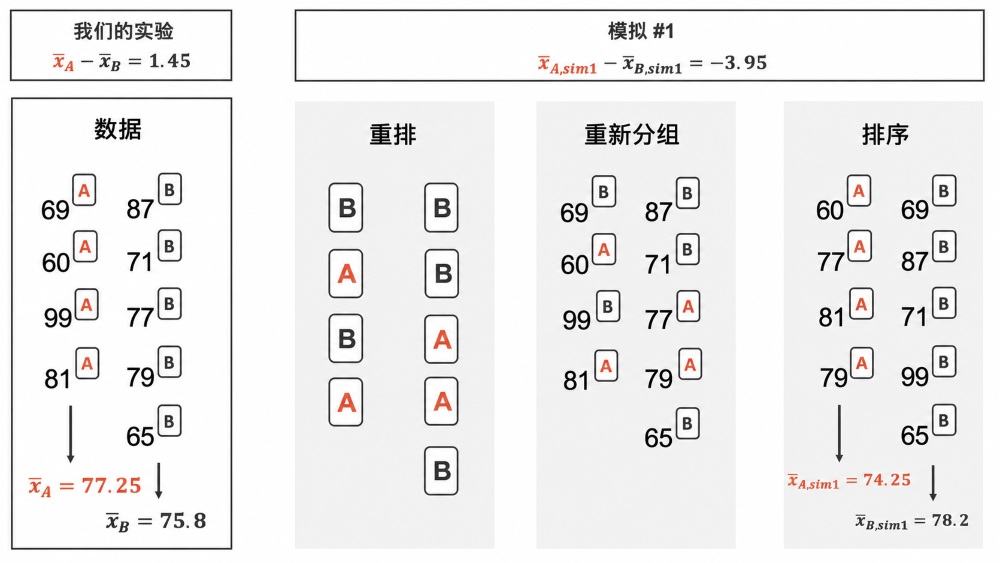
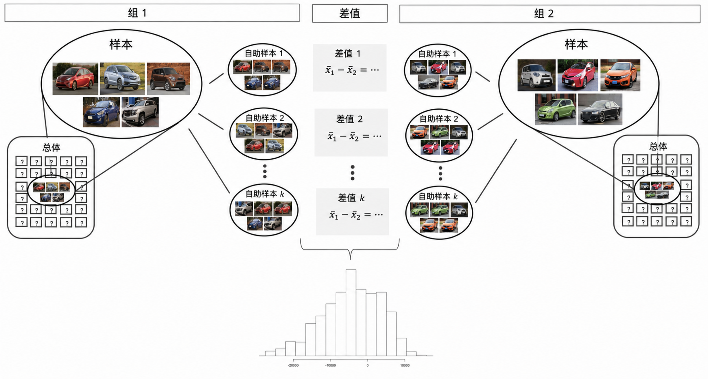

# 两个独立均值的比较推断 {#sec-inference-two-means}

```{r}
#| include: false
source("_common.R")
```


::: {.chapterintro data-latex=""}
现在，我们将 [第 -@sec-inference-one-mean 章]中的方法进行推广，把置信区间和假设检验应用于来自两个组（第 1 组和第 2 组）的总体均值差：$\mu_1 - \mu_2.$

在接下来的研究中，我们将基于样本确定 $\mu_1 - \mu_2$ 的合理点估计，你可能已经猜到它的形式了：$\bar{x}_1 - \bar{x}_2.$ \index{point estimate!difference in means}\index{difference in means!point estimate} 接着，我们将通过三种不同的方法进行推断分析：使用随机化检验，使用自助法进行区间估计，以及如果验证了点估计可以用正态分布进行建模，则计算该点估计的标准误并应用数学框架。
:::

```{r}
#| include: false
terms_chp_20 <- c("point estimate")
```


在本节中，我们考虑在数据非配对条件下的两个总体均值差 $\mu_1 - \mu_2,$。
与单样本情形一样，我们需要确定条件，以确保能够使用 $t$ 分布、差值的点估计 $\bar{x}_1 - \bar{x}_2,$ 以及一个新的标准误公式。

在两个独立均值情境下处理推断问题的细节，与应用于两个独立比例情境的细节极为相似。
我们首先介绍一种随机化检验，即在原假设为真的前提下对观测进行打乱重排。
然后，我们对数据进行自助法（不施加原假设），为真实的总体均值差 $\mu_1 - \mu_2$ 构建置信区间。只要条件满足，这里的数学模型（$t$ 分布）就能够同时描述随机化检验和自助法。

这些推断工具被应用于三个不同的数据情境：确定干细胞是否能改善心脏功能，探究孕妇吸烟习惯与新生儿出生体重之间的关联，以及探索是否有令人信服的证据表明某一版本的考试比另一版本更难。
本节的动机来自于诸如“是否有令人信服的证据表明，吸烟母亲的新生儿平均出生体重与不吸烟母亲的新生儿不同？”这类问题。

\clearpage

## 均值差的随机化检验 {#sec-rand2mean}

一位教师决定使用同一场考试的两种略有不同的版本。
在分发试卷之前，他们打乱了所有试卷，以确保每位学生收到的是随机分配的版本。
考虑到参加版本 B 考试的学生可能会有抱怨，他们希望评估两组间观测到的差异是否大到足以提供令人信服的证据，证明版本 B（平均而言）比版本 A 更难。

::: {.data data-latex=""}
[`classdata`](http://openintrostat.github.io/openintro/reference/classdata.html) 数据集可以在 [**openintro**](http://openintrostat.github.io/openintro) R 包中找到。
:::

\vspace{-5mm}

### 观测数据

学生在这两场考试中表现的汇总统计量如 [表 -@tbl-summaryStatsForTwoVersionsOfExams]所示，并在 [图 -@fig-boxplotTwoVersionsOfExams]中以图形展示。

```{r}
#| label: tbl-summaryStatsForTwoVersionsOfExams
#| tbl-cap: 各考试版本得分的汇总统计量。
#| tbl-pos: H
classdata <- classdata |>
  filter(lecture %in% c("a", "b")) |>
  mutate(
    lecture = str_to_upper(lecture),
    exam = lecture
  )

classdata |>
  group_by(exam) |>
  summarise(
    n = n(),
    mean = mean(m1),
    sd = sd(m1),
    min = min(m1),
    max = max(m1)
  ) |>
  kbl(
    linesep = "",
    booktabs = TRUE,
    col.names = c("组", "n", "均值", "标准差", "最小值", "最大值"),
    align = "ccccc"
  ) |>
  kable_styling(
    bootstrap_options = c("striped", "condensed"),
    latex_options = c("striped"),
    full_width = FALSE
  ) |>
  column_spec(1:5, width = "5em")
```


```{r}
#| label: fig-boxplotTwoVersionsOfExams
#| fig-cap: 参加两种不同考试版本之一的学生的考试成绩。
#| fig-alt: 按考试版本划分的考试成绩箱线图。
#| fig-asp: 0.5
ggplot(classdata, aes(x = exam, y = m1, color = exam)) +
  geom_boxplot(show.legend = FALSE) +
  geom_jitter(width = 0.1) +
  labs(
    title = "按考试版本划分的考试成绩箱线图",
    x = "考试版本",
    y = "分数"
  ) +
  scale_color_manual(values = c(IMSCOL["blue", "full"], IMSCOL["red", "full"]))
```

::: {.guidedpractice data-latex=""}
请构建假设，以评估在原假设为真的情况下，观测到的样本均值差 $\bar{x}_A - \bar{x}_B=3.1,$ 是否可能仅由随机性导致。
我们稍后将使用 $\alpha = 0.01$ 的显著性水平来评估这些假设。[^20-inference-two-means-1]
:::

[^20-inference-two-means-1]: $H_0:$ 平均而言，两次考试同样困难。
    $\mu_A - \mu_B = 0.$ $H_A:$ 平均而言，其中一次考试比另一次更难。
    $\mu_A - \mu_B \neq 0.$

::: {.guidedpractice data-latex=""}
在继续评估上一个引导练习中的假设之前，让我们仔细思考一下这个数据集。
两组间的观测是否独立？
是否有任何关于离群值的担忧？[^20-inference-two-means-2]
:::

[^20-inference-two-means-2]: 由于考试被打乱重排，本例中的“处理”是随机分配的，因此组内和组间的独立性条件得以满足。
    汇总统计量表明数据大致围绕均值对称，且最大值和最小值未提示有任何需要担忧的离群值。

\clearpage

### 统计量的变异性

在 [第 -@sec-foundations-randomization 章]中，统计量的变异性（之前是指 $\hat{p}_1 - \hat{p}_2$）是通过在两个处理组间多次打乱重排观测后可视化呈现的。
打乱重排的过程实现了原假设模型（即处理没有效果）。
在考试例子中，原假设是考试 A 和考试 B 同样困难，因此两次考试的平均分应该相同。
如果考试确实同样困难，*由于自然变异性*，我们有时会预期学生在考试 A 上表现得稍好一点 $(\bar{x}_A > \bar{x}_B)$，有时则预期学生在考试 B 上表现得稍好一点 $(\bar{x}_B > \bar{x}_A)$。当前的问题是：$\bar{x}_A - \bar{x}_B=3.1$ 是否表明考试 A 比考试 B 更容易？

[图 -@fig-rand2means]展示了将考试版本随机分配给观测到的考试分数的过程。
如果原假设为真，那么每份考试的分数都应代表学生在该内容上的真实能力。
他们得到的是考试 A 还是考试 B 应该无关紧要。
通过重新分配哪个学生得到哪种考试，我们能够理解仅由自然变异性引起的平均考试分数差异是如何变化的。
[图 -@fig-rand2means]中只展示了随机化过程的一次迭代，从而得到一个模拟的平均分差异。

```{r}
#| label: fig-rand2means
#| fig-cap: |
#|   在假设考试同等难度的原假设下，将考试版本（A 或 B）随机分配给考试分数。
#| fig-alt: |
#|   四个面板展示了包含 9 个考试分数的玩具数据集的四种不同排列。第一个面板给出了观测数据：4 份考试是 A 版，平均分为 77.25；5 份考试是 B 版，平均分为 75.8，差异为 1.45。第二个面板展示了考试版本的打乱重排分配（4 个分数被随机重新分配为 A 版，5 个分数被随机重新分配为 B 版）。第三个面板展示了每个分数与重新分配后的考试版本的对应关系。第四个面板将考试排序，使 A 版考试放在一起，B 版考试放在一起。在随机重新分配的版本中，A 版考试的平均分为 74.25，B 版考试的平均分为 78.2，差异为 -3.95。
#| out-width: 75%

```


基于 [图 -@fig-rand2means]的思路， [图 -@fig-randexams]展示了在 1,000 次随机模拟中模拟统计量 $\bar{x}_{1, sim} - \bar{x}_{2, sim}$ 的值。
我们可以看到，仅凭偶然，分数差异可以在 -10 分到 +10 分之间的任何位置。

```{r}
#| label: fig-randexams
#| fig-cap: |
#|   对考试类型进行 1,000 次不同随机化所计算出的均值差的直方图。
#| fig-alt: |
#|   对考试类型进行 1,000 次不同随机化所计算出的均值差的直方图。
#| fig-asp: 0.5
set.seed(47)
classdata |>
  specify(m1 ~ exam) |>
  hypothesize(null = "independence") |>
  generate(reps = 1000, type = "permute") |>
  calculate(stat = "diff in means", order = c("A", "B")) |>
  visualize() +
  labs(
    title = "1,000 次随机化均值差",
    x = "随机化均值差\n(A - B)",
    y = "频数"
  )
```


### 观测统计量与原假设统计量

随机化检验的目标是评估观测数据，此处关注的统计量是$\bar{x}_A - \bar{x}_B=3.1.$随机化分布使我们能够判断，如果两次考试难度相同，那么3.1分的差异是否超出了仅由分数的自然变异性所能预期的范围。
通过在 [图 -@fig-randexamspval]图中标出数值3.1，我们可以衡量3.1与原假设下生成的随机化差值有多大的差异或相似程度。

```{r}
#| label: fig-randexamspval
#| fig-cap: |
#|   通过1,000次不同的考试类型随机化计算得到的均值差直方图。
#|   观测到的3.1分差异以垂直线标出，比3.1更极端的区域被着色以表示 p 值。
#| fig-alt: |
#|   通过1,000次不同的考试类型随机化计算得到的均值差直方图。
#|   观测到的3.1分差异以垂直线标出，比3.1更极端的区域被着色以表示 p 值。
stat_2means <- classdata |>
  specify(m1 ~ exam) |>
  calculate(stat = "diff in means", order = c("A", "B"))

set.seed(47)
classdata |>
  specify(m1 ~ exam) |>
  hypothesize(null = "independence") |>
  generate(reps = 1000, type = "permute") |>
  calculate(stat = "diff in means", order = c("A", "B")) |>
  visualize() +
  labs(
    title = "1,000个随机化均值差",
    x = "随机化均值差\n(A - B)",
    y = "计数"
  ) +
  shade_p_value(
    obs_stat = stat_2means,
    direction = "two-sided",
    color = IMSCOL["red", "full"]
  )
```


::: {.workedexample data-latex=""}
估算 [图 -@fig-randexamspval]中描绘的 p 值，并在案例研究的背景下给出结论。

------------------------------------------------------------------------

使用软件，我们可以发现有900个重排后的均值差小于观测差异（3.14）（在1,000次随机化中）。
因此有10% 的模拟差值大于观测差异。
为了得到 p 值，我们将随机化差值中大于观测值的比例乘以2，得到 p 值 = 0.2。

之前，我们设定将使用 $\alpha = 0.01.$ 由于 p 值大于 $\alpha,$ 我们不拒绝原假设。
也就是说，数据并未令人信服地表明一个考试版本比另一个更难，教师不应认定需要给版本B的考试成绩加分。
:::

较大的 p 值以及$\bar{x}_A - \bar{x}_B=3.1$与随机化差值的一致性，促使我们*不拒绝原假设*。
换种说法，没有证据表明其中一个考试更容易。
人们可能倾向于得出考试具有相同难度水平的结论，但这个结论是错误的。
假设检验框架的设定仅仅是为了拒绝原假设，而不是为了验证原假设。
正如我们所得出的结论，数据与“考试A和B同等难度”的说法相一致，但数据与“考试A比考试B容易3.1分”的说法也相一致。
数据无法判定这两个考试是同等难度还是其中一个稍微容易一些。
的确，不拒绝原假设的结论往往显得不尽如人意。
然而，在本例中，教师和全班可能都松了一口气，因为没有证据表明其中一个考试比另一个更难。

## 均值差的自助法置信区间

\index{difference in means}

在提供一个基于实际数据进行自助分析的完整示例之前，我们回到虚构的 Awesome Auto 示例，以此可视化两样本自助法的设定。
考虑一个扩展的场景，其研究问题集中于比较一个 Awesome Auto 特许经营店（第1组）与另一个不同的 Awesome Auto 特许经营店（第2组）的汽车平均价格。
自助法的过程可以*分别*应用于*每组*，并且每次都重新计算均值差。
[图 -@fig-bootmeans2means]直观地描述了当关注的统计量基于两个独立样本计算时的自助过程。
分析过程与单样本情况类似，但现在关注的（单一）统计量是*样本均值差*。
也就是说，分别对每组进行自助重抽样，但将结果合并以得到一个自助均值差。
重复此过程将产生 $k$ 个自助均值差，而直方图将描述与均值差相关的自然抽样变异性。

```{r}
#| include: false
terms_chp_20 <- c(terms_chp_20, "difference in means")
```


```{r}
#| label: fig-bootmeans2means
#| fig-cap: |
#|   对于两个组的比较，自助重采样是分别对每个组进行的，但统计量以差值进行计算。然后，这 k 个差值作为我们感兴趣的统计量被分析，从而对我们感兴趣的参数得出结论。
#| fig-alt: |
#|   样本显示为分别来自两个独立的、大型的、未知的总体。直接从两个观测样本各自出发，可以进行自助重采样（有放回）。通过比较自助均值的差，将来自样本 1 的自助样本 1 与来自样本 2 的自助样本 1 进行比较。自助均值的差的直方图显示差值范围大约在 -20,000 美元到 +10,000 美元之间。
#| out-width: 80%

```


在接下来的几节中，我们将离开虚构的 Awesome Auto 情境，将自助法应用于研究胚胎干细胞是否有助于改善心脏功能，以及随后用于研究生育特征的实际数据集。请注意，虚构情境使我们能够可视化自助法，因为我们的样本量为5。可视化对于理解自助法的运作原理非常重要。然而，自助法在很大程度上依赖于样本是总体的优秀代表，而5个观测几乎从来不足以真正代表完整总体的所有细微差别。为此，我们将在更大的样本量上应用自助方法，正如在出生数据集提供的 1,000 个随机样本中所看到的那样。

### 观测数据

使用胚胎干细胞治疗是否有助于改善心脏病发作后的心脏功能？
[表 -@tbl-statsSheepEscStudy]包含了一项在心脏病发作的绵羊身上测试 ESCs 的实验的汇总统计量。
这些绵羊中的每一只都被随机分配到 ESC 组或对照组，并在研究中测量了它们心脏泵血能力的变化。
[@Menard:2005] [图 -@fig-stem-cell-histograms]提供了两个数据集的直方图。
正值对应于泵血能力增加，这通常意味着更强的恢复能力。
我们的目标是确定 ESCs 相对于对照组对心脏泵血能力变化影响的 95% 置信区间。

::: {.data data-latex=""}
[`stem_cell`](http://openintrostat.github.io/openintro/reference/stem_cell.html) 数据集可以在 [**openintro**](http://openintrostat.github.io/openintro) R 包中找到。
:::

```{r}
#| label: tbl-statsSheepEscStudy
#| tbl-cap: 胚胎干细胞研究的汇总统计量。
#| tbl-pos: H
stem_cell <- openintro::stem_cell |>
  mutate(
    trmt = if_else(trmt == "ctrl", "Control", "ESC"),
    trmt = fct_relevel(trmt, "ESC", "Control"),
    change = after - before
  )

stem_cell |>
  group_by(trmt) |>
  summarise(
    n = n(),
    mean = mean(change),
    sd = sd(change)
  ) |>
  kbl(
    linesep = "",
    booktabs = TRUE,
    col.names = c("组别", "n", "均值", "标准差"),
    digits = 2,
    align = "lccc"
  ) |>
  kable_styling(
    bootstrap_options = c("striped", "condensed"),
    latex_options = c("striped"),
    full_width = FALSE
  ) |>
  column_spec(1:4, width = "6em")
```


心脏泵血能力变量差异的点估计很容易找到：它就是样本均值差。

$$\bar{x}_{esc} - \bar{x}_{control}\   =\ 3.50 - (-4.33)\   =\ 7.83$$

### 统计量的变异性

正如我们在 [第 -@sec-two-prop-boot-ci 节]中所见，我们将使用自助法来估计在重复抽样时与样本均值差相关的变异性。
这种方法类似于两个比例的情形：分别从每组（此处是 ESCs 组和对照组）*分别*有放回抽取一个样本，计算样本均值，然后取它们的差值。
重复整个过程多次，即可产生样本均值差的自助分布（*无需*原假设的假定）。

[图 -@fig-bootexamsci]显示了均值差的变异性，并叠加绘制了 90% 百分位置信区间和标准误置信区间。

```{r}
#| label: fig-bootexamsci
#| fig-cap: |
#|   从两组中各抽取 1,000 个自助样本后的均值差直方图。观测均值差以一条黑色垂直线标在
#|   7.83 处。蓝色虚线和红色点线分别给出了真实总体均值差的自助百分位数置信区间和
#|   自助标准误置信区间。
#| fig-alt: |
#|   从两组中各抽取 1,000 个自助样本后的均值差直方图。观测均值差以一条黑色垂直线标在
#|   7.83 处。蓝色虚线和红色点线分别给出了真实总体均值差的自助百分位数置信区间和
#|   自助标准误置信区间。
set.seed(470)

boot_2mean <- stem_cell |>
  specify(change ~ trmt) |>
  generate(reps = 1000, type = "bootstrap") |>
  calculate(stat = "diff in means", order = c("ESC", "Control"))

stat_2means <- stem_cell |>
  specify(change ~ trmt) |>
  calculate(stat = "diff in means", order = c("ESC", "Control"))


ci_perc_2mean <- boot_2mean |>
  get_confidence_interval(level = 0.9, type = "percentile")

ci_se_2mean <- boot_2mean |>
  get_confidence_interval(
    level = 0.9,
    type = "se",
    point_estimate = stat_2means
  )

boot_2mean |>
  infer::visualize() +
  infer::shade_confidence_interval(
    ci_perc_2mean,
    fill = NULL,
    size = 1,
    color = IMSCOL["green", "full"],
    linetype = "dashed"
  ) +
  infer::shade_confidence_interval(
    ci_se_2mean,
    fill = NULL,
    size = 1,
    color = IMSCOL["red", "full"],
    linetype = "dotted"
  ) +
  labs(
    title = "1,000 个自助均值差",
    x = "自助均值差\n(ESC - Control)",
    y = "频数"
  ) +
  geom_vline(xintercept = stat_2means$stat, size = 1) +
  expand_limits(x = c(0, 15), y = c(0, 200)) +
  geom_line(
    aes(y = 200, x = stat, color = "a", linetype = "a"),
    alpha = 0,
    size = 1
  ) + # 虚拟代码
  geom_line(
    aes(y = 200, x = stat, color = "b", linetype = "b"),
    alpha = 0,
    size = 1
  ) + # 虚拟代码
  geom_line(
    aes(y = 200, x = stat, color = "c", linetype = "c"),
    alpha = 0,
    size = 1
  ) + # 虚拟代码
  guides(color = guide_legend(override.aes = list(alpha = 1))) +
  scale_color_manual(
    name = NULL,
    values = c(
      "a" = IMSCOL["blue", "full"],
      "b" = IMSCOL["red", "full"],
      "c" = IMSCOL["black", "full"]
    ),
    labels = c(
      "百分位数\n区间\n",
      "标准误\n区间\n",
      "观测\n统计量"
    ),
    guide = "legend"
  ) +
  scale_linetype_manual(
    name = NULL,
    values = c("a" = "dashed", "b" = "dotted", "c" = "solid"),
    labels = c(
      "百分位数\n区间\n",
      "标准误\n区间\n",
      "观测\n统计量"
    ),
    guide = "legend"
  ) +
  theme(
    legend.position = c(0.87, 0.75),
    legend.background = element_rect(fill = "white")
  )
```


::: {.guidedpractice data-latex=""}
利用自助均值差的直方图，估计样本均值差的标准误，$\bar{x}_{ESC} - \bar{x}_{Control}.$[^20-inference-two-means-3]
:::

[^20-inference-two-means-3]: 总体均值差（$\bar{x}_{ESC} - \bar{x}_{Control}$）的点估计为 7.83。

::: {.workedexample data-latex=""}
选择真实平均泵送能力差 $\mu_{ESC} - \mu_{Control}.$ 的一个自助置信区间。该区间是否显示两种处理间存在差异？

------------------------------------------------------------------------

由于上述两个 90% 置信区间（无论是百分位数法还是标准误法）都不包含 0（注意 0 从未出现在自助法差值中，因此 95% 和 99% 的区间也会得出相同结论！），区间显示存在差异，我们得出结论：ESC 治疗在心脏泵血能力方面显著优于对照组。

由于该研究是一项随机对照实验，我们可以得出结论：是处理（ESC）导致了泵送能力的改变。
:::

## 检验均值差的数学模型 {#sec-math2samp}

每年，美国都会向公众发布一个大型数据集，其中包含该国记录的出生信息。
这个数据集一直受到医学研究者的关注，他们正在研究准妈妈的习惯与做法同其孩子出生情况之间的关联。
我们将使用 2014 年发布的数据集中随机抽取的 1,000 个观测单位。

::: {.data data-latex=""}
[`births14`](http://openintrostat.github.io/openintro/reference/births14.html) 数据可以在 [**openintro**](http://openintrostat.github.io/openintro) R 包中找到。
:::

### 观测数据

该数据集中的四个观测单位如 [表 -@tbl-babySmokeDF]所示。
我们特别关注两个变量：`weight` 和 `smoke`。
`weight` 变量代表新生儿的体重，`smoke` 变量描述母亲在孕期是否吸烟。

```{r}
#| label: tbl-babySmokeDF
#| tbl-cap: "`births14` 数据集中的四个观测单位。空单元格表示缺失数据。"
#| tbl-pos: H
births14 |>
  select(-premie, -mature, -lowbirthweight, -whitemom, -marital) |>
  head(4) |>
  kbl(
    linesep = "",
    booktabs = TRUE,
    escape = FALSE,
    align = "cccclcclll"
  ) |>
  kable_styling(
    bootstrap_options = c("striped", "condensed"),
    latex_options = c("striped")
  )
```


我们想知道，是否有令人信服的证据表明，吸烟母亲所生新生儿的平均出生体重与不吸烟母亲所生新生儿不同？
我们将用该样本的数据来尝试回答这个问题。

::: {.workedexample data-latex=""}
设立适当的假设，以评估母亲吸烟与新生儿平均出生体重之间是否存在关联。

------------------------------------------------------------------------

原假设代表组间无差异的情况。

-   $H_0:$ 吸烟与不吸烟母亲所生新生儿的平均出生体重没有差异。用统计符号表示为：$\mu_{n} - \mu_{s} = 0,$，其中 $\mu_{n}$ 代表不吸烟母亲，$\mu_s$ 代表吸烟母亲。
-   $H_A:$ 吸烟与不吸烟母亲所生新生儿的平均出生体重存在差异 $(\mu_{n} - \mu_{s} \neq 0).$
:::

[表 -@tbl-births14-summary-stats]展示了数据中的样本统计量。
我们可以看到，吸烟母亲所生婴儿的平均出生体重低于不吸烟母亲所生婴儿的。

```{r}
#| label: tbl-births14-summary-stats
#| tbl-cap: "`births14` 数据集的汇总统计量。"
#| tbl-pos: H
births14_nona <- births14 |>
  filter(
    !is.na(habit),
    !is.na(weight)
  )

births14_sample_stats <- births14_nona |>
  group_by(habit) |>
  summarise(
    n = n(),
    Mean = mean(weight),
    SD = sd(weight)
  )

xbar_nonsmoker <- round(
  births14_sample_stats |> filter(habit == "nonsmoker") |> pull(Mean),
  2
)
xbar_smoker <- round(
  births14_sample_stats |> filter(habit == "smoker") |> pull(Mean),
  2
)
xbar_difference <- xbar_nonsmoker - xbar_smoker
sd_nonsmoker <- round(
  births14_sample_stats |> filter(habit == "nonsmoker") |> pull(SD),
  2
)
sd_smoker <- round(
  births14_sample_stats |> filter(habit == "smoker") |> pull(SD),
  2
)
n_nonsmoker <- births14_sample_stats |>
  filter(habit == "nonsmoker") |>
  pull(n)
n_smoker <- births14_sample_stats |>
  filter(habit == "smoker") |>
  pull(n)
se_difference <- round(
  sqrt(sd_nonsmoker^2 / n_nonsmoker + sd_smoker^2 / n_smoker),
  2
)
t_difference <- round(xbar_difference / se_difference, 2)
df_difference <- min(n_nonsmoker - 1, n_smoker - 1)

births14_sample_stats |>
  kbl(
    linesep = "",
    booktabs = TRUE,
    col.names = c("习惯", "n", "均值", "标准差"),
    align = "lccc",
    digits = 2
  ) |>
  kable_styling(
    bootstrap_options = c("striped", "condensed"),
    latex_options = c("striped"),
    full_width = FALSE
  ) |>
  column_spec(1:4, width = "7em")
```


### 统计量的变异性

我们检查使用 $t$ 分布来对样本均值差进行建模所需满足的两个条件。

-   因为数据来自简单随机样本，所以观测是独立的（无论是样本内还是样本之间）。
-   由于两组都超过 30 个观测，我们在 [图 -@fig-babySmokePlotOfTwoGroupsToExamineSkew]中检查数据，看是否有特别极端的离群值，结果没有发现。

由于两个条件都满足，样本均值差可以用 $t$ 分布来建模。

```{r}
#| label: fig-babySmokePlotOfTwoGroupsToExamineSkew
#| fig-cap: |
#|   左图代表母亲在孕期吸烟的婴儿出生体重。
#|   右图代表母亲在孕期不吸烟的婴儿出生体重。
#| fig-alt: |
#|   左图代表母亲在孕期吸烟的婴儿出生体重。
#|   右图代表母亲在孕期不吸烟的婴儿出生体重。
#| fig-asp: 0.35
#| out-width: 100%
births14_nona |>
  mutate(
    habit = fct_rev(if_else(
      habit == "smoker",
      "母亲吸烟",
      "母亲不吸烟"
    ))
  ) |>
  ggplot(aes(x = weight)) +
  geom_histogram(binwidth = 1) +
  facet_wrap(~habit, ncol = 2, scales = "free_y") +
  scale_x_continuous(breaks = seq(0, 10, 2), limits = c(0, 10)) +
  labs(x = "新生儿体重 (磅)", y = "频数")
```


::: {.guidedpractice data-latex=""}
[表 -@tbl-births14-summary-stats]中的汇总统计量可能对本次引导练习有帮助。
总体均值差 $\mu_{n} - \mu_{s}$ 的点估计是什么？[^20-inference-two-means-4]
:::

[^20-inference-two-means-4]: 总体差异（$\bar{x}_{n} - \bar{x}_{s}$）的点估计是 `r xbar_difference`。

### 观测统计量与原假设下的统计量

::: {.important data-latex=""}
**用于比较两个均值的检验统计量是 t 统计量。**

\index{T score!difference in means}\index{difference in means!T score}
\index{t-test}

t 统计量是组间差异相对于组内观测的变异性程度的比值。

\vspace{-5mm}

$$T = \frac{(\bar{x}_1 - \bar{x}_2) - 0}{\sqrt{s_1^2/n_1 + s_2^2/n_2}}$$

当原假设为真且条件满足时，t 统计量服从自由度为 $df = min(n_1 - 1, n_2 -1).$ 的 t 分布。

条件：

-   组内和组间的观测是独立的。
-   大样本且无极端离群值。
:::

```{r}
#| include: false
terms_chp_20 <- c(terms_chp_20, "T score", "t-test")
```


\vspace{-2mm}

::: {.guidedpractice data-latex=""}
计算不吸烟与吸烟母亲所生婴儿体重均值差的点估计的标准误。[^20-inference-two-means-5]
:::

[^20-inference-two-means-5]: $SE(\bar{x}_{n} - \bar{x}_{s}) = \sqrt{s^2_{n}/ n_{n} + s^2_{s}/n_{s}} = \sqrt{1.23^2/867 + 1.60^2/114} = 0.16$

\vspace{-2mm}

::: {.workedexample data-latex=""}
完成前面示例和引导练习中基于 `births14` 数据集和研究问题开始的假设检验。
使用可辨识水平 $\alpha=0.05$。作为参考，$\bar{x}_{n} - \bar{x}_{s} = `r xbar_difference`,$ $SE = `r se_difference`,$ 样本量为 $n_n = `r n_nonsmoker`$ 和 $n_s = `r n_smoker`.$

------------------------------------------------------------------------

我们可以利用之前的信息找到这个检验的检验统计量：

\vspace{-5mm}

$$T = \frac{\ `r xbar_difference` - 0\ }{`r se_difference`} = `r t_difference`$$

我们使用软件计算单尾面积。
我们将使用 $n_n - 1 = `r n_nonsmoker-1`$ 和 $n_s - 1 = `r n_smoker-1`$ 中较小的那个作为自由度：$df = `r df_difference`.$ 单尾面积大约为 0.00017；将此值乘以 2 即得到双尾面积和 p 值，0.00034。

p 值小于可辨识水平 0.05，因此我们拒绝原假设。
数据提供了统计上可辨识的证据，表明母亲在孕期吸烟与不吸烟所生婴儿的平均体重存在差异。
:::

\vspace{-5mm}

这个结果可能并不令人惊讶。
我们都知道吸烟有害健康，你可能也听说过孕期吸烟不仅对母亲有害，对婴儿同样有害。
事实上，烟草业的一些人竟然胆敢将此吹捧为吸烟的*好处*：

> *这是真的。吸烟女性生下的婴儿更小，但他们和从不吸烟女性生下的婴儿一样健康。而且有些女性更愿意生小一点的婴儿。* —— Philip Morris 公司董事会主席 Joseph Cullman（约瑟夫·卡尔曼），于 CBS《面对全国》节目，1971年1月3日

此外，母亲吸烟与不吸烟所生婴儿之间的健康差异并不仅限于体重差异。[^20-inference-two-means-6]

[^20-inference-two-means-6]: 你可以观看 John Oliver（约翰·奥利弗）在《上周今夜秀》上的一期节目 [*Last Week Tonight*](youtu.be/6UsHHOCH4q8)，了解烟草行业现今的劣迹。
    请注意，其中含有一些成人语言。

关于独立样本 t 检验的检验功效的一个小注记（回顾 [第 -@sec-pow 节]中关于检验功效的讨论）。事实证明，这里给出的独立样本 t 检验的检验功效通常低于 [第 -@sec-mathpaired 节]中讨论的配对 t 检验。不过，取决于数据收集的方式，我们并不总是有对数据进行配对的机制，从而降低观测间固有的变异性。

\clearpage

## 估计均值差的数学模型

### 观测数据

与假设检验一样，对于能否使用 $t$ 分布对差异进行建模的问题，我们需要检查新的条件。
与两个比例的情形类似，我们需要一个更稳健的独立性条件，以确保我们确信两组也是独立的。
其次，我们还需要分别检查每个组的正态性，在实践中这通常是对离群值的检查。

```{r}
#| include: false
terms_chp_20 <- c(terms_chp_20, "t-CI")
```


\index{point estimate!difference in means}\index{difference in means!point estimate}

::: {.important data-latex=""}
**使用 $t$ 分布进行均值差推断。**

如果满足以下条件，$t$ 分布可用于对两个均值的标准化差值进行推断：

-   *独立性（扩展）*。数据在两组内和两组间都是独立的，例如，数据来自独立的随机样本或一个随机化实验。
-   *正态性*。我们分别检查每组的离群值。

标准误可计算为 \index{standard error (SE)!difference in means}\index{difference in means!standard error (SE)}

$$SE = \sqrt{\frac{\sigma_1^2}{n_1} + \frac{\sigma_2^2}{n_2}}$$

自由度的官方公式相当复杂，通常使用软件计算，因此，如果软件不便获取，你可以使用 $n_1 - 1$ 和 $n_2 - 1$ 中的较小值作为自由度。
:::

回忆一下，误差界由标准误定义。
$\bar{x}_1 - \bar{x}_2$ 的误差界可以直接从 $SE(\bar{x}_1 - \bar{x}_2).$ 中获得

::: {.important data-latex=""}
**$\bar{x}_1 - \bar{x}_2.$ 的误差界**

误差界为 $t^\star_{df} \times \sqrt{\frac{s_1^2}{n_1} + \frac{s_2^2}{n_2}}$，其中 $t^\star_{df}$ 是根据具有 *df* 自由度的 t 分布的指定百分位数计算得出的。
:::

```{r}
#| include: false
terms_chp_20 <- c(terms_chp_20, "SE difference in means")
```


### 统计量的变异性

\index{t-CI!difference in means}

::: {.workedexample data-latex=""}
能否使用 $t$ 分布，基于点估计 $\bar{x}_{esc} - \bar{x}_{control} = 7.83$ 进行推断？

------------------------------------------------------------------------

首先，我们检查独立性条件。
由于绵羊被随机化分配到各组，因此组内和组间的独立性条件得以满足。

[图 -@fig-stem-cell-histograms]并未显示任何一组中存在明显的离群值。
（ESC 组看起来确实变异性稍大，但这与存在明显的离群值不同。）

两个条件都满足后，我们可以使用 $t$ 分布来对样本均值差进行建模。
:::

```{r}
#| label: fig-stem-cell-histograms
#| fig-cap: |
#|   心脏病发作后，处理组（ESC，接受了胚胎干细胞处理）和对照组（未接受该处理）心脏泵血功能变化值的直方图。
#| fig-alt: |
#|   心脏病发作后，处理组（ESC，接受了胚胎干细胞处理）和对照组（未接受该处理）心脏泵血功能变化值的直方图。
stem_cell |>
  ggplot(aes(x = change)) +
  geom_histogram(binwidth = 2.5) +
  facet_wrap(~trmt, ncol = 1) +
  scale_x_continuous(
    labels = label_percent(scale = 1, accuracy = 1),
    breaks = seq(-10, 15, 5)
  ) +
  labs(
    x = "心脏泵血功能的变化",
    y = "频数"
  )
```


通常，我们使用统计软件来查找合适的自由度；如果软件不可用，我们可以使用 $n_1 - 1$ 和 $n_2 - 1$ 中的较小值作为自由度，例如，在使用 t 分布表查找尾部面积时。
为了在“示例”和“引导练习”中保持透明，我们将使用后一种方法来确定 $df$；在 ESC 示例中，这意味着我们将使用 $df = 8$。

::: {.workedexample data-latex=""}
计算绵羊心脏病发作后 ESCs 对心脏泵血能力变化影响的 95% 置信区间。

------------------------------------------------------------------------

我们将使用之前计算出的样本差值和标准误：

$$
\begin{aligned}
\bar{x}_{esc} - \bar{x}_{control} &= 7.83 \\
SE &= \sqrt{\frac{5.17^2}{9} + \frac{2.76^2}{9}} = 1.95
\end{aligned}
$$

使用 $df = 8$，我们可以确定 95% 置信区间的临界值 $t^{\star}_{8} = 2.31$。
最后，我们可以将这些值代入置信区间公式：

$$
\begin{aligned}
\text{点估计} \ &\pm\ t^{\star} \times SE \\
7.83 \ &\pm\ 2.31\times 1.95 \\
(3.32 \ &, \ 12.34)
\end{aligned}
$$

我们有 95% 的信心认为，接受胚胎干细胞治疗的绵羊的心脏泵血功能比未接受干细胞治疗的绵羊高 3.32% 到 12.34%。
:::

\clearpage

## 章节回顾 {#sec-chp20-review}

### 总结

在本章中，我们将单均值的推断方法推广到了均值差的问题上。
你可能已经注意到，这与将单比例推断（ [第 -@sec-inference-one-prop 章]）推广到比例差推断（ [第 -@sec-inference-two-props 章]）的章节有相似之处。
当考虑样本均值差时（实际上，当考虑许多定量统计量时），我们使用 t 分布来描述 t 统计量（样本均值的标准化差值）的抽样分布。
置信水平的概念以及假设检验结论可能产生的错误类型，都与前面章节中看到的类似（参见 [第 -@sec-foundations-decision-errors 章]）。

### 术语

本章介绍的术语列在 [表 -@tbl-terms-chp-20]中。
如果你不确定其中某些术语的含义，我们建议你返回正文复习它们的定义。
你应该能轻易地发现它们，因为它们是以**粗体文本**显示的。

```{r}
#| label: tbl-terms-chp-20
#| tbl-cap: 本章介绍的术语。
#| tbl-pos: H
make_terms_table(terms_chp_20)
```


\clearpage

## 练习 {#sec-chp20-exercises}

奇数编号练习的答案可以在 [附录 -@sec-exercise-solutions-20]中找到。

::: {.exercises data-latex=""}

:::
