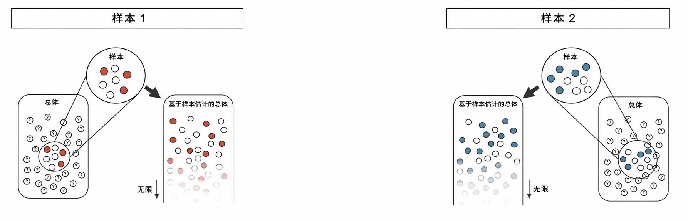
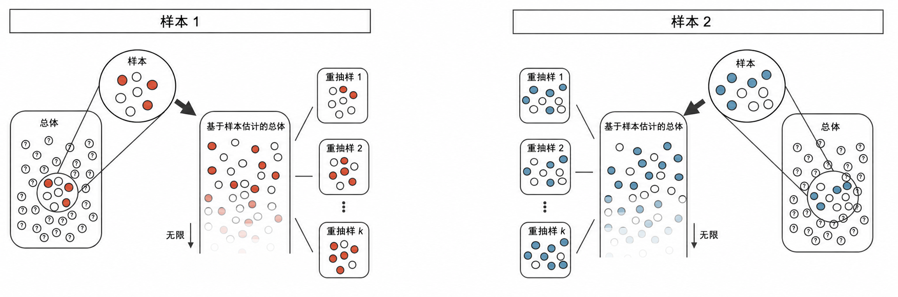
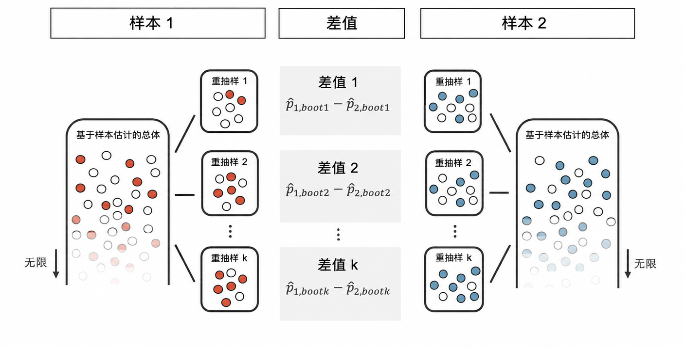
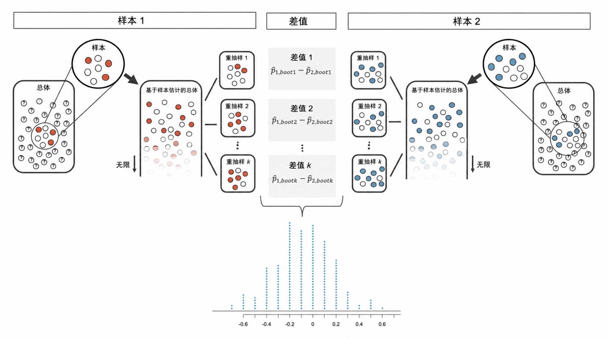

# 两个比例的比较推断 {#sec-inference-two-props}

```{r}
#| include: false
source("_common.R")
```


\vspace{-5mm}

::: {.chapterintro data-latex=""}
现在，我们将 [第 -@sec-inference-one-prop 章]中的方法推广，对两组（第 1 组和第 2 组）总体比例之差 $p_1 - p_2.$ 应用置信区间和假设检验。

在接下来的研究中，我们将根据样本，为 $p_1 - p_2$ 找到一个合理的点估计；你可能已经猜到它的形式了：$\hat{p}_1 - \hat{p}_2.$ \index{point estimate!difference of proportions}\index{difference of proportions!point estimate}接着，我们将用三种不同的方法进行推断分析：使用随机化检验，使用自助法进行区间估计，以及在确认这个点估计可以用正态分布建模后，计算该点估计的标准误，并应用相应的数学框架。
:::

```{r}
#| include: false
terms_chp_17 <- c("point estimate")
```


\vspace{-5mm}

## 比例之差的随机化检验 {#sec-two-prop-errors}

### 观测数据

让我们再看一看在 [第 -@sec-two-sided-hypotheses 节]中介绍过的心肺复苏（CPR）研究。
该实验对因心脏病发作接受 CPR 并随后入院的患者进行了两种处理。
每位患者都被随机分配到两组之一：接受抗凝血剂的处理组，或不接受抗凝血剂的对照组。
我们关心的结果变量是患者是否至少存活 24 小时。
[@Bottiger:2001]

::: {.data data-latex=""}
[`cpr`](http://openintrostat.github.io/openintro/reference/cpr.html) 数据可以在 [**openintro**](http://openintrostat.github.io/openintro) R 包中找到。
:::

结果汇总在 [表 -@tbl-cpr-summary-again]中（它是 [表 -@tbl-cpr-summary]的副本）。
对照组 50 名患者中有 11 名存活，处理组 40 名患者中有 14 名存活。

```{r}
#| label: tbl-cpr-summary-again
#| tbl-cap: |
#|   CPR 研究结果。处理组患者接受了抗凝血剂，
#|   对照组患者则没有接受。
#| tbl-pos: H
cpr |>
  mutate(
    outcome = str_to_title(outcome),
    group = str_to_title(group)
  ) |>
  count(group, outcome) |>
  pivot_wider(names_from = outcome, values_from = n) |>
  janitor::adorn_totals(where = c("row", "col")) |>
  kbl(
    linesep = "",
    booktabs = TRUE,
    col.names = c("组", "死亡", "存活", "合计"),
    align = "lccc"
  ) |>
  kable_styling(
    bootstrap_options = c("striped", "condensed"),
    latex_options = c("striped"),
    full_width = FALSE
  ) |>
  column_spec(1:4, width = "7em")
```


::: {.guidedpractice data-latex=""}
这是一项观察性研究还是一项实验？
研究类型会对我们能够从结果中作出哪些推断产生什么影响？[^17-inference-two-props-1]
:::

[^17-inference-two-props-1]: 这项研究是一项实验，因为患者被随机分配到了实验分组。
    由于这是一项实验，因此可以利用研究结果来评估 CPR 后使用抗凝血剂与患者是否存活之间的因果关系。

在这项研究中，CPR 后接受抗凝血剂的患者中，存活比例较高，为$\hat{p}_T = \frac{14}{40} = 0.35,$；未接受抗凝血剂的患者中，存活比例为 $\hat{p}_C = \frac{11}{50} = 0.22.$。不过，仅凭这些观察到的比例，我们还无法判断这一差异（$\hat{p}_T - \hat{p}_C = 0.35 - 0.22 = 0.13$）是否提供了*有说服力的证据*，表明 CPR 后使用抗凝血剂是有效的。

正如我们在 [第 -@sec-foundations-randomization 章]中看到的那样，在假设原假设为真的前提下，我们可以把响应（`survived` 或 `died`）重新随机分配到各处理条件，并计算可能出现的比例差。
我们将观测随机分配到两组的过程在 [图 -@fig-fullrand]中进行了总结和可视化。

### 统计量的变异性

[图 -@fig-cpr-rand-dot-plot]显示了从 100 次随机化模拟（即 [图 -@fig-fullrand]所描述的重复迭代）中得到的差值的堆叠点图，其中每个点代表一次模拟中感染率的差值（对照组比例减去处理组比例）。

```{r}
#| label: fig-cpr-rand-dot-plot
#| fig-cap: |
#|   在独立性模型 $H_0$（模拟中存活不受处理影响）下进行 100 次模拟所生成的差异堆叠点图。100 次模拟中有 12 次的差异至少达到研究中观察到的 13%。
#| fig-alt: |
#|   在独立性模型 $H_0$（模拟中存活不受处理影响）下进行 100 次模拟所生成的差异堆叠点图。100 次模拟中有 12 次的差异至少达到研究中观察到的 13%。
#| fig-asp: 0.5
set.seed(47)
cpr |>
  specify(response = outcome, explanatory = group, success = "survived") |>
  hypothesize(null = "independence") |>
  generate(reps = 100, type = "permute") |>
  calculate(stat = "diff in props", order = c("treatment", "control")) |>
  # simplify by rounding
  mutate(stat = round(stat, 3)) |>
  ggplot(aes(x = stat)) +
  geom_dotplot(binwidth = 0.02, dotsize = 0.5) +
  labs(
    y = NULL,
    x = "随机化存活率差异\n（处理组 - 对照组）"
  ) +
  theme(
    axis.title.y = element_blank(),
    axis.text.y = element_blank(),
    axis.ticks.y = element_blank()
  ) +
  gghighlight(stat >= 0.13)
```


### 观察统计量与原假设统计量

注意，这些模拟差异的分布是以 0 为中心的。我们是在假设独立性模型（即 CPR 后使用抗凝血剂对存活没有影响）成立的前提下进行模拟的。在原假设下，我们预期差异会在 0 附近随机波动，由于本研究的样本量很小，这里的“附近”范围是相当宽的。

::: {.workedexample data-latex=""}
根据 [图 -@fig-cpr-rand-dot-plot]，你会多频繁地观察到至少 13%（0.13）的差异？
这是一个罕见事件吗？

------------------------------------------------------------------------

根据 [图 -@fig-cpr-rand-dot-plot]，如果原假设为真，仅由随机性造成至少 13% 的差异约有 12% 的概率。这不是一个非常罕见的事件。
:::

观察到的 13% 的差异并非罕见事件，这提出了对研究结果的两种可能解释：

-   $H_0$ **独立性模型**。CPR 后使用抗凝血剂对存活没有影响，我们只是碰巧观察到了一个只会在罕见场合下出现的差异。
-   $H_A$ **备择模型**。CPR 后使用抗凝血剂提高了存活机会，而我们观察到的差异实际上是由于 CPR 后使用抗凝血剂有效提高了存活机会，这解释了 13%.的差异。

由于我们判定该结果并非那么罕见（在心肺复苏后使用抗凝血剂对存活率没有影响的假设下，观察到 13% 或更大差异的概率为 12%），我们无法拒绝 $H_0$，并得出结论：研究结果没有提供反对独立模型的有力证据。因此，数据不支持拒绝 $H_0$ 而支持 $H_A$。但这并不意味着我们已经证明了抗凝血剂无效，只是表明这项研究没有提供它们在当前环境下有效的*有说服力的证据*。

统计推断建立在以下评估之上：如果原假设事实上成立，那么仅因偶然性出现此类差异的可能性有多大。在统计推断中，数据科学家评估给定数据下哪个模型最合理。错误确实会发生，就像罕见事件一样，我们可能会选择错误的模型。虽然我们并非总能做出正确选择，但统计推断为我们提供了控制和评估这些错误发生频率的工具。

## 比例差异的自助法置信区间 {#sec-two-prop-boot-ci}

\chaptermark{比例差异的自助法置信区间}

在 [第 -@sec-two-prop-errors 节]中，我们利用随机化分布来理解当原假设 $H_0: p_1 - p_2 = 0$ 成立时 $\hat{p}_1 - \hat{p}_2$ 的分布。现在，通过自助法，我们研究 $\hat{p}_1 - \hat{p}_2$ 的变异性，而无需假设原假设成立。

### 观测数据

重新考虑来自 [第 -@sec-two-prop-errors 节]的 CPR 数据，该数据由 [表 -@tbl-cpr-summary]提供。同样，我们使用样本比例之差作为感兴趣的观测统计量。此处，统计量的值为：$\hat{p}_T - \hat{p}_C = 0.35 - 0.22 = 0.13.$

### 样本比例差异的变异性

应用于两个样本的自助法是 [第 -@sec-foundations-bootstrapping 章]中所述方法的扩展。现在，我们有两个样本，因此每个样本都估计它们所来源的总体。在 CPR 研究中，`treatment` 样本估计所有已经（或将要）接受处理的个体总体；`control` 样本估计所有不接受处理作为对照的个体总体。 [图 -@fig-boot2proppops]扩展了 [图 -@fig-boot1]，以展示同时从两个样本进行自助法的过程。

```{r}
#| label: fig-boot2proppops
#| fig-cap: 创建两个总体，用于从中分别抽取自助样本。
#| out-width: 100%
#| fig-alt: |
#|   样本 1 取自总体 1（7 个中有 3 个彩色弹珠）；样本 2 取自总体 2（9 个中有 5 个彩色弹珠）。
#|   每个样本都被用于创建各自独立的无限大代理总体。代理总体 1 有 3/7 的彩色弹珠；代理总体 2 有 4/9 的彩色弹珠。

```


与之前一样，一旦估计了总体，我们就可以随机对观测进行重抽样来创建自助样本，如 [图 -@fig-boot2propresamps]所示。

```{r}
#| label: fig-boot2propresamps
#| fig-cap: 从估计的总体中分别抽取自助样本。
#| out-width: 100%
#| fig-alt: |
#|   样本 1 取自总体 1（7 个中有 3 个彩色弹珠）；样本 2 取自总体 2（9 个中有 5 个彩色弹珠）。
#|   每个样本都被用于创建各自独立的无限大代理总体。代理总体 1 有 3/7 的彩色弹珠；代理总体 2 有 4/9 的彩色弹珠。
#|   从每个代理总体中进行重抽样。从代理总体 1 抽取的三个重样本分别含有 2/7、4/7 和 5/7 的彩色弹珠；
#|   从代理总体 2 抽取的三个重样本分别含有 5/9、4/9 和 7/9 的彩色弹珠。

```


统计量（样本比例之差）的变异性可以通过以下方法计算：从样本 1 抽取一个自助重样本，从样本 2 抽取一个自助重样本，然后计算自助比例之差。

```{r}
#| label: fig-boot2samp2
#| fig-cap: |
#|   例如，来自样本 1 和样本 2 的第一组自助重样本，
#|   分别提供了 2/7 和 5/9 的重样本比例。
#| out-width: 60%
#| fig-alt: |
#|   比较来自两个代理总体的第一个重样本。
#|   代理总体 1 的重样本 1 有 2/7 的彩色弹珠；
#|   代理总体 2 的重样本 1 有 5/9 的彩色弹珠。
#|   自助比例之差的计算为 2/7 减去 5/9。

```


与以往一样，比例之差的变异性只能通过重复模拟来估计，在本例中，也就是重复的自助重抽样。 [图 -@fig-boot2samp2]展示了针对每次重复的自助抽样计算出的多个自助差值。

```{r}
#| label: fig-boot2samp3
#| fig-cap: |
#|   对于每对自助样本，我们计算样本比例之差。
#| out-width: 100%
#| fig-alt: |
#|   图中展示了两个无限大的代理总体（由样本 1 和样本 2 创建）。
#|   每个代理总体各显示了三个重样本。
#|   对于每对重样本，都计算了自助比例之差。
#|   第一对重样本给出的自助比例之差为 2/7 减去 5/9；
#|   第二对重样本给出的自助比例之差为 4/7 减去 4/9；
#|   最后一对重样本给出的自助比例之差为 5/7 减去 7/9。
#| fig-asp: 0.6

```


重复的自助模拟会产生目标统计量的自助抽样分布，在这里目标统计量是样本比例之差。
[图 -@fig-boot2samp1]可视化了这一过程，而 [图 -@fig-bootCPR1000]展示了 CPR 数据的 1000 个自助比例之差。
请注意，CPR 数据中两个组别的人数分别为 40 和 50，而图示例子中两组的人数分别为 7 和 9。
因此，在图示的例子中，样本比例分布的变异性更高。
正如您将在 [第 -@sec-math-2prop 节]中讨论的数学模型中所见，较大的样本量会导致比例之差的标准误更小。

```{r}
#| label: fig-boot2samp1
#| fig-cap: |
#|   将每对自助样本的比例之差进行组合，以构建比例之差的抽样分布。
#| out-width: 100%
#| fig-alt: |
#|   图中展示了两个无限大的代理总体（由样本 1 和样本 2 创建）。
#|   每个代理总体各显示了三个重样本。对于每对重样本，都计算了自助比例之差。
#|   一个点图展示了许多自助比例之差。这些差值大约在 -0.6 到 +0.3 之间。
#| fig-asp: 0.6

```


```{r}
#| label: fig-bootCPR1000
#| fig-cap: |
#|   基于 CPR 数据 1000 次自助模拟得到的比例之差直方图。请注意，由于 CPR 数据的样本量比图示的示例大，
#|   在 CPR 直方图中，比例之差的变异性要小得多。
#| fig-alt: |
#|   基于 CPR 数据 1000 次自助模拟得到的比例之差直方图。
#| fig-asp: 0.5
set.seed(47)
cpr_boot_dist <- cpr |>
  specify(response = outcome, explanatory = group, success = "survived") |>
  generate(reps = 1000, type = "bootstrap") |>
  calculate(stat = "diff in props", order = c("treatment", "control"))

ggplot(cpr_boot_dist, aes(x = stat)) +
  geom_histogram(binwidth = 0.05) +
  labs(
    x = "自助存活比例之差\n（处理组 - 对照组）",
    y = "计数"
  )
```


### 自助法百分位区间与 SE 区间比较

[图 -@fig-bootCPR1000]提供了对样本间存活比例之差的变异性的估计。
该直方图中的值可以用两种不同的方式来为感兴趣的参数 $p_1 - p_2$ 构建置信区间。

```{r}
cpr_boot_90 <- cpr_boot_dist |>
  summarise(
    lower = round(quantile(stat, 0.05), 3),
    upper = round(quantile(stat, 0.95), 3)
  )

cpr_boot_90_lower_perc <- cpr_boot_90 |> pull(lower)
cpr_boot_90_upper_perc <- cpr_boot_90 |> pull(upper)
```


正如在 [第 -@sec-foundations-bootstrapping 章]中所述，自助置信区间可以直接根据 [图 -@fig-bootCPR1000]中的自助差值计算得出。
由分布的百分位数构建的区间称为**百分位区间**\index{bootstrap!percentile interval}\index{percentile interval}。
注意，这里我们通过求自助差值的第 $5^{th}$ 和 $95^{th}$ 百分位数值来计算 90% 置信区间。
自助分布的第 5 百分位比例是 `r cpr_boot_90_lower_perc`，第 95 百分位比例是 `r cpr_boot_90_upper_perc`。
结果是：我们有 90% 的把握认为，在总体中，心肺复苏后接受抗凝血剂的个体存活概率的真实差异介于比未接受抗凝血剂者低 `r cpr_boot_90_lower_perc` 到高 `r cpr_boot_90_upper_perc` 之间。
该区间表明，我们并没有太多关于抗凝血剂效果（无论是正向还是负向）的明确证据。

```{r}
#| include: false
terms_chp_17 <- c(terms_chp_17, "percentile interval")
```


```{r}
#| label: fig-bootCPR1000CI
#| fig-cap: |
#|   对 CPR 数据进行 1000 次自助法处理。每次模拟都会从原始数据中生成一个样本，
#|   其中处理组的存活概率为 $\hat{p}_{T}  = 14/40$，对照组的存活概率为 $\hat{p}_{C} = 11/50.$
#| fig-alt: |
#|   基于 CPR 数据 1000 次自助模拟得到的比例之差直方图。第 5 和第 95 百分位数显示为两条垂直线。
ggplot(cpr_boot_dist, aes(x = stat)) +
  geom_histogram(binwidth = 0.05) +
  labs(
    x = "自助存活比例之差\n（处理组 - 对照组）",
    y = "计数"
  ) +
  gghighlight(stat <= cpr_boot_90_lower_perc | stat >= cpr_boot_90_upper_perc) +
  annotate(
    "segment",
    x = c(cpr_boot_90_lower_perc, cpr_boot_90_upper_perc),
    xend = c(cpr_boot_90_lower_perc, cpr_boot_90_upper_perc),
    y = 0,
    yend = 175
  ) +
  annotate(
    "text",
    x = cpr_boot_90_lower_perc,
    y = 190,
    label = "第5百分位数"
  ) +
  annotate(
    "text",
    x = cpr_boot_90_upper_perc,
    y = 190,
    label = "第95百分位数"
  )
```


```{r}
cpr_boot_se <- cpr_boot_dist |>
  summarise(se = round(sd(stat), 4)) |>
  pull(se)

cpr_boot_90_lower_se <- round((14 / 40 - 11 / 50) - 2 * cpr_boot_se, 3)
cpr_boot_90_upper_se <- round((14 / 40 - 11 / 50) + 2 * cpr_boot_se, 3)
```


另一种方法是，我们可以利用自助差值的变异性来计算差值的标准误。
由此产生的区间称为 **SE 区间**\index{SE interval}\index{bootstrap!SE interval}。
[第 -@sec-math-2prop 节]详细介绍了样本比例之差标准误的数学模型，但自助分布通常能极好地估计样本统计量抽样分布的变异性。

```{r}
#| include: false
terms_chp_17 <- c(terms_chp_17, "SE interval")
```


$$
SE(\hat{p}_T - \hat{p}_C) \approx SE(\hat{p}_{T, boot} - \hat{p}_{C, boot}) = `r cpr_boot_se`
$$

比例之差的变异性是在 R 中使用 `sd()` 函数计算的，但任何统计软件都能计算差值的标准差，这正是我们希望近似的确切量。

请注意，我们并不知道 $\hat{p}_T - \hat{p}_C,$ 的真实分布，因此我们将使用一个粗略的近似来寻找 $p_T - p_C$ 的置信区间。正如自助直方图所示，该分布的形状大致对称且呈钟形。
所以，作为一个粗略的近似，我们将应用 68-95-99.7 法则，该法则告诉我们95%的观测差异与真实参数（比例之差）的距离大致不超过2个标准误。
$p_T - p_C$ 的一个95%置信区间由下式给出：

$$
\hat{p}_T - \hat{p}_C \pm 2 \cdot SE \rightarrow \ \ \ 14/40 - 11/50 \pm 2 \cdot `r cpr_boot_se` \ \ \  \rightarrow \ \ \  (`r cpr_boot_90_lower_se`, `r cpr_boot_90_upper_se`)
$$

我们有 95% 的把握认为 $p_T - p_C$ 的真实值介于 `r cpr_boot_90_lower_se` 和 `r cpr_boot_90_upper_se` 之间。
再次强调，包含零值的宽置信区间表明，该研究几乎没有提供关于抗凝血剂有效性的证据。
对于其他百分比，例如 90% 自助标准误置信区间，我们将使用标准正态分布给出的分位数，如 [第 -@sec-normalDist 节]和 [图 -@fig-er6895997]所示。

### 95% mean? 意味着什么？ {#sec-ci-meaning-95}

请记住，置信区间的目标是为我们所关心的一个*参数*找到一个合理的取值范围。
被估计的统计量并不是我们关心的值，但它通常是未知参数的最佳猜测。
置信水平（通常是 95%）是一个需要花点时间才能适应的数字。
令人惊讶的是，这个百分比描述的不是手头的数据集，而是许多可能的数据集。
理解置信区间的一种方法是，考虑你作为一名科学家曾经构造过或将要构造的所有置信区间，置信水平描述的正是**那些**区间。

[图 -@fig-ci25ints]展示了一个假设场景：在完全相同的总体（目标都是估计真实参数值 $p_1 - p_2 = 0.47$）上进行了 25 项不同的研究。手头的研究对应一个点估计（一个点）及其相应的区间。
我们不可能知道手头的这个区间是位于未知的真实参数值（黑色虚线）的右侧还是左侧。
也无从知晓该区间是否捕获了真实参数（蓝色）或者没有（红色）。
如果我们构建的是 95% 置信区间，那么在我们一生中创建的区间中，大约有 5% *不会*捕获感兴趣的参数（例如，在 [图 -@fig-ci25ints]中会是红色）。
我们知道的是，在我们作为科学家的一生中，创建并报告的区间中大约有 95% 会捕获感兴趣的参数值：因此使用“95% 置信”这一说法。

```{r}
#| label: fig-ci25ints
#| fig-cap: |
#|   一个假设的总体，参数值为: $p_1 - p_2 = 0.47.$ 二十五项
#|   不同的研究，每项都得出了不同的点估计、标准误和置信
#|   区间。手头的研究是其中一条水平线（希望是蓝色的那条！）。
#| out-width: 85%
#| fig-alt: |
#|   绘制了一系列 25 条水平线，代表 25 项不同的研究（每一项研究代表两个样本，分别来自总体 1 和总体 2）。
#|   每条水平线从左端（置信区间的下界）延伸到右端（置信区间的上界），这个区间是基于那个特定样本构造的。
#|   线的中心是一个实心圆点，代表样本 1 的成功比例减去样本 2 的成功比例所得的观测差异。
#|   一条垂直虚线穿过水平线，位于 p = 0.47 处（这是两个总体比例之差的真实值）。
#|   25 条水平线中有 24 条与位于 0.47 处的垂直线相交，但有一条水平线完全位于 0.47 之上。
#|   这条不相交的线被标记为红色，因为来自那个特定样本的置信区间未能捕获到真实的总体比例之差。
#| fig-asp: 0.55
par(mar = c(0, 0, 0, 0))
set.seed(52)
m <- 103.4594
s <- 19.31445
n <- 100
k <- 25
SE <- s / sqrt(n)

set.seed(47)
means <- c()
SE <- c()
for (i in 1:k) {
  temp <- sample(nrow(run09), n)
  d <- run09$time[temp]
  means[i] <- mean(d, na.rm = TRUE)
  SE[i] <- sd(d) / sqrt(n)
}
xR <- m + 4 * c(-1, 1) * s / sqrt(n)
yR <- c(0.7, 25.3)
plot(xR, yR, type = "n", xlab = "", ylab = "", axes = FALSE)
abline(v = m, lty = 2, col = IMSCOL["black", "f1"])
axis(1, at = m, expression("p"[1] * " - p"[2] * " = 0.47"))
for (i in 1:k) {
  ci <- means[i] + 2 * c(-1, 1) * SE[i]
  if (abs(means[i] - m) > 1.96 * SE[i]) {
    col <- IMSCOL["red", "full"]
    points(means[i], i, cex = 1.4, col = col)
    lines(ci, rep(i, 2), col = col, lwd = 4)
  } else {
    col <- IMSCOL["blue", "full"]
  }
  points(means[i], i, pch = 20, cex = 1.2, col = col)
  lines(ci, rep(i, 2), col = col)
}
```


诚然，选择 95% 或 90% 甚至 99% 作为置信水平有些武断；然而，这与我们在决定当 p 值低于 0.05（或分别为 0.10 或 0.01）时将其声明为“可辨识的”所使用的逻辑有关。
事实上，我们可以从数学上证明，当使用相同的数据和数学工具进行分析时，95% 置信区间和显著性水平为 0.05 的双侧假设检验将提供相同的结论。
置信区间与假设检验之间明确联系的完整推导超出了本书的范围。

## 比例之差的数学模型 {#sec-math-2prop}

### 两个比例之差的变异性

与 $\hat{p}$ 类似，当满足某些条件时，两个样本比例之差 $\hat{p}_1 - \hat{p}_2$ 可以用正态分布来建模。
首先，我们需要一个更广泛的独立性条件；其次，成功—失败条件必须在两个组中都得到满足。

::: {.important data-latex=""}
**$\hat{p}_1 -\hat{p}_2$ 抽样分布为正态的条件。**

当满足以下条件时，差值 $\hat{p}_1 - \hat{p}_2$ 可以用正态分布建模：

1.  *独立性（扩展版）。* 数据在两组内部以及两组之间都是独立的。通常，如果数据来自两个独立的随机样本，或者数据来自一个随机化实验，则满足此条件。
2.  *成功—失败条件。* 该条件对两组都成立，我们需要分别检查每组的成功与失败次数。也就是说，在两组中的每一组，我们都应至少有 10 次成功和 10 次失败。

当这些条件满足时，$\hat{p}_1 - \hat{p}_2$ 的标准误为：

$$SE(\hat{p}_1 - \hat{p}_2) = \sqrt{\frac{p_1(1-p_1)}{n_1} + \frac{p_2(1-p_2)}{n_2}}$$

其中 $p_1$ 和 $p_2$ 代表总体比例，$n_1$ 和 $n_2$ 代表样本量。

请注意，在大多数情况下，标准误是使用观测数据来近似的：

$$SE(\hat{p}_1 - \hat{p}_2) = \sqrt{\frac{\hat{p}_1(1-\hat{p}_1)}{n_1} + \frac{\hat{p}_2(1-\hat{p}_2)}{n_2}}$$

其中 $\hat{p}_1$ 和 $\hat{p}_2$ 代表观测到的样本比例，$n_1$ 和 $n_2$ 代表样本量。
:::

回想一下，误差界是由标准误定义的。
$\hat{p}_1 - \hat{p}_2$ 的误差界可以直接从 $SE(\hat{p}_1 - \hat{p}_2).$ 得到

::: {.important data-latex=""}
**$\hat{p}_1 - \hat{p}_2.$ 的误差界**

误差界是 $z^\star \times \sqrt{\frac{\hat{p}_1(1-\hat{p}_1)}{n_1} + \frac{\hat{p}_2(1-\hat{p}_2)}{n_2}}$，其中 $z^\star$ 是根据正态分布上的指定百分位数计算得到的。
:::

\index{standard error (SE)!difference in proportions}
\index{difference in proportions!standard error (SE)}

```{r}
#| include: false
terms_chp_17 <- c(terms_chp_17, "SE difference in proportions")
```


### 两比例之差的置信区间

\index{Z-CI!difference in proportions}
我们可以将通用的两比例之差的置信区间公式应用到这里，其中我们使用 $\hat{p}_1 - \hat{p}_2$ 作为点估计并代入 $SE$ 公式：

$$
\begin{aligned}
\text{点估计} \ &\pm \  z^{\star} \ \times \ SE \\
(\hat{p}_1 - \hat{p}_2) \ &\pm \ z^{\star} \times \sqrt{\frac{\hat{p}_1(1-\hat{p}_1)}{n_1} + \frac{\hat{p}_2(1-\hat{p}_2)}{n_2}}
\end{aligned}
$$

::: {.important data-latex=""}
**两比例之差的标准误，$\hat{p}_1 -\hat{p}_2.$**

当正态模型的条件满足时，比例差 $\hat{p}_1 -\hat{p}_2,$ 的**变异性**能够很好地由下式描述：

$$SE(\hat{p}_1 -\hat{p}_2) = \sqrt{\frac{\hat{p}_1(1-\hat{p}_1)}{n_1} + \frac{\hat{p}_2(1-\hat{p}_2)}{n_2}}$$
:::

::: {.workedexample data-latex=""}
我们重新考虑针对心脏骤停接受心肺复苏（CPR）后入院的患者的实验。
这些患者被随机分配到处理组（接受抗凝血剂）或对照组（不接受抗凝血剂）。
我们关心的结果变量是患者是否至少存活 24 小时。
结果如 [表 -@tbl-cpr-summary]所示。
检查我们是否可以使用正态分布对样本比例之差建模。

------------------------------------------------------------------------

我们首先检查独立性：由于这是一个随机化实验，因此可以合理地假设观测是独立的。
接下来，我们检查每组的成功—失败条件。
每个实验组中至少有 10 次成功和 10 次失败（11，14，39，26），因此该条件也满足。
由于两个条件都满足，对于这些数据，样本比例之差可以合理地用正态分布建模。
:::

::: {.workedexample data-latex=""}
为CPR研究中的存活率差异创建并解释一个90%置信区间。

------------------------------------------------------------------------

我们用 $p_T$ 表示处理组的存活率，$p_C$ 表示对照组的存活率：

$$\hat{p}_{T} - \hat{p}_{C} = \frac{14}{40} - \frac{11}{50}  = 0.35 - 0.22 = 0.13$$

我们使用之前提供的标准误公式。
与单样本比例情形一样，在置信区间的计算中，我们在公式中使用各比例的样本估计值：

$$SE \approx \sqrt{\frac{0.35 (1 - 0.35)}{40} + \frac{0.22 (1 - 0.22)}{50}}  = 0.095$$

对于 90% 置信区间，我们使用 $z^{\star} = 1.65$：

$$
\begin{aligned}
\text{点估计} \ &\pm \ z^{\star} \ \times \ SE \\
0.13 \ &\pm \ 1.65 \ \times \ 0.095 \\
(-0.027 \ &, \ 0.287)
\end{aligned}
$$

我们有 90% 的把握认为，接受抗凝血剂治疗的个体的存活概率比对照组个体的存活概率低 2.7% 到高 28.7%。
因为区间包含 0%，所以我们没有足够的信息来说明抗凝血剂是对心肺复苏后入院的心脏病患者有益还是有害。

请注意，问题要求计算的是 90% 置信区间，表明不需要很高的置信水平（如 95% 或 99%）。
较低的置信水平增加了潜在误差的可能性，但它也产生了一个更窄的区间。
:::

::: {.guidedpractice data-latex=""}
进行了一项为期 5 年的实验来评估鱼油补充剂对减少心血管事件的效果，每名受试者被随机分配到两个处理组之一 [@Manson:2019]。
我们将考虑 [表 -@tbl-fish-oil-data]所列患者中的心脏病发作结果。

为鱼油对心脏病发作的影响创建一个95%置信区间，适用于研究中样本所代表的患者群体。并在研究背景下解释该区间。[^17-inference-two-props-2]
:::

[^17-inference-two-props-2]: 因为患者是被随机分配的，所以受试者（在组内和组间）是独立的。
    成功—失败条件在两组中也均得到满足，因为所有计数都至少为 10。
    这满足了使用正态分布对比例差进行建模所需的条件。
    计算样本比例 $(\hat{p}_{\text{鱼油}} = 0.0112,$ $\hat{p}_{\text{安慰剂}} = 0.0155),$、差异的点估计 $(0.0112 - 0.0155 = -0.0043),$ 以及标准误 $SE = \sqrt{\frac{0.0112 \times 0.9888}{12933} + \frac{0.0155 \times 0.9845}{12938}},$ $SE = 0.00145.$。接下来，将这些值代入置信区间的一般公式，我们将使用 $z^{\star} = 1.96$ 的 95% 置信水平：$-0.0043 \pm 1.96 \times 0.00145 = (-0.0071, -0.0015)$。我们有 95% 的把握认为，对于与研究中相似的患者，鱼油在 5 年内可使心脏病发作率降低 0.15 至 0.71 个百分点（在约 1.55% 的基线水平上）。
    因为置信区间完全在 0 以下，并且处理是随机分配的，所以数据提供了强有力的证据，表明鱼油补充剂能够减少像研究中那样的患者的心脏病发作。

```{r}
#| label: tbl-fish-oil-data
#| tbl-cap: |
#|   关于 n-3 脂肪酸补充剂及其相关健康益处的研究结果。
#| tbl-pos: H
fish_oil_18[[3]] |>
  as_tibble() |>
  mutate(group = c("fish oil", "placebo")) |>
  mutate(total = myocardioal_infarction + no_event) |>
  column_to_rownames(var = "group") |>
  kbl(
    linesep = "",
    booktabs = TRUE,
    col.names = c("心脏病发作", "未发作", "合计"),
    row.names = TRUE
  ) |>
  kable_styling(
    bootstrap_options = c("striped", "condensed"),
    latex_options = c("striped"),
    full_width = FALSE
  ) |>
  column_spec(1:4, width = "7em")
```


::: {.data data-latex=""}
[`fish_oil_18`](http://openintrostat.github.io/openintro/reference/fish_oil.html) 数据集可以在 [**openintro**](http://openintrostat.github.io/openintro) R 包中找到。
:::

### 两个比例之差的假设检验 {#sec-test-prop-pool}

计算标准误和检查技术条件的细节与置信区间非常相似。
然而，当原假设为 $p_1 - p_2 = 0$ 时，我们会使用一个特殊的比例，即**合并比例**\index{pooled proportion}，来估计标准误并检查成功—失败条件。

::: {.important data-latex=""}
**当** $H_0$ **为** $p_1 - p_2 = 0$ **时，使用合并比例。**

当原假设为两比例相等时，使用合并比例 $(\hat{p}_{\textit{pool}})$ 来验证成功—失败条件并估计标准误：

$$\hat{p}_{\textit{pool}} = \frac{\text{成功次数}}{\text{样本量}} = \frac{\hat{p}_1 n_1 + \hat{p}_2 n_2}{n_1 + n_2}$$

这里 $\hat{p}_1 n_1$ 代表样本 1 中的成功次数，因为 $\hat{p}_1 = \frac{\text{样本 1 中的成功次数}}{n_1}.$

类似地，$\hat{p}_2 n_2$ 代表样本 2 中的成功次数。
:::

::: {.important data-latex=""}
**评估两个比例的检验统计量是 Z 统计量。**

z 统计量\index{Z score!difference in proportions}\index{difference in proportions!Z score}是一个比值，它衡量了两个样本比例间的差异相对于该比例差期望变异性的大小。

$$Z = \frac{(\hat{p}_1 - \hat{p}_2) - 0}{\sqrt{\hat{p}_{pool}(1-\hat{p}_{pool}) \bigg(\frac{1}{n_1} + \frac{1}{n_2} \bigg)}}$$

当原假设为真且条件满足时，Z 服从标准正态分布。
有关合并比例的计算，请参见下面的方框。

条件：

-   独立的观测
-   大样本：$(n_1 p_1 \geq 10$ 且 $n_1 (1-p_1) \geq 10$ 且 $n_2 p_2 \geq 10$ 且 $n_2 (1-p_2) \geq 10)$
-   使用以下公式检查条件：$(n_1 \hat{p}_{\textit{pool}} \geq 10$、$n_1 (1-\hat{p}_{\textit{pool}}) \geq 10$、$n_2 \hat{p}_{\textit{pool}}\geq 10$ 和 $n_2 (1-\hat{p}_{\textit{pool}}) \geq 10)$
:::

```{r}
#| include: false
terms_chp_17 <- c(terms_chp_17, "Z score two proportions")
```


乳腺X光检查是一种用于筛查乳腺癌的 X 光检查程序。
是否应该使用乳腺X光检查存在争议，这也是我们下一个例子的主题，我们将学习当 $H_0$ 为 $p_1 - p_2 = 0$（等价地，$p_1 = p_2$）时的两总体比例假设检验。

一项为期 30 年的研究纳入了近 90,000 名自我认同为女性的参与者。
在为期 5 年的筛查期内，每位参与者被随机分配到两个组之一：第一组参与者接受定期的乳腺X光检查以筛查乳腺癌，第二组参与者接受定期的非乳腺X光乳腺癌检查。
在接下来的 25 年研究期间没有进行干预，我们将考虑在整个 30 年期间因乳腺癌导致的死亡。研究结果总结在 [表 -@tbl-mammogramStudySummaryTable]中。

::: {.data data-latex=""}
[`mammogram`](http://openintrostat.github.io/openintro/reference/mammogram.html) 数据集可以在 [**openintro**](http://openintrostat.github.io/openintro) R 包中找到。
:::

如果乳腺X光检查远比非乳腺X光乳腺癌检查更有效，那么我们应该会在对照组中看到额外的乳腺癌死亡。
另一方面，如果乳腺X光检查不如常规乳腺癌检查有效，我们则会预期在乳腺X光检查组中看到乳腺癌死亡的增加。

```{r}
#| label: tbl-mammogramStudySummaryTable
#| tbl-cap: 乳腺癌研究的总结结果。
#| tbl-pos: H
mammogram |>
  mutate(breast_cancer_death = fct_rev(breast_cancer_death)) |>
  count(treatment, breast_cancer_death) |>
  pivot_wider(names_from = breast_cancer_death, values_from = n) |>
  kbl(
    linesep = "",
    booktabs = TRUE,
    col.names = c("处理", "是", "否"),
    format.args = list(big.mark = ",")
  ) |>
  add_header_above(c("", "死于乳腺癌？" = 2)) |>
  kable_styling(
    bootstrap_options = c("striped", "condensed"),
    latex_options = c("striped"),
    full_width = FALSE
  )
```


::: {.guidedpractice data-latex=""}
这项研究是实验还是观察性研究？[^17-inference-two-props-3]
:::

[^17-inference-two-props-3]: 这是一项实验。
    患者被随机分配接受乳腺 X 光检查或标准的乳腺癌检查。
    我们将能够基于这项研究得出因果结论。

::: {.guidedpractice data-latex=""}
设立假设，以检验乳腺 X 光检查组和对照组的乳腺癌死亡率是否存在差异。[^17-inference-two-props-4]
:::

[^17-inference-two-props-4]: $H_0:$ 使用乳腺 X 光检查筛查的患者的乳腺癌死亡率与对照组患者的乳腺癌死亡率相同，$p_{MGM} - p_{C} = 0.$ $H_A:$ 使用乳腺 X 光检查筛查的患者的乳腺癌死亡率与对照组患者的乳腺癌死亡率不同，$p_{MGM} - p_{C} \neq 0.$

描述乳腺 X 光检查的研究问题是为了检验特定的假设（这与参数的置信区间形成对比）。为了充分利用假设检验的结构，我们在原假设为真的条件下评估随机性（正如我们在假设检验中一贯的做法）。使用 [表 -@tbl-mammogramStudySummaryTable]中的数据，我们将检查使用正态分布通过假设检验来分析研究结果的条件。

$$
\begin{aligned}
\hat{p}_{\textit{pool}}
    &= \frac
        {\text{整个研究中死于乳腺癌的患者数}}
        {\text{整个研究中的患者总数}} \\
    &= \frac{500 + 505}{500 + \text{44,425} + 505 + \text{44,405}} \\
    &= 0.0112
\end{aligned}
$$

这个比例是整个研究中乳腺癌死亡率的一个估计值，并且如果原假设成立，即 $p_{MGM} = p_{C}.$，它也是我们对比例 $p_{MGM}$ 和 $p_{C}$ 的最佳估计。我们也会在计算标准误时使用这个合并比例。

```{r}
#| include: false
terms_chp_17 <- c(terms_chp_17, "pooled proportion")
```


::: {.workedexample data-latex=""}
在本研究中，使用正态分布来建模比例之差是否合理？

------------------------------------------------------------------------

因为患者是随机分配的，所以可以假定观测是独立的，无论是在各组内部还是在处理组之间。
我们还必须为每个组检查成功—失败条件。
在原假设下，比例 $p_{MGM}$ 和 $p_{C}$ 是相等的，因此我们使用 $H_0$ 下这些值的最佳估计，即来自两个样本的合并比例 $\hat{p}_{\textit{pool}} = 0.0112:$ ，来检查成功—失败条件。

$$
\begin{aligned}
\hat{p}_{\textit{pool}} \times n_{MGM}
      &= 0.0112 \times \text{44,925} = 503\\
 (1 - \hat{p}_{\textit{pool}}) \times n_{MGM}
      &= 0.9888 \times \text{44,925} = \text{44,422} \\
  \hat{p}_{\textit{pool}} \times n_{C}
      &= 0.0112 \times \text{44,910} = 503\\
  (1 - \hat{p}_{\textit{pool}}) \times n_{C}
      &= 0.9888 \times \text{44,910} = \text{44,407}
\end{aligned}
$$

成功—失败条件得到满足，因为所有值都至少为 10。
在两个条件都满足的情况下，我们可以可靠地使用正态分布来对比例之差进行建模。
:::

在前一个例子中，合并比例被用来检查成功—失败条件[^17-inference-two-props-5]。在下一个例子中，我们会看到合并比例发挥作用的另一个地方：标准误的计算。

[^17-inference-two-props-5]: 有关不要求满足成功—失败条件的两比例假设检验的示例，请参见 [第 -@sec-two-prop-errors 节]。

::: {.workedexample data-latex=""}
计算两个组乳腺癌死亡率差异的点估计，并使用合并比例 $\hat{p}_{\textit{pool}} = 0.0112$ 来计算标准误。

------------------------------------------------------------------------

乳腺癌死亡率差异的点估计是

\vspace{-2mm}

$$
\hat{p}_{MGM} - \hat{p}_{C} = \frac{500}{500 + 44,425} - \frac{505}{505 + 44,405} = 0.01113 - 0.01125 = -0.00012
$$

乳腺 X 光检查组的乳腺癌死亡率比对照组低 0.012%。
接下来，*使用合并比例* $\hat{p}_{\textit{pool}}:$ 计算标准误，

\vspace{-2mm}

$$SE = \sqrt{\frac{\hat{p}_{\textit{pool}}(1-\hat{p}_{\textit{pool}})}{n_{MGM}} + \frac{\hat{p}_{\textit{pool}}(1-\hat{p}_{\textit{pool}})}{n_{C}}}= 0.00070$$
:::

::: {.workedexample data-latex=""}
使用点估计 $\hat{p}_{MGM} - \hat{p}_{C} = -0.00012$ 和标准误 $SE = 0.00070,$ 计算该假设检验的 p 值并写出结论。

------------------------------------------------------------------------

我们首先计算检验统计量并绘图：

\vspace{-5mm}

$$Z = \frac{\text{点估计} - \text{零值}}{SE} = \frac{-0.00012 - 0}{0.00070} = -0.17$$

```{r}
#| fig-asp: 0.4
#| out-width: 60%
#| fig-align: center
par(mar = c(2, 0, 0, 0))
normTail(L = -0.17, U = 0.17, col = IMSCOL["blue", "full"])
```

下侧尾部面积为 0.4325，我们将其乘以 2 得到 p 值：0.8650。
由于 p 值大于 0.05，我们不拒绝原假设。
也就是说，如果原假设为真，乳腺癌死亡率的差异很可能只是偶然发生的。
因此，相对于常规乳腺检查，我们没有观察到乳房 X 光检查带来益处或害处。
:::

我们能得出乳房 X 光检查既无益也无害的结论吗？
在评估乳房 X 光检查研究以及其他任何医学研究时，需要牢记以下几点：

-   我们不拒绝原假设，这意味着我们没有足够的证据来断定乳房 X 光检查会降低或增加乳腺癌死亡率。
-   如果乳房 X 光检查确实有益或有害，数据表明其效应也不大。
-   乳房 X 光检查比非乳房 X 光的乳腺检查更昂贵还是更便宜？如果一种选择比另一种昂贵得多，且未能提供明确的益处，那么我们应该倾向于较便宜的选项。
-   该研究的作者还发现，乳房 X 光检查导致了乳腺癌的过度诊断，这意味着发现了（或认为发现了）一些乳腺癌，但这些癌症在患者有生之年不会引发症状。也就是说，在乳腺癌症状出现之前，其他原因就已导致患者死亡。这意味着有些患者可能接受了不必要的乳腺癌治疗，而这种治疗是另一个需要考虑的成本。同样需要认识到，过度诊断可能给患者带来不必要的生理或心理伤害。

这些考量突显了医疗与治疗建议的复杂性。
研究医学治疗的专家和委员会会运用类似上述的考量，基于现有证据提供其最佳建议。


## 章节回顾 {#sec-chp17-review}

### 小结

当感兴趣的参数是两组间总体比例之差时，可以应用随机化检验、自助法和数学建模。
对于置信区间，分别对每组应用自助法将得到样本比例之差的抽样分布；只要样本量足够大，满足成功—失败条件，并且数据对整个总体具有代表性，数学模型就会显示出相似的分布形态。
请记住，有些数据集产生的置信区间可能无法捕捉到真实参数，这就是变异性的本质！
在你的一生中，大约 95% 你创建的置信区间会捕捉到感兴趣的参数，而大约 5% 不会。
对于假设检验，对解释变量进行重复随机化会创建样本比例之差的原假设分布，该分布代表了在原假设下可能出现的差异。
只要样本量足够大以满足成功—失败条件，随机化方法与数学模型将会产生相似的原假设分布。

### 术语

本章引入的术语列于 [表 -@tbl-terms-chp-17]。
如果你不确定某些术语的含义，我们建议你回到正文中回顾其定义。
你应该能很容易认出它们，因为它们是**粗体**。

```{r}
#| label: tbl-terms-chp-17
#| tbl-cap: 本章引入的术语。
#| tbl-pos: H
make_terms_table(terms_chp_17)
```


## 练习 {#sec-chp17-exercises}

奇数编号习题的答案可在 [附录 -@sec-exercise-solutions-17]中找到。

::: {.exercises data-latex=""}

:::
